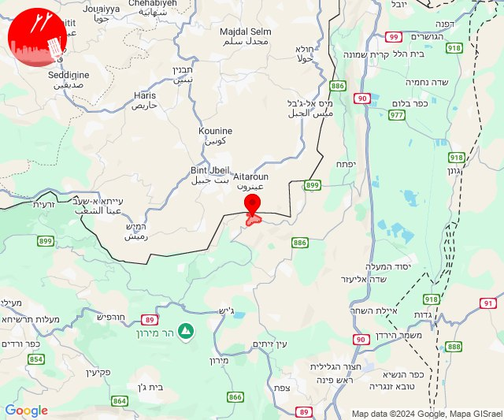

# Alerts for 2024-09-10

## 12:38

שינויים באזורי ההתרעה

בעקבות שינויים שבוצעו בפיקוד העורף, פוצלו מספר יישובים לאזורי התרעה נפרדים ונוספו אזורי התרעה חדשים שיפורטו בהמשך.

משתמשים אשר בחרו באחד מן היישובים הבאים:
צפת, ניר עם, פקיעין, קלע, אשדות יעקב

נדרשים להיכנס לאפליקצית ״צופר״ ולבחור את אזור ההתרעה הרצוי.

(שימו לב, אין צורך בעדכון גרסה נוסף - רשימת היישובים עודכנה)

תיאור חלוקת היישובים:
צפת
• צפת - נוף כנרת
• ⁠צפת - עיר
• ⁠צפת - עכברה

קלע
• רמת טראמפ
• ⁠מצוק עורבים

שדרות, איבים, ניר עם
• שדרות, איבים
• ⁠ניר עם

בברכה,
מערכת צופר.

## 13:03

🔴 צבע אדום (10/09/2024):

16:03:
• קו העימות: זרעית, שומרה (מיידי)

צופר - צבע אדום

## 13:03

## 13:22

🔴 צבע אדום (10/09/2024):

16:21:
• קו העימות: אילון, יערה, עבדון, מנות, חוות אירוח גורן, גורן, נווה זיו, אדמית, ערב אל עראמשה, אילון, יערה (מיידי)

16:22:
• קו העימות: חניתה, אדמית, ערב אל עראמשה (מיידי)

צופר - צבע אדום

## 13:22

## 13:31

🔴 צבע אדום (10/09/2024):

16:29:
• קו העימות: בית ספר שדה מירון, סאסא (מיידי)

16:30:
• קו העימות: סאסא, בית ספר שדה מירון, סאסא (מיידי)

16:31:
• קו העימות: בית ספר שדה מירון, סאסא (מיידי)

צופר - צבע אדום

## 13:31

## 14:50

🔴 צבע אדום (10/09/2024):

17:50:
• קו העימות: ע'ג'ר (מיידי)

צופר - צבע אדום

## 14:50

## 15:39

✈️ חדירת כלי טיס עוין (10/09/2024):

18:35:
• קו העימות: יפתח, רמות נפתלי 

18:37:
• קו העימות: דישון 

18:38:
• קו העימות: יפתח, רמות נפתלי 

18:39:
• קו העימות: מרכז אזורי מבואות חרמון, לב החולה 

צופר - צבע אדום

## 15:39

## 15:43

✈️ חדירת כלי טיס עוין (10/09/2024):

18:43:
• גליל עליון: אזור תעשייה חצור הגלילית, חצור הגלילית, ראש פינה 

צופר - צבע אדום

## 15:44

## 15:46

✈️ חדירת כלי טיס עוין (10/09/2024):

18:46:
• גליל עליון: עמיעד 

צופר - צבע אדום

## 15:46

## 16:11

🔴 צבע אדום (10/09/2024):

19:11:
• קו העימות: אביבים (מיידי)

צופר - צבע אדום

## 16:11

## 16:20

✈️ חדירת כלי טיס עוין (10/09/2024):

19:20:
• גליל עליון: איילת השחר 

צופר - צבע אדום

## 16:20

