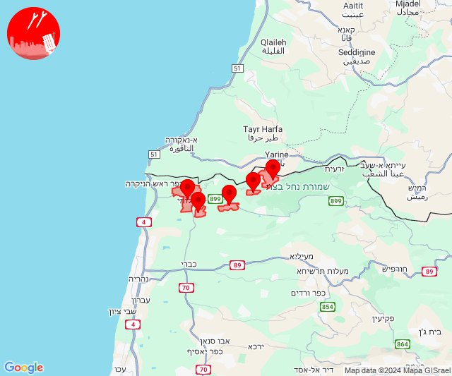
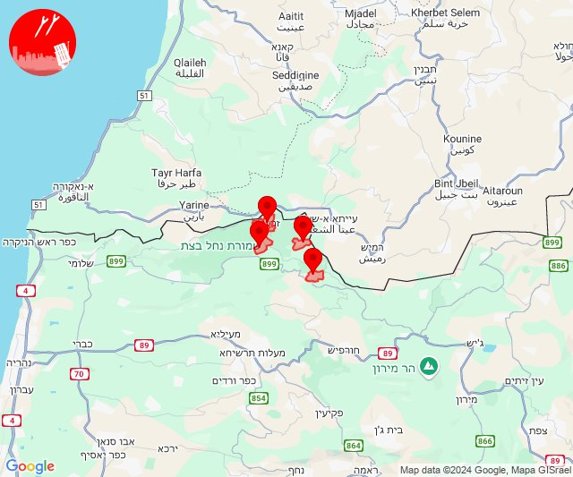
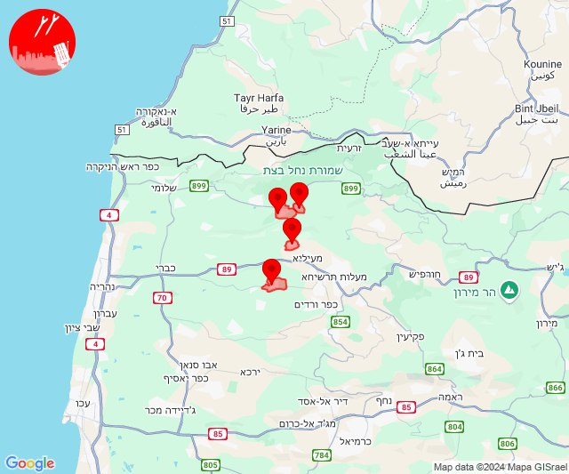
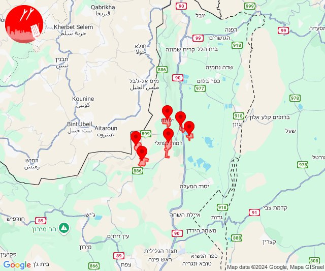
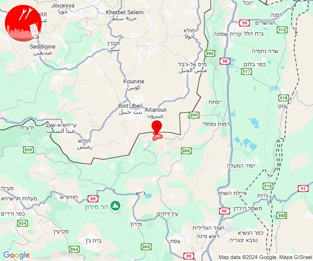
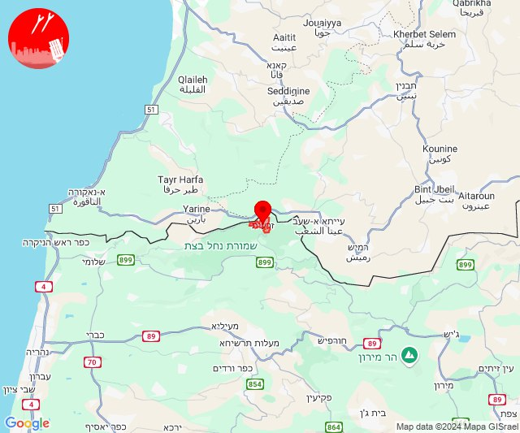
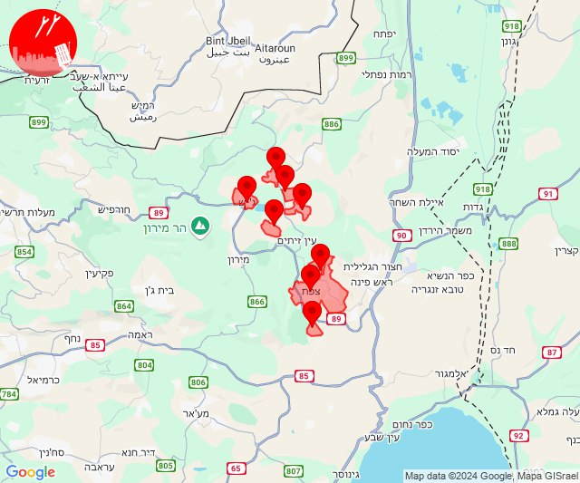

# Alerts for 2024-09-12

## 09:58

🔴 צבע אדום (12/09/2024):

12:58:
• קו העימות: מצובה, שלומי, יערה, אדמית, ערב אל עראמשה (מיידי)

צופר - צבע אדום

## 09:58

## 10:00

🔴 צבע אדום (12/09/2024):

13:00:
• קו העימות: זרעית, שומרה, שתולה, נטועה (מיידי)

צופר - צבע אדום

## 10:00

## 10:03

🔴 צבע אדום (12/09/2024):

13:02:
• קו העימות: הילה, עין יעקב (מיידי, 15 שניות)

13:03:
• קו העימות: גורן, גורנות הגליל (מיידי)

צופר - צבע אדום

## 10:03

## 11:21

✈️ חדירת כלי טיס עוין (12/09/2024):

14:21:
• קו העימות: לב החולה, דישון, יפתח, מלכיה, מרכז אזורי מבואות חרמון, רמות נפתלי 

צופר - צבע אדום

## 11:21

## 13:45

🔴 צבע אדום (12/09/2024):

16:45:
• קו העימות: אביבים (מיידי)

צופר - צבע אדום

## 13:45

## 15:17

🔴 צבע אדום (12/09/2024):

18:17:
• קו העימות: זרעית (מיידי)

צופר - צבע אדום

## 15:17

## 22:12

🔴 צבע אדום (13/09/2024):

01:11:
• גליל עליון: ביריה, צפת - עיר, קדיתא (30 שניות)
• קו העימות: אזור תעשייה רמת דלתון, דלתון, כרם בן זמרה, ג'ש - גוש חלב (מיידי)

01:12:
• גליל עליון: צפת - עכברה, צפת - עיר, ביריה (30 שניות)

צופר - צבע אדום

## 22:12

