# Alerts for 2024-09-14

## 03:02

🔴 צבע אדום (14/09/2024):

06:02:
• קו העימות: שתולה (מיידי)

צופר - צבע אדום

## 03:02

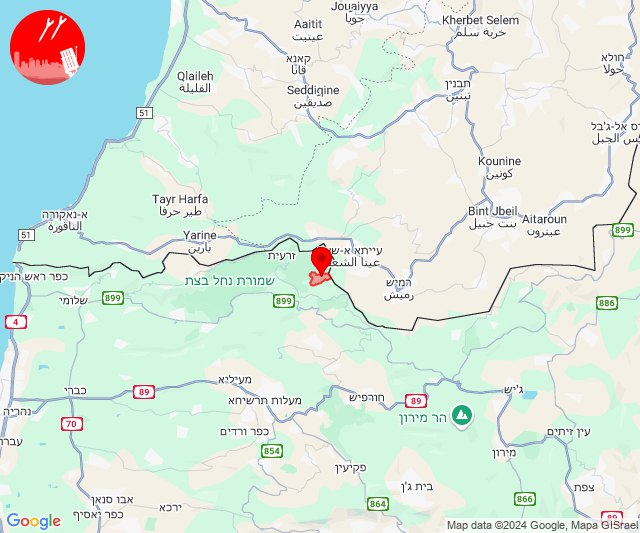

## 03:09

🔴 צבע אדום (14/09/2024):

06:09:
• קו העימות: גורנות הגליל (מיידי)

צופר - צבע אדום

## 03:09

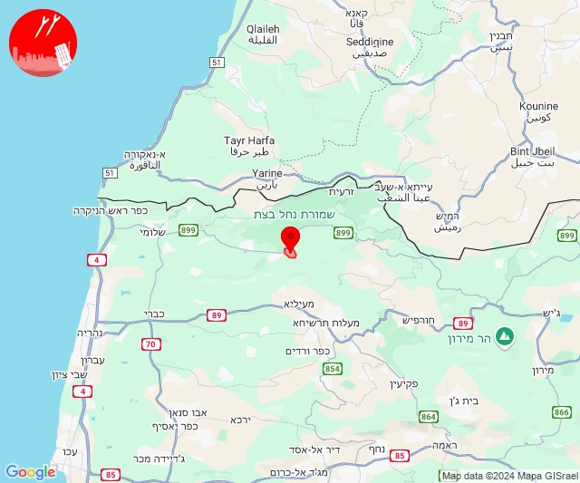

## 04:30

🔴 צבע אדום (14/09/2024):

07:30:
• קו העימות: דוב''ב (מיידי)

צופר - צבע אדום

## 04:30

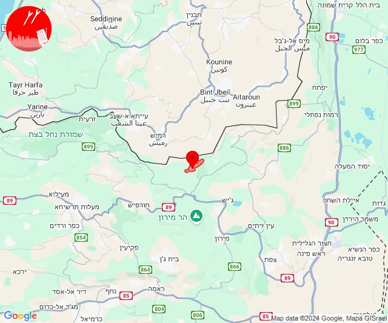

## 04:38

🔴 צבע אדום (14/09/2024):

07:38:
• קו העימות: יפתח (מיידי)

צופר - צבע אדום

## 04:38

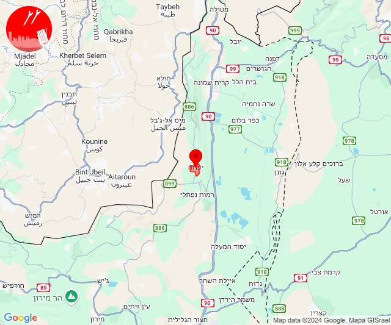

## 05:18

🔴 צבע אדום (14/09/2024):

08:17:
• קו העימות: דישון, מלכיה (מיידי)

08:18:
• גליל תחתון: חוקוק (דקה)
• גליל עליון: כחל, צפת - עכברה, צפת - עיר (דקה, 30 שניות)

צופר - צבע אדום

## 05:18

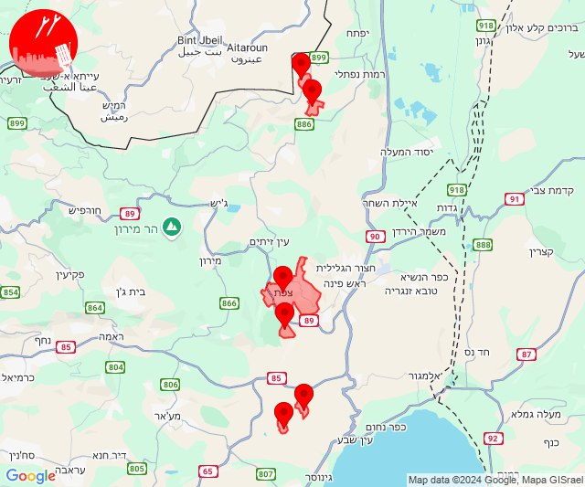

## 06:01

🔴 צבע אדום (14/09/2024):

08:59:
• קו העימות: עלמה, רמות נפתלי (מיידי)
• גליל עליון: אליפלט (30 שניות)

09:00:
• קו העימות: דישון, מלכיה (מיידי)
• גליל עליון: אזור תעשייה חצור הגלילית, אזור תעשייה צ.ח.ר, חצור הגלילית, ראש פינה, מנחת מחניים, מחניים, טובא זנגריה, עמוקה, צפת - נוף כנרת, צפת - עיר, כרכום (30 שניות)

09:01:
• גליל עליון: אזור תעשייה צ.ח.ר, עמיעד, כורזים ורד הגליל, צפת - נוף כנרת, צפת - עיר (30 שניות)

צופר - צבע אדום

## 06:01

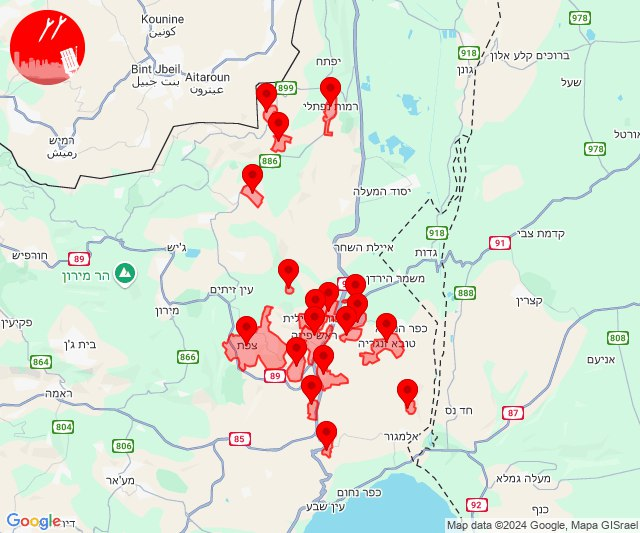

## 07:07

🔴 צבע אדום (14/09/2024):

10:07:
• קו העימות: אביבים (מיידי)

צופר - צבע אדום

## 07:07

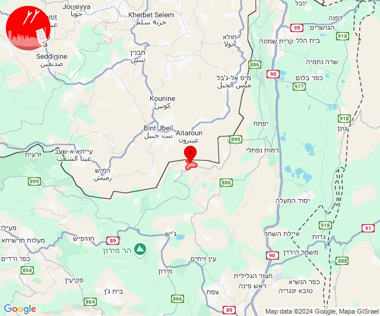

## 10:56

🔴 צבע אדום (14/09/2024):

13:56:
• מערב לכיש: אשקלון - דרום, אזור תעשייה הדרומי אשקלון, אשקלון - צפון (30 שניות)

צופר - צבע אדום

## 10:56

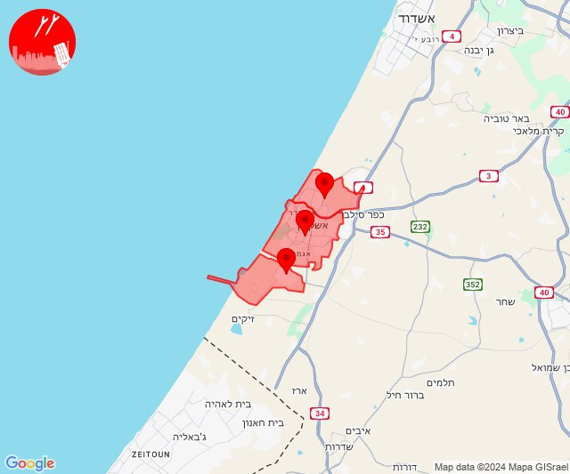

## 11:01

🔴 צבע אדום (14/09/2024):

14:01:
• קו העימות: כפר סאלד (15 שניות)

צופר - צבע אדום

## 11:01

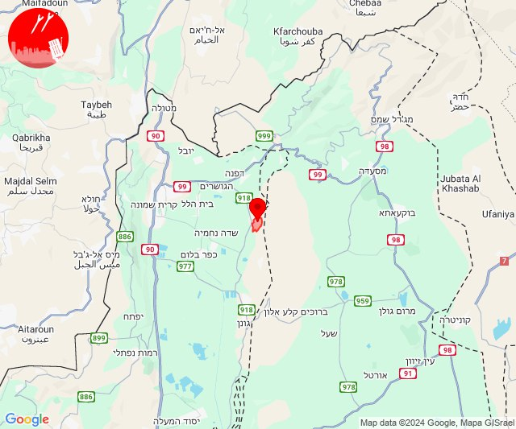

## 11:11

🔴 צבע אדום (14/09/2024):

14:11:
• קו העימות: שאר ישוב (מיידי)

צופר - צבע אדום

## 11:11

## 12:40

🔴 צבע אדום (14/09/2024):

15:40:
• קו העימות: ברעם (מיידי)

צופר - צבע אדום

## 12:40

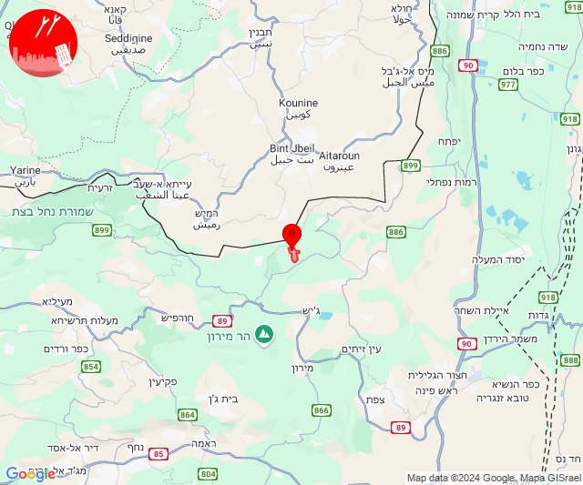

## 14:08

🔴 צבע אדום (14/09/2024):

17:08:
• קו העימות: יראון (מיידי)

צופר - צבע אדום

## 14:08

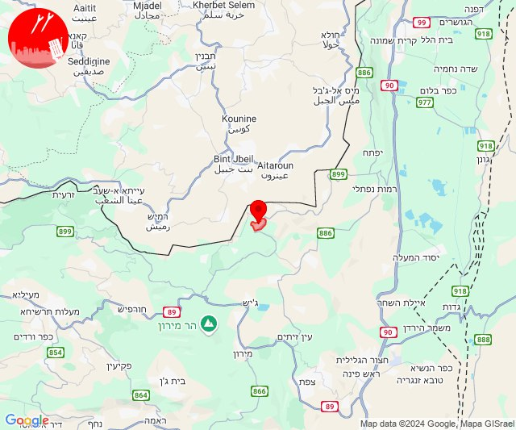

## 14:53

✈️ חדירת כלי טיס עוין (14/09/2024):

17:52:
• קו העימות: מרגליות, קריית שמונה 

17:53:
• קו העימות: מרגליות, קריית שמונה 

צופר - צבע אדום

## 14:53

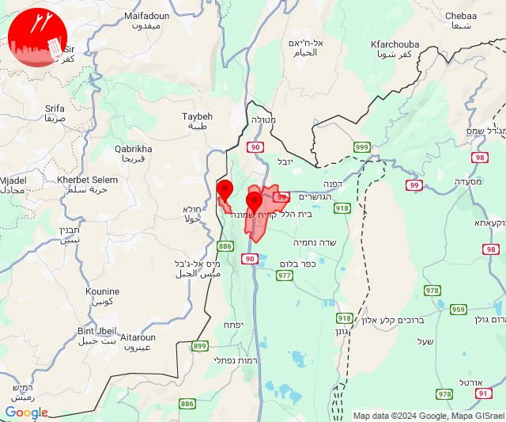

