# Alerts for 2024-09-15

## 03:05

🔴 צבע אדום (15/09/2024):

06:05:
• קו העימות: ע'ג'ר (מיידי)

צופר - צבע אדום

## 03:05

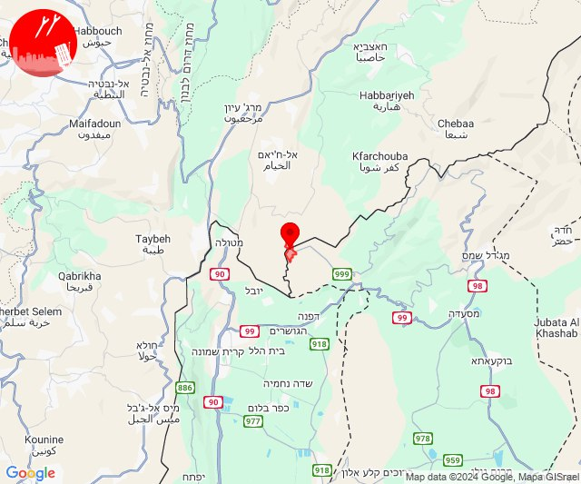

## 03:32

🔴 צבע אדום (15/09/2024):

06:32:
• דן: אור יהודה, גת רימון, יהוד מונוסון, מעש, סביון, קריית אונו, מגשימים, גני תקווה, אזור, חולון, כפר סירקין, רמת גן - מזרח, רמת גן - מערב (דקה וחצי)
• השפלה: גיבתון, גן שלמה, נצר סרני, ראשון לציון - מזרח, רחובות, אזור תעשייה נשר - רמלה, אזור תעשייה רגמ, אחיסמך, אירוס, באר יעקב, בן שמן, גינתון, ישרש, כפר נוער בן שמן, לוד, מצליח, ניר צבי, נס ציונה, רמלה, תעשיון צריפין, אחיעזר, בית דגן, בית חשמונאי, בית עוזיאל, גזר, גני הדר, גני יוחנן, זיתן, חולדה, חמד, חניון הנתיב מהיר, יגל, יד רמב''ם, יציץ, כפר ביל''ו, כפר בן נון, כפר חב''ד, כפר שמואל, כרמי יוסף, מזכרת בתיה, משמר איילון, משמר דוד, משמר השבעה, נען, סתריה, עזריה, פדיה, פתחיה, צפריה, קריית עקרון, רמות מאיר, גנות, נצר חזני, ראשון לציון - מערב, בית חנן, נטעים (דקה וחצי)
• ירקון: גמזו, חשמונאים, כפר דניאל, כפר רות, לפיד, מבוא מודיעים, מודיעין - ליגד סנטר, מודיעין מכבים רעות, מודיעין עילית, מתתיהו, נוף איילון, שילת, שעלבים, אלעד, בארות יצחק, בני עטרות, גבעת כ''ח, מזור, נופך, נחלים, נחשונים, רינתיה, תעשיון חצב, אזור תעשייה חבל מודיעין, בית נחמיה, בית עריף, ברקת, חדיד, טירת יהודה, כפר טרומן, נאות קדומים, שוהם, איירפורט סיטי, כפר האורנים, מודיעין - ישפרו סנטר (דקה וחצי)
• שפלת יהודה: בקוע, לטרון, מיני ישראל - נחשון, נחשון, הראל, נווה שלום (דקה וחצי)
• שומרון: נילי, נעלה, עופרים (דקה וחצי)

צופר - צבע אדום

## 03:32

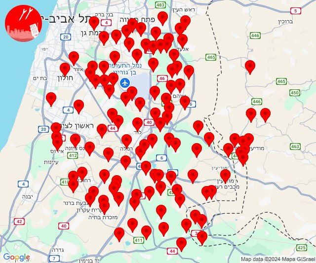

## 04:51

✈️ חדירת כלי טיס עוין (15/09/2024):

07:51:
• קו העימות: בית הלל, כפר גלעדי, כפר יובל, מטולה, מנרה, מעיין ברוך, מרגליות, משגב עם, קריית שמונה, תל חי 

צופר - צבע אדום

## 04:51

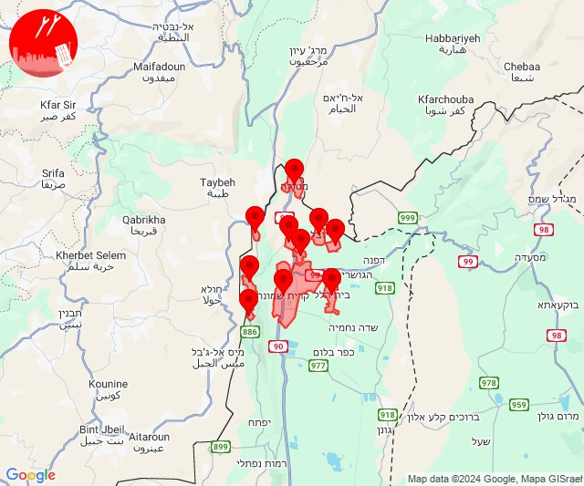

## 05:20

🔴 צבע אדום (15/09/2024):

08:19:
• קו העימות: כפר בלום, עמיר, קריית שמונה, בית הלל, להבות הבשן, שמיר (מיידי, 15 שניות)
• צפון הגולן: מצוק עורבים, רמת טראמפ, שעל (15 שניות)

08:20:
• צפון הגולן: מצוק עורבים (15 שניות)

צופר - צבע אדום

## 05:20

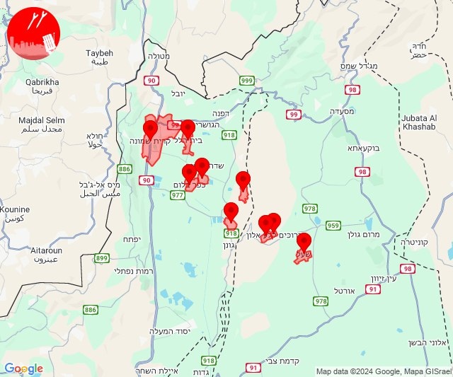

## 08:40

🔴 צבע אדום (15/09/2024):

11:40:
• קו העימות: דוב''ב (מיידי)

צופר - צבע אדום

## 08:40

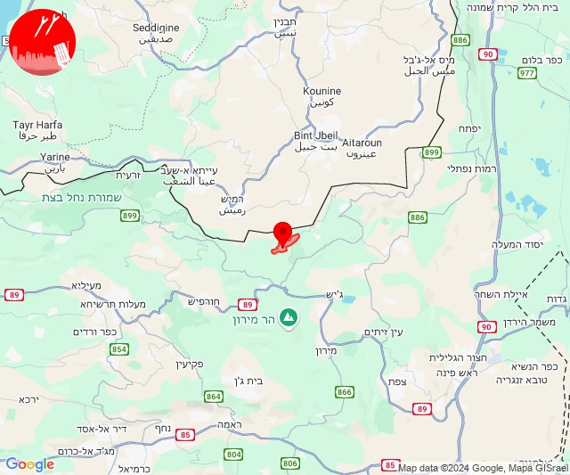

## 09:27

🔴 צבע אדום (15/09/2024):

12:27:
• קו העימות: ערב אל עראמשה (מיידי)

צופר - צבע אדום

## 09:27

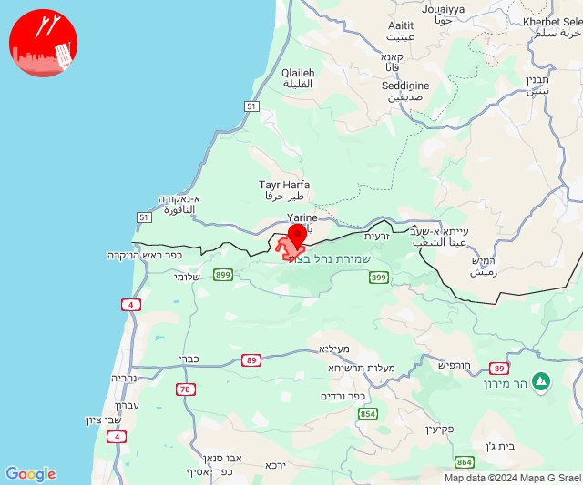

## 09:41

🔴 צבע אדום (15/09/2024):

12:41:
• קו העימות: כפר יובל (מיידי)

צופר - צבע אדום

## 09:41

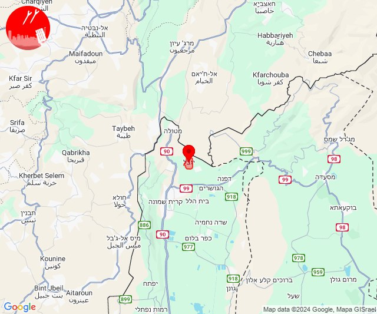

## 13:03

🔴 צבע אדום (15/09/2024):

16:03:
• קו העימות: שאר ישוב (מיידי)

צופר - צבע אדום

## 13:03

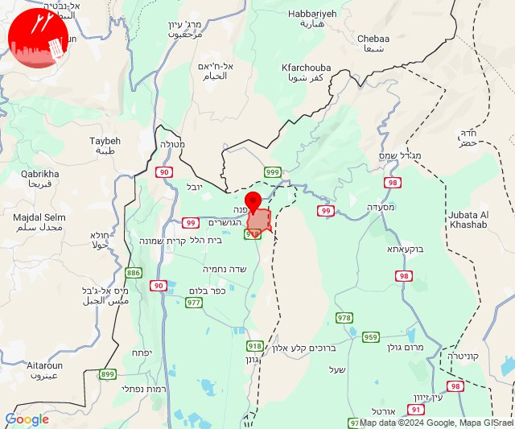

## 15:00

🔴 צבע אדום (15/09/2024):

18:00:
• קו העימות: בצת, מצובה, שלומי (מיידי)

צופר - צבע אדום

## 15:00

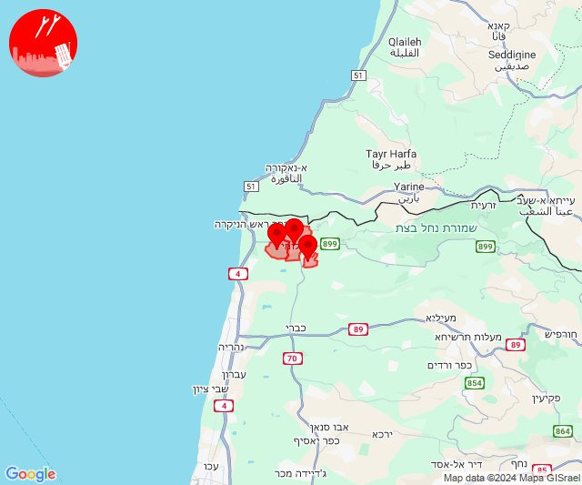

## 15:15

✈️ חדירת כלי טיס עוין (15/09/2024):

18:11:
• קו העימות: ע'ג'ר 

18:12:
• קו העימות: דפנה, שאר ישוב, ע'ג'ר 

18:13:
• קו העימות: שאר ישוב, כפר סאלד 

18:14:
• קו העימות: קיבוץ דן, שדה נחמיה, שמיר 

18:15:
• קו העימות: עמיר, כפר סאלד 

צופר - צבע אדום

## 15:15

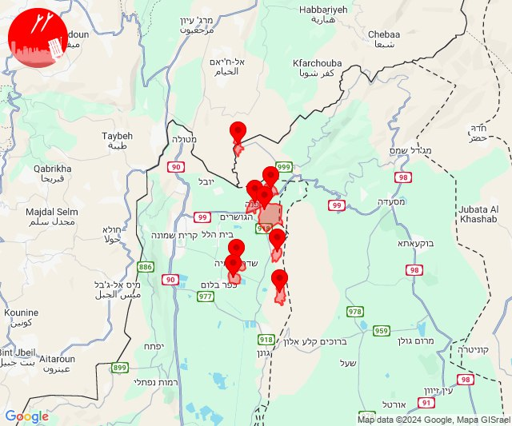

## 15:21

✈️ חדירת כלי טיס עוין (15/09/2024):

18:21:
• גליל עליון: רפטינג נהר הירדן 

צופר - צבע אדום

## 15:21

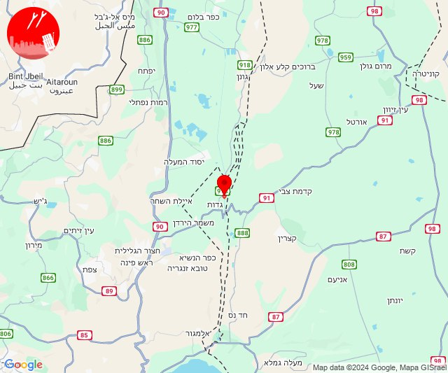

## 15:23

✈️ חדירת כלי טיס עוין (15/09/2024):

18:23:
• גליל עליון: רפטינג נהר הירדן 

צופר - צבע אדום

## 15:23

## 16:13

🔴 צבע אדום (15/09/2024):

19:13:
• קו העימות: רמות נפתלי (מיידי)

צופר - צבע אדום

## 16:13

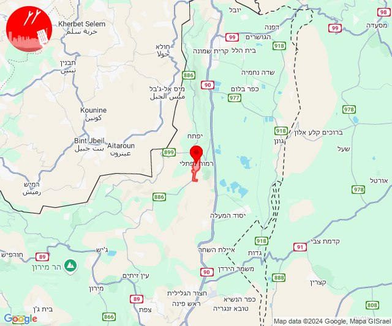

## 23:21

🔴 צבע אדום (16/09/2024):

02:21:
• קו העימות: אביבים, יראון (מיידי)

צופר - צבע אדום

## 23:21

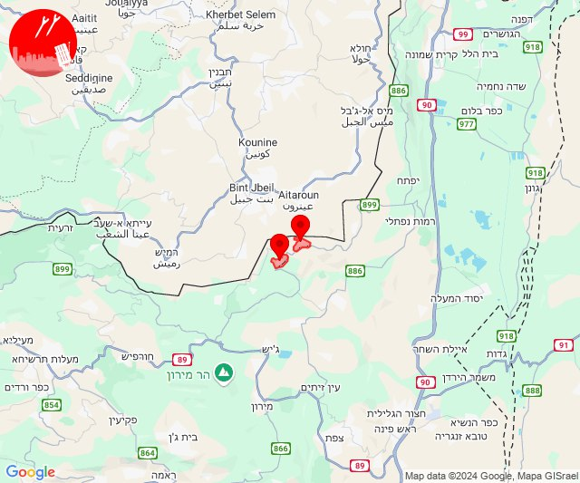

