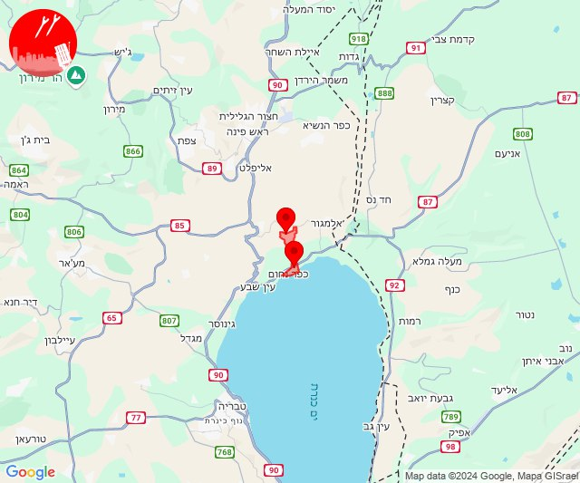
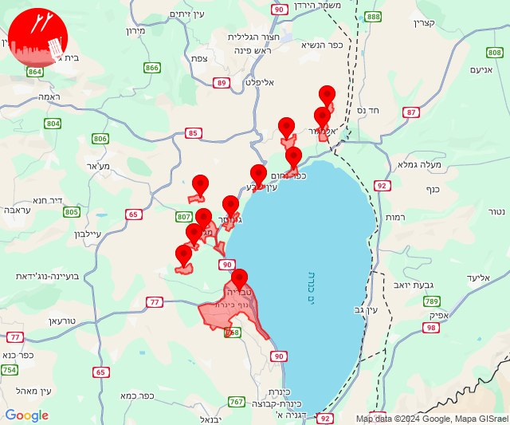
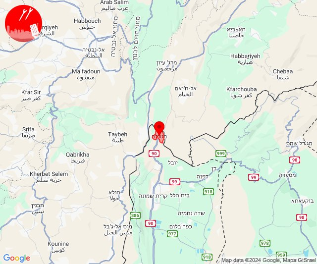
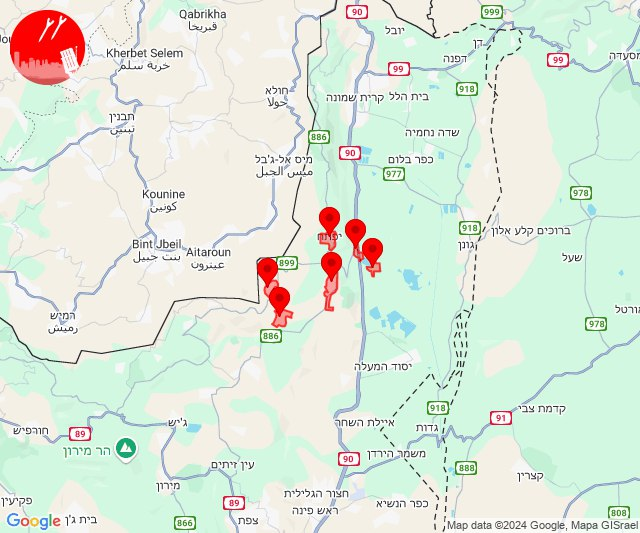
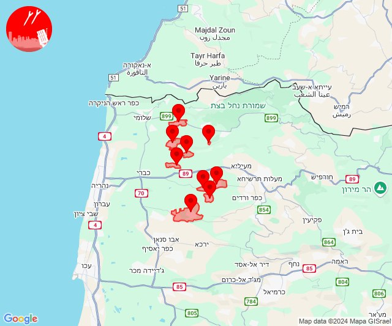
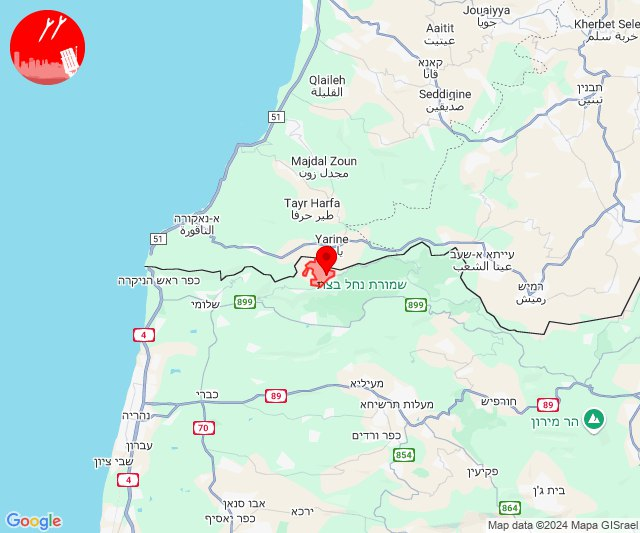
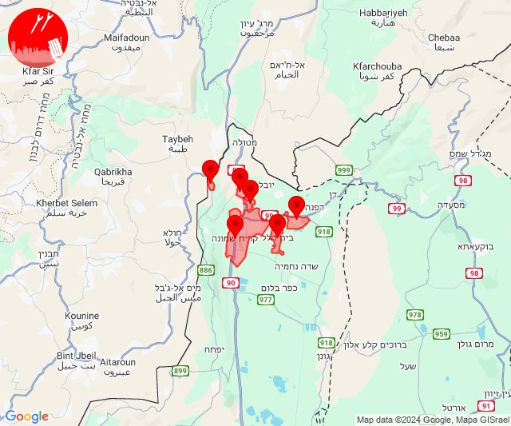
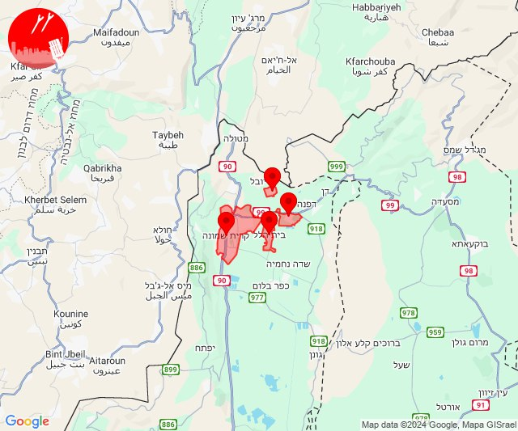
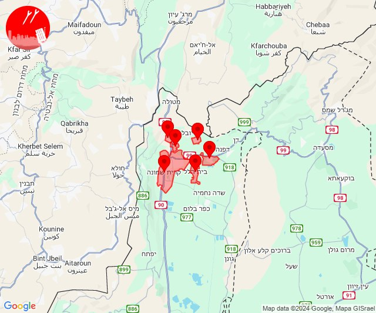

# Alerts for 2024-09-18

## 01:35

🔴 צבע אדום (18/09/2024):

04:35:
• גליל עליון: אמנון, כפר נחום (30 שניות)

צופר - צבע אדום

## 01:35

## 01:36

✈️ חדירת כלי טיס עוין (18/09/2024):

04:32:
• גליל עליון: כרכום 
• דרום הגולן: אלמגור 

04:33:
• גליל עליון: כרכום, אמנון 

04:34:
• גליל עליון: כפר נחום, אמנון 

04:35:
• גליל עליון: טבחה 

04:36:
• גליל תחתון: גינוסר, ואדי אל חמאם, לבנים, מגדל, טבריה, ארבל 

צופר - צבע אדום

## 01:36

## 03:12

🔴 צבע אדום (18/09/2024):

06:12:
• קו העימות: מטולה (מיידי)

צופר - צבע אדום

## 03:12

## 03:12

✈️ חדירת כלי טיס עוין (18/09/2024):

06:12:
• קו העימות: מטולה 

צופר - צבע אדום

## 03:13

## 08:13

🔴 צבע אדום (18/09/2024):

11:13:
• קו העימות: לב החולה, דישון, יפתח, מלכיה, מרכז אזורי מבואות חרמון, רמות נפתלי (מיידי)

צופר - צבע אדום

## 08:13

## 11:59

🔴 צבע אדום (18/09/2024):

14:59:
• קו העימות: יחיעם, געתון, עין יעקב, יערה, עבדון, מנות, נווה זיו, חוות אירוח גורן (15 שניות, מיידי)
• גליל עליון: כליל (30 שניות)

צופר - צבע אדום

## 11:59

## 12:41

✈️ חדירת כלי טיס עוין (18/09/2024):

15:41:
• קו העימות: ערב אל עראמשה 

צופר - צבע אדום

## 12:41

## 13:39

✈️ חדירת כלי טיס עוין (18/09/2024):

16:39:
• קו העימות: מעיין ברוך, הגושרים 

צופר - צבע אדום

## 13:39

🔴 צבע אדום (18/09/2024):

16:39:
• קו העימות: קריית שמונה, בית הלל, הגושרים, תל חי, משגב עם, כפר גלעדי, קריית שמונה, תל חי (מיידי)

צופר - צבע אדום

## 13:39

## 13:40

✈️ חדירת כלי טיס עוין (18/09/2024):

16:39:
• קו העימות: מעיין ברוך, הגושרים 

16:40:
• קו העימות: בית הלל, קריית שמונה 

צופר - צבע אדום

## 13:40

## 13:44

🔴 צבע אדום (18/09/2024):

16:44:
• קו העימות: מעיין ברוך, הגושרים, קריית שמונה, בית הלל, כפר גלעדי, תל חי (מיידי)

צופר - צבע אדום

## 13:44

