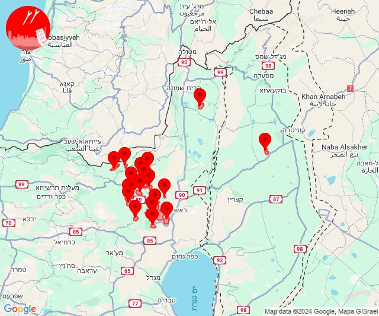

# Alerts for 2024-09-20

## 04:30

🔴 צבע אדום (20/09/2024):

07:30:
• קו העימות: מטולה (מיידי)

צופר - צבע אדום

## 04:30

## 10:03

🔴 צבע אדום (20/09/2024):

13:02:
• גליל עליון: צפת - עיר, ביריה, צפת - עכברה, צפת - עיר, קדיתא, צפת - נוף כנרת, עמוקה, בר יוחאי, כפר שמאי, מירון, מרכז אזורי מרום גליל, ביריה, צפת - עיר (30 שניות)
• קו העימות: דלתון, אזור תעשייה רמת דלתון, כרם בן זמרה, ריחאנייה, כפר בלום, ג'ש - גוש חלב, ברעם, דוב''ב (מיידי)
• צפון הגולן: אורטל (מיידי)

13:03:
• צפון הגולן: אורטל (מיידי)

צופר - צבע אדום

## 10:03

## 10:31

🔴 צבע אדום (20/09/2024):

13:29:
• צפון הגולן: מרום גולן, אורטל, שעל (מיידי, 15 שניות)
• דרום הגולן: חד נס (15 שניות)

13:30:
• גליל עליון: כפר הנשיא, גדות, משמר הירדן, רפטינג נהר הירדן (30 שניות)

13:31:
• צפון הגולן: עין זיוון, אורטל (מיידי)
• דרום הגולן: אלוני הבשן (מיידי)

צופר - צבע אדום

## 10:31

## 10:58

🔴 צבע אדום (20/09/2024):

13:56:
• קו העימות: בית ספר שדה מירון, סאסא, צבעון, מתת (מיידי)

13:57:
• קו העימות: נטועה, בית ספר שדה מירון, סאסא, מתת, סאסא, בית ספר שדה מירון (מיידי)

צופר - צבע אדום

## 10:58

## 12:32

🔴 צבע אדום (20/09/2024):

15:32:
• קו העימות: דוב''ב, ברעם (מיידי)

צופר - צבע אדום

## 12:32

## 13:02

🔴 צבע אדום (20/09/2024):

16:02:
• קו העימות: סאסא (מיידי)

צופר - צבע אדום

## 13:02

## 14:08

✈️ חדירת כלי טיס עוין (20/09/2024):

17:08:
• קו העימות: כפר גלעדי, קריית שמונה, תל חי 

צופר - צבע אדום

## 14:08

## 14:08

🔴 צבע אדום (20/09/2024):

17:07:
• קו העימות: זרעית, שתולה, דלתון, אזור תעשייה רמת דלתון, ג'ש - גוש חלב, כרם בן זמרה, שומרה, ברעם, צבעון (מיידי)
• גליל עליון: אזור תעשייה חצור הגלילית, חצור הגלילית, עמוקה, ראש פינה, אור הגנוז, בר יוחאי, מרכז אזורי מרום גליל, ספסופה - כפר חושן, קדיתא, אזור תעשייה צ.ח.ר, מנחת מחניים, טובא זנגריה, ביריה, צפת - עיר, צפת - עכברה, צפת - נוף כנרת, כפר הנשיא, שדה אליעזר, מלון אחוזת ירדן, איילת השחר (30 שניות)

17:08:
• קו העימות: דלתון (מיידי)
• גליל עליון: אזור תעשייה חצור הגלילית, חצור הגלילית, ראש פינה, עמוקה, צפת - נוף כנרת, אליפלט, צפת - עיר (30 שניות)

צופר - צבע אדום

## 14:08

