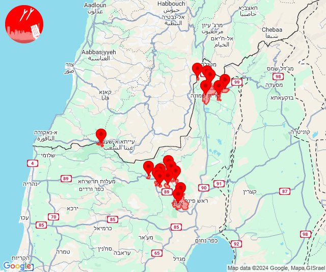
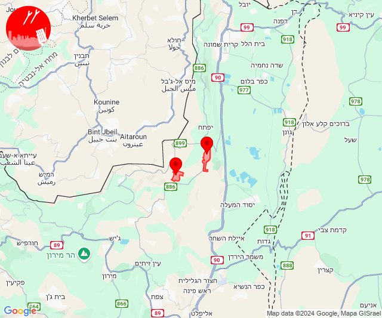
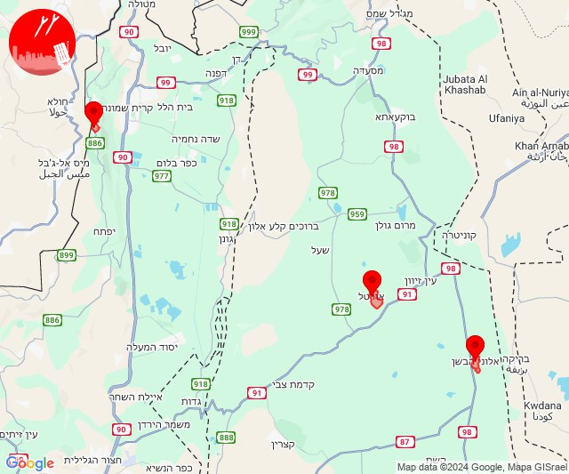
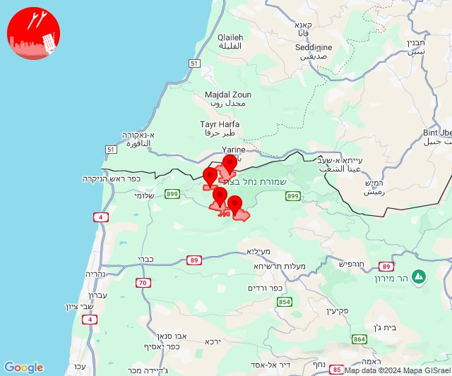
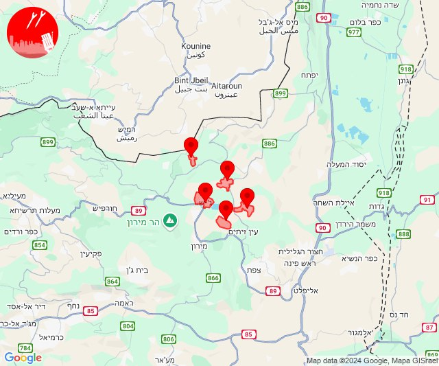
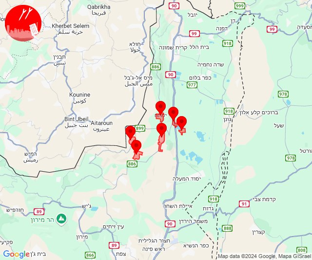
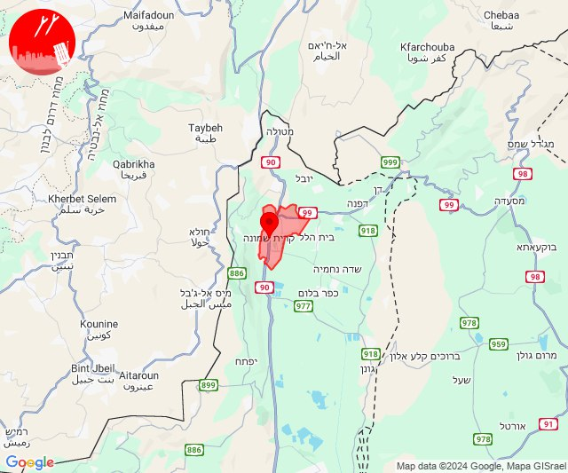
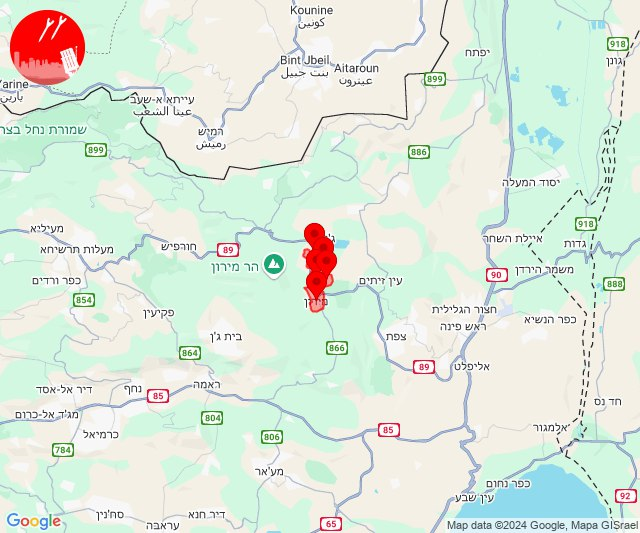
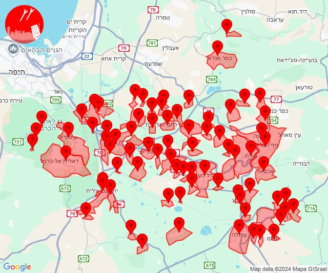

# Alerts for 2024-09-21

## 11:00

🔴 צבע אדום (21/09/2024):

13:59:
• קו העימות: זרעית, בית הלל, קריית שמונה, הגושרים, תל חי, כפר גלעדי, משגב עם (מיידי)

14:00:
• קו העימות: ג'ש - גוש חלב, צבעון, אזור תעשייה רמת דלתון, דלתון, כרם בן זמרה (מיידי)
• גליל עליון: קדיתא, צפת - עיר, ביריה, אור הגנוז, ספסופה - כפר חושן (30 שניות)

צופר - צבע אדום

## 11:00

## 11:03

🔴 צבע אדום (21/09/2024):

14:03:
• קו העימות: רמות נפתלי, דישון (מיידי)

צופר - צבע אדום

## 11:03

## 11:47

🔴 צבע אדום (21/09/2024):

14:46:
• קו העימות: מנרה (מיידי)

14:47:
• צפון הגולן: אורטל (מיידי)
• דרום הגולן: אלוני הבשן (מיידי)

צופר - צבע אדום

## 11:47

## 11:58

🔴 צבע אדום (21/09/2024):

14:57:
• קו העימות: ערב אל עראמשה, אילון, גורן, אדמית (מיידי)

14:58:
• קו העימות: ערב אל עראמשה, גורן, אילון (מיידי)

צופר - צבע אדום

## 11:58

## 12:05

🔴 צבע אדום (21/09/2024):

15:05:
• קו העימות: דלתון, ברעם, ג'ש - גוש חלב, כרם בן זמרה (מיידי)
• גליל עליון: קדיתא (30 שניות)

צופר - צבע אדום

## 12:05

## 14:47

✈️ חדירת כלי טיס עוין (21/09/2024):

17:47:
• קו העימות: דישון, רמות נפתלי, מלכיה, מרכז אזורי מבואות חרמון, יפתח, לב החולה 

צופר - צבע אדום

## 14:47

## 16:34

🔴 צבע אדום (21/09/2024):

19:34:
• קו העימות: קריית שמונה (מיידי)

צופר - צבע אדום

## 16:34

## 16:40

✈️ חדירת כלי טיס עוין (21/09/2024):

19:40:
• קו העימות: לב החולה, דישון, יפתח, מלכיה, מרכז אזורי מבואות חרמון, רמות נפתלי 

צופר - צבע אדום

## 16:40

## 17:46

✈️ חדירת כלי טיס עוין (21/09/2024):

20:46:
• גליל עליון: מירון, מרכז אזורי מרום גליל, ספסופה - כפר חושן, בר יוחאי, אור הגנוז 

צופר - צבע אדום

## 17:46

## 22:12

🔴 צבע אדום (22/09/2024):

01:09:
• ואדי ערה: אזור תעשייה יקנעם עילית, יקנעם המושבה והזורע, יקנעם עילית, מדרך עוז, משמר העמק, עין העמק (דקה וחצי)

01:10:
• העמקים: אורנים, אלונים, בית שערים, גבת, גניגר, יפעת, כפר יהושע, כפר תקווה, מגדל העמק, מנשית זבדה, נהלל, קריית טבעון - בית זייד, רמת דוד, רמת ישי, שדה יעקב, שער העמקים, שריד, היוגב, כפר ברוך, תחנת רכבת כפר ברוך, תחנת רכבת כפר יהושוע, בסמת טבעון, כפר גדעון, אלוני אבא, בית לחם הגלילית, אזור תעשייה אלון התבור, אחוזת ברק, אכסאל, בלפוריה, גבעת אלה, דברת, דחי, זרזיר, חג'אג'רה, יפיע, כפר החורש, מזרע, מרחביה מושב, מרחביה קיבוץ, נוף הגליל, נין, נצרת, סולם, עילוט, עפולה, שמשית, תל עדשים, תמרת, אלון הגליל, כעביה טבאש, כעביה, כפר טבאש (דקה)
• הכרמל: גבעת וולפסון, דלית אל כרמל, עספיא, בית סוהר קישון, כלא דמון, יערות הכרמל (דקה)
• המפרץ: כפר חסידים, יגור (דקה)

01:11:
• העמקים: ריינה, ציפורי, הושעיה, משהד, אזור תעשייה ציפורית, ח'וואלד, נופית (דקה)
• המפרץ: רכסים (דקה)
• מרכז הגליל: כפר מנדא (דקה)

01:12:
• מרכז הגליל: יודפת (דקה)

צופר - צבע אדום

## 22:12

