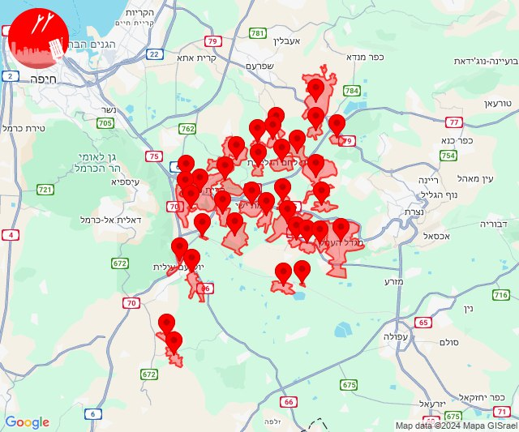
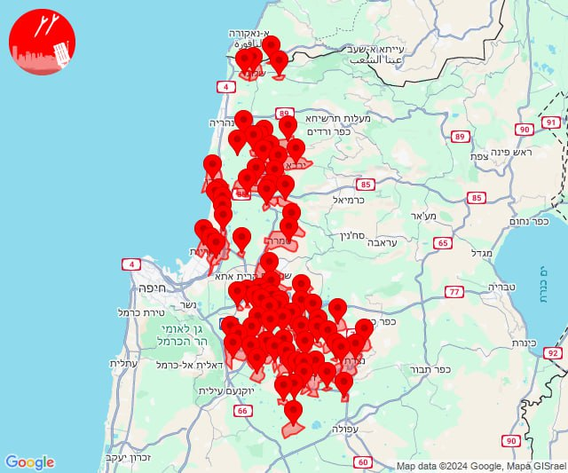
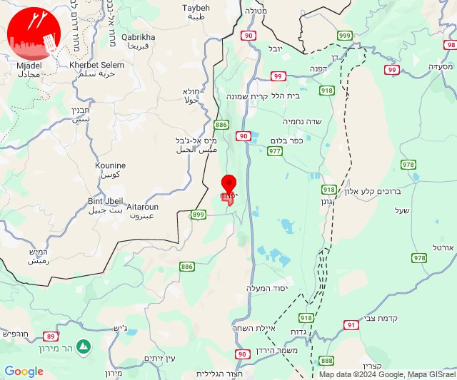

# Alerts for 2024-09-22

## 00:37

🔴 צבע אדום (22/09/2024):

03:37:
• קו העימות: דוב''ב (מיידי)

צופר - צבע אדום

## 00:37

## 00:47

🔴 צבע אדום (22/09/2024):

03:47:
• קו העימות: דוב''ב (מיידי)

צופר - צבע אדום

## 00:47

## 00:57

✈️ חדירת כלי טיס עוין (22/09/2024):

03:56:
• דרום הגולן: רמת מגשימים 

03:57:
• דרום הגולן: חספין, נוב 

צופר - צבע אדום

## 00:57

## 01:49

🔴 צבע אדום (22/09/2024):

04:48:
• ואדי ערה: עין השופט, רמת השופט, יקנעם המושבה והזורע (דקה וחצי)
• העמקים: בית שערים, כפר יהושע, מנשית זבדה, נהלל, רמת ישי (דקה)

04:49:
• העמקים: אורנים, אלוני אבא, אלונים, בית לחם הגלילית, בסמת טבעון, גבת, זרזיר, חג'אג'רה, יפעת, כעביה טבאש, כפר טבאש, כפר תקווה, מגדל העמק, קריית טבעון - בית זייד, רמת דוד, שדה יעקב, שער העמקים, תמרת, כפר ברוך, תחנת רכבת כפר ברוך, תחנת רכבת כפר יהושוע, אלון הגליל, הסוללים, כעביה (דקה)
• ואדי ערה: אזור תעשייה יקנעם עילית (דקה וחצי)
• מרכז הגליל: ביר אלמכסור (דקה)

צופר - צבע אדום

## 01:49

## 02:10

🔴 צבע אדום (22/09/2024):

05:10:
• העמקים: הושעיה, ציפורי, אלון הגליל, אלוני אבא, בית לחם הגלילית, בסמת טבעון, גבעת אלה, הסוללים, הרדוף, זרזיר, חג'אג'רה, כעביה טבאש, כעביה, כפר טבאש, מנשית זבדה, עדי, עילוט, ראס עלי, ריינה, שמשית, תמרת, ח'וואלד, סואעד חמירה, יפיע, כפר החורש, נוף הגליל, נצרת, עין מאהל, משהד, כפר כנא, אזור תעשייה ציפורית (דקה)
• מרכז הגליל: ביר אלמכסור, חנתון, כפר מנדא, שפרעם, דמיידה, מורשת, כאוכב אבו אלהיג'א, יודפת, קורנית, רומת אל הייב, רומאנה, בית רימון, עוזייר (דקה)

צופר - צבע אדום

## 02:11

## 03:24

🔴 צבע אדום (22/09/2024):

06:24:
• מרכז הגליל: אעבלין, מצפה אבי''ב, דמיידה, מורשת, ביר אלמכסור, כאוכב אבו אלהיג'א, כפר מנדא, שכניה (דקה)
• קו העימות: שתולה, אבן מנחם (מיידי)

צופר - צבע אדום

## 03:24

## 03:32

🔴 צבע אדום (22/09/2024):

06:28:
• המפרץ: קריית ביאליק, קריית מוצקין, אזור תעשייה קריית ביאליק (דקה)
• גליל עליון: אזור תעשייה שער נעמן, כפר מסריק (דקה, 30 שניות)

06:29:
• גליל עליון: עין המפרץ, בית העלמין החדש עכו (30 שניות)
• מרכז הגליל: טמרה (דקה)

06:30:
• העמקים: בית לחם הגלילית, אלון הגליל, אלוני אבא, אלונים, בית שערים, בסמת טבעון, גבעת אלה, הסוללים, הרדוף, זרזיר, חג'אג'רה, כעביה טבאש, כעביה, כפר טבאש, כפר יהושע, כפר תקווה, מנשית זבדה, נהלל, נופית, עדי, קריית טבעון - בית זייד, ראס עלי, רמת דוד, רמת ישי, שדה יעקב, שמשית, שער העמקים, תמרת, ח'וואלד, חוואלד, סואעד חמירה, היוגב, גבת, כפר ברוך, מגדל העמק, יפעת (דקה)
• מרכז הגליל: ביר אלמכסור, שפרעם (דקה)
• המפרץ: בית עלמין תל רגב (דקה)
• גליל עליון: כפר יאסיף, ג'דידה מכר, ירכא, אבו סנאן, אשרת, עמקה, כליל (30 שניות)

06:31:
• גליל עליון: ג'וליס, טל - אל, בית העלמין החדש עכו, בית העמק, אזור תעשייה שער נעמן, אפק, אזור תעשייה בר-לב, אחיהוד, יסעור, כפר מסריק, עין המפרץ, עכו - אזור תעשייה, עכו, ג'דידה מכר, כפר יאסיף, אבו סנאן, כליל, עמקה, נס עמים, נתיב השיירה (30 שניות, דקה)
• העמקים: גניגר, יפיע, כפר החורש, נצרת, עילוט, ריינה, שריד, תחנת רכבת כפר ברוך (דקה)
• המפרץ: קריית ביאליק, אזור תעשייה קריית ביאליק, קריית ים, קריית מוצקין (דקה)
• מרכז הגליל: כאבול (דקה)
• קו העימות: יערה, בצת, שלומי (מיידי)

06:32:
• גליל עליון: בית העמק, עין המפרץ, עכו, בית העלמין החדש עכו, ג'דידה מכר, עכו - אזור תעשייה, כפר מסריק (30 שניות)
• העמקים: מזרע, ציפורי, גבעת אלה, זרזיר, שמשית, הסוללים, חג'אג'רה, נהלל, תמרת (דקה)
• קו העימות: חניתה (מיידי)

צופר - צבע אדום

## 03:32

✈️ חדירת כלי טיס עוין (22/09/2024):

06:32:
• ערבה: באר אורה 

צופר - צבע אדום

## 03:32

## 03:33

## 03:35

✈️ חדירת כלי טיס עוין (22/09/2024):

06:35:
• ערבה: באר אורה 

צופר - צבע אדום

## 03:35

## 03:53

🔴 צבע אדום (22/09/2024):

06:52:
• דרום הגולן: חוף גולן, צאלון, חוף כינר, דוגה, דוגית, אלמגור, חוף כורסי, לבנון, חלוקים, מעלה גמלא, רמות (15 שניות, 30 שניות)
• גליל עליון: חוף אמנון, כפר נחום (30 שניות)

06:53:
• דרום הגולן: חוף גופרה, חוף סוסיתא, עין גב (15 שניות)

צופר - צבע אדום

## 03:53

## 04:00

🔴 צבע אדום (22/09/2024):

06:59:
• גליל עליון: אזור תעשייה שער נעמן (דקה)
• המפרץ: קריית ביאליק, אזור תעשייה קריית ביאליק, קריית ים, קריית מוצקין (דקה)
• קו העימות: נווה זיו, מנות, עבדון, יערה, חניתה (מיידי)

07:00:
• המפרץ: קריית ביאליק (דקה)
• גליל עליון: כפר מסריק, עכו - אזור תעשייה, ג'דידה מכר, עין המפרץ, עכו, בית העלמין החדש עכו, שומרת, כפר מסריק, עכו - אזור תעשייה, ג'דידה מכר, עכו, בית העלמין החדש עכו, עין המפרץ (30 שניות)
• מנשה: חיפה - קריית חיים ושמואל (דקה)
• קו העימות: ערב אל עראמשה (מיידי)

צופר - צבע אדום

## 04:00

## 06:57

🔴 צבע אדום (22/09/2024):

09:57:
• דרום הגולן: מיצר (מיידי)

צופר - צבע אדום

## 06:57

## 06:58

✈️ חדירת כלי טיס עוין (22/09/2024):

09:57:
• דרום הגולן: מיצר 

09:58:
• דרום הגולן: אפיק, נאות גולן, בני יהודה וגבעת יואב, מיצר 

צופר - צבע אדום

## 06:58

## 09:16

✈️ חדירת כלי טיס עוין (22/09/2024):

12:13:
• קו העימות: מנרה 

12:14:
• קו העימות: מרגליות, בית הלל, כפר גלעדי, כפר יובל, מטולה, מנרה, מעיין ברוך, מרגליות, משגב עם, קריית שמונה, תל חי, מנרה 

12:15:
• קו העימות: מרגליות, קריית שמונה 

12:16:
• קו העימות: בית הלל, כפר גלעדי, כפר יובל, לב החולה, מטולה, מנרה, מעיין ברוך, מרגליות, משגב עם, קריית שמונה, תל חי, דישון, יפתח, מלכיה, מרכז אזורי מבואות חרמון, רמות נפתלי, קריית שמונה 

צופר - צבע אדום

## 09:16

## 09:18

✈️ חדירת כלי טיס עוין (22/09/2024):

12:18:
• קו העימות: יפתח 

צופר - צבע אדום

## 09:18

## 12:55

🔴 צבע אדום (22/09/2024):

15:55:
• קו העימות: משגב עם (מיידי)

צופר - צבע אדום

## 12:55

## 12:55

✈️ חדירת כלי טיס עוין (22/09/2024):

15:55:
• קו העימות: מרגליות, מנרה 

צופר - צבע אדום

## 12:55

## 14:50

🔴 צבע אדום (22/09/2024):

17:50:
• קו העימות: מעיין ברוך (מיידי)

צופר - צבע אדום

## 14:50

## 15:53

🔴 צבע אדום (22/09/2024):

18:53:
• קו העימות: מטולה (מיידי)

צופר - צבע אדום

## 15:53

## 18:16

✈️ חדירת כלי טיס עוין (22/09/2024):

21:16:
• דרום הגולן: מיצר 

צופר - צבע אדום

## 18:16

## 18:20

✈️ חדירת כלי טיס עוין (22/09/2024):

21:20:
• דרום הגולן: חמת גדר 

צופר - צבע אדום

## 18:20

## 18:21

🔴 צבע אדום (22/09/2024):

21:21:
• דרום הגולן: חמת גדר (15 שניות)

צופר - צבע אדום

## 18:21

## 18:25

✈️ חדירת כלי טיס עוין (22/09/2024):

21:25:
• בקעת בית שאן: גשר 

צופר - צבע אדום

## 18:25

## 18:28

✈️ חדירת כלי טיס עוין (22/09/2024):

21:28:
• בקעת בית שאן: אזור תעשייה צבאים, בית אלפא וחפציבה, בית השיטה, בית יוסף, בית שאן, גשר, חוות עדן, חמדיה, טירת צבי, ירדנה, כפר גמילה מלכישוע, כפר רופין, מולדת, מירב, מסילות, מעוז חיים, מעלה גלבוע, נוה איתן, נווה אור, ניר דוד, עין הנצי''ב, רחוב, רשפים, שדה אליהו, שדה נחום, שדי תרומות, שלוחות, תל תאומים, גני חוגה, שלפים, רוויה 

צופר - צבע אדום

## 18:28

