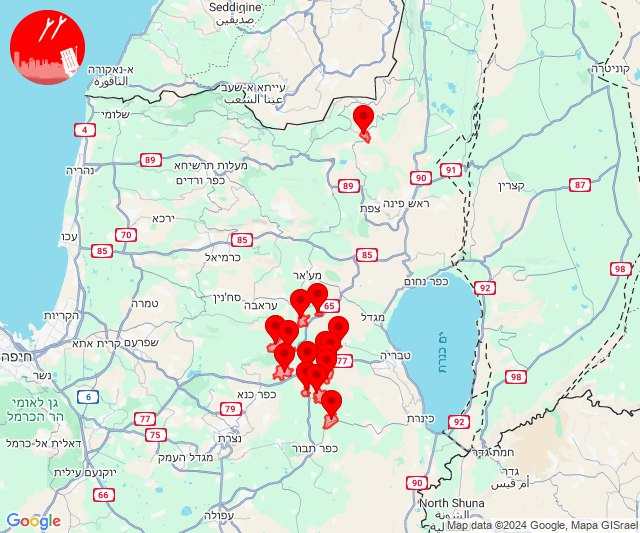

# Alerts for 2024-09-23

## 01:45

✈️ חדירת כלי טיס עוין (23/09/2024):

04:45:
• דרום הגולן: רמת מגשימים 

צופר - צבע אדום

## 01:45

## 01:50

✈️ חדירת כלי טיס עוין (23/09/2024):

04:50:
• דרום הגולן: מיצר 

צופר - צבע אדום

## 01:50

## 01:54

✈️ חדירת כלי טיס עוין (23/09/2024):

04:54:
• דרום הגולן: חמת גדר 

צופר - צבע אדום

## 01:54

## 03:32

🔴 צבע אדום (23/09/2024):

06:31:
• קו העימות: נטועה (מיידי)

06:32:
• קו העימות: סאסא (מיידי)

צופר - צבע אדום

## 03:32

## 05:26

✈️ חדירת כלי טיס עוין (23/09/2024):

08:26:
• קו העימות: הילה, חוסן, כפר ורדים, מעונה, מעיליא, מעלות תרשיחא 

צופר - צבע אדום

## 05:26

## 06:35

✈️ חדירת כלי טיס עוין (23/09/2024):

09:35:
• קו העימות: בית הלל, כפר גלעדי, כפר יובל, מטולה, מנרה, מעיין ברוך, מרגליות, משגב עם, קריית שמונה, תל חי 

צופר - צבע אדום

## 06:35

## 08:30

🔴 צבע אדום (23/09/2024):

11:30:
• קו העימות: אזור תעשייה רמת דלתון, ג'ש - גוש חלב, כרם בן זמרה (מיידי)
• גליל עליון: קדיתא (30 שניות)

צופר - צבע אדום

## 08:30

## 09:20

🔴 צבע אדום (23/09/2024):

12:20:
• קו העימות: אלקוש (מיידי)

צופר - צבע אדום

## 09:20

## 09:21

🔴 צבע אדום (23/09/2024):

12:21:
• קו העימות: אבירים (מיידי)

צופר - צבע אדום

## 09:21

## 09:25

✈️ חדירת כלי טיס עוין (23/09/2024):

12:24:
• קו העימות: אבירים, אלקוש, נטועה, פסוטה 

12:25:
• קו העימות: דוב''ב, מתת, סאסא 

צופר - צבע אדום

## 09:25

🔴 צבע אדום (23/09/2024):

12:23:
• גליל עליון: כחל (דקה)

12:24:
• גליל תחתון: חוקוק (דקה)
• גליל עליון: צפת - עכברה, צפת - עיר, ביריה, עמוקה, צפת - נוף כנרת, צפת - עיר, ראש פינה, חצור הגלילית (30 שניות)
• קו העימות: אזור תעשייה רמת דלתון, דלתון (מיידי)

12:25:
• גליל עליון: צפת - עכברה, צפת - עיר, קדרים, ביריה, כורזים ורד הגליל, עמיעד, כפר נחום, צפת - נוף כנרת, צפת - עיר (30 שניות, דקה)

צופר - צבע אדום

## 09:25

## 09:25

## 09:45

🔴 צבע אדום (23/09/2024):

12:43:
• גליל תחתון: גבעת אבני, הודיות, לביא, כפר נהר הירדן, אתר ההנצחה גולני, שדה אילן (דקה)
• העמקים: אילניה (דקה)

12:44:
• מרכז הגליל: טורעאן, מצפה נטופה (דקה)
• קו העימות: ריחאנייה (מיידי)
• גליל תחתון: כפר כמא, נבי שועייב (דקה)

12:45:
• מרכז הגליל: בועיינה-נוג'ידאת, עילבון, מסד (דקה)

צופר - צבע אדום

## 09:45

## 10:17

🔴 צבע אדום (23/09/2024):

13:17:
• קו העימות: חורפיש (מיידי)

צופר - צבע אדום

## 10:18

## 10:23

🔴 צבע אדום (23/09/2024):

13:23:
• קו העימות: בית הלל (מיידי)

צופר - צבע אדום

## 10:23

## 11:30

🔴 צבע אדום (23/09/2024):

14:30:
• קו העימות: לב החולה, דישון, יפתח, מלכיה, מרכז אזורי מבואות חרמון, רמות נפתלי, אבירים, אלקוש, נטועה, פסוטה (מיידי)

צופר - צבע אדום

## 11:30

## 12:26

🔴 צבע אדום (23/09/2024):

15:26:
• קו העימות: מרגליות (מיידי)

צופר - צבע אדום

## 12:26

## 13:16

🔴 צבע אדום (23/09/2024):

16:15:
• ואדי ערה: אזור תעשייה יקנעם עילית, אליקים, יקנעם המושבה והזורע, יקנעם עילית, אזור תעשייה מבוא כרמל, עין העמק (דקה וחצי)
• גליל עליון: קדיתא, ביריה (30 שניות)
• העמקים: כפר תקווה, קריית טבעון - בית זייד, שער העמקים, אורנים, אלונים, בסמת טבעון (דקה)
• הכרמל: גבעת וולפסון, דלית אל כרמל, עספיא, כרם מהר''ל, ניר עציון, עין חוד, יערות הכרמל (דקה)
• קו העימות: ג'ש - גוש חלב, כרם בן זמרה, דלתון, אזור תעשייה רמת דלתון (מיידי)
• המפרץ: כפר חסידים, רכסים (דקה)

16:16:
• המפרץ: איבטין, בית עלמין תל רגב (דקה)
• העמקים: נופית, חוואלד, ח'וואלד (דקה)

צופר - צבע אדום

## 13:16

## 13:25

🔴 צבע אדום (23/09/2024):

16:24:
• מרכז הגליל: עילבון, מסד (דקה)

16:25:
• מרכז הגליל: טורעאן, מצפה נטופה, טפחות, מע'אר, דיר חנא, בועיינה-נוג'ידאת (דקה)
• גליל תחתון: אתר ההנצחה גולני, הודיות, כפר זיתים, לביא, נבי שועייב (דקה)

צופר - צבע אדום

## 13:25

## 14:03

🔴 צבע אדום (23/09/2024):

17:02:
• המפרץ: קריית ביאליק, קריית ים, קריית מוצקין, אזור תעשייה קריית ביאליק, חיפה - קריית חיים ושמואל, כפר ביאליק (דקה)
• גליל עליון: אזור תעשייה שער נעמן, כפר מסריק, עכו - אזור תעשייה, ג'דידה מכר, עין המפרץ, עכו, בית העלמין החדש עכו, נס עמים, שבי ציון, שומרת, לוחמי הגטאות, מזרעה, רגבה, בוסתן הגליל, בית העמק, אבו סנאן, כפר יאסיף (דקה, 30 שניות)
• קו העימות: עברון (15 שניות)

17:03:
• גליל עליון: כפר מסריק (30 שניות)

צופר - צבע אדום

## 14:03

## 14:04

✈️ חדירת כלי טיס עוין (23/09/2024):

17:04:
• קו העימות: אבירים, אלקוש, נטועה, פסוטה 

צופר - צבע אדום

## 14:04

## 14:15

🔴 צבע אדום (23/09/2024):

17:13:
• שומרון: קרני שומרון, עלי זהב, פדואל, בית אריה, עמנואל, אזור תעשייה בראון, חוות גלעד, קדומים, ברוכין (דקה וחצי)
• שרון: אלקנה, עץ אפרים (דקה וחצי)

17:14:
• קו העימות: ג'ש - גוש חלב (מיידי)
• גליל עליון: ספסופה - כפר חושן (30 שניות)
• שומרון: ברקן, קריית נטפים, רבבה, יקיר, נופים, חוות יאיר, אזור תעשייה ברקן, אזור תעשייה אריאל, אריאל (דקה וחצי)
• שרון: שערי תקווה, אלפי מנשה (דקה וחצי)

17:15:
• שומרון: עופרים (דקה וחצי)

צופר - צבע אדום

## 14:15

## 14:20

🔴 צבע אדום (23/09/2024):

17:20:
• גליל תחתון: נבי שועייב, גבעת אבני, הודיות, לביא, כפר נהר הירדן, כפר זיתים (דקה)
• מרכז הגליל: מסד, עילבון (דקה)

צופר - צבע אדום

## 14:20

## 14:23

🔴 צבע אדום (23/09/2024):

17:22:
• ואדי ערה: אזור תעשייה יקנעם עילית, יקנעם המושבה והזורע, יקנעם עילית (דקה וחצי)
• העמקים: אלונים, קריית טבעון - בית זייד, בסמת טבעון, נופית, ח'וואלד, רמת ישי, כפר יהושע, שדה יעקב, אלוני אבא, בית שערים, בית לחם הגלילית, חג'אג'רה, כעביה טבאש, כעביה, כפר טבאש (דקה)

17:23:
• העמקים: אורנים, כפר תקווה, מנשית זבדה, נהלל, רמת דוד, שער העמקים, כפר ברוך, תחנת רכבת כפר יהושוע, גבת, ראס עלי, זרזיר (דקה)
• הכרמל: דלית אל כרמל, עספיא, בית סוהר קישון (דקה)

צופר - צבע אדום

## 14:23

## 14:42

🔴 צבע אדום (23/09/2024):

17:41:
• המפרץ: יגור, כפר חסידים, אושה, חיפה - מפרץ, כפר המכבי, קריית אתא, רמת יוחנן, איבטין, רכסים, בית עלמין תל רגב (דקה)
• הכרמל: עספיא, בית סוהר קישון, דלית אל כרמל, גבעת וולפסון, כלא דמון (דקה)
• מנשה: נשר (דקה)
• העמקים: אורנים, אלונים, בסמת טבעון, כפר תקווה, נופית, קריית טבעון - בית זייד, ראס עלי, שער העמקים, ח'וואלד, חוואלד, שדה יעקב, תחנת רכבת כפר יהושוע (דקה)
• ואדי ערה: אזור תעשייה יקנעם עילית (דקה וחצי)

17:42:
• מרכז הגליל: שפרעם (דקה)

צופר - צבע אדום

## 14:42

## 15:05

🔴 צבע אדום (23/09/2024):

18:04:
• העמקים: אלוני אבא, אלונים, בסמת טבעון, קריית טבעון - בית זייד, שדה יעקב, כפר יהושע, רמת ישי, מנשית זבדה, בית לחם הגלילית, חג'אג'רה, אורנים, בית שערים, גבת, זרזיר, כפר טבאש, כפר תקווה, נהלל, רמת דוד, שער העמקים, כפר ברוך, תחנת רכבת כפר יהושוע, אלון הגליל (דקה)
• ואדי ערה: אזור תעשייה יקנעם עילית, יקנעם המושבה והזורע, יקנעם עילית (דקה וחצי)
• הכרמל: בית סוהר קישון (דקה)
• מרכז הגליל: ביר אלמכסור (דקה)

18:05:
• העמקים: הרדוף, כעביה טבאש, כעביה, נופית, ראס עלי, ח'וואלד, סואעד חמירה (דקה)

צופר - צבע אדום

## 15:05

## 16:00

🔴 צבע אדום (23/09/2024):

18:56:
• מרכז הגליל: יודפת, סכנין, יובלים, ערב אל נעים, אשבל, אשחר, חוסנייה, מעלה צביה (דקה, 30 שניות)
• העמקים: גבת, זרזיר, נהלל, רמת דוד, תמרת, בית שערים, מנשית זבדה, יפעת, שריד, תחנת רכבת כפר ברוך, אלוני אבא, אלונים, בית לחם הגלילית, גבעת אלה, גניגר, חג'אג'רה, יפיע, כפר יהושע, מגדל העמק, עילוט, רמת ישי, שדה יעקב, כפר ברוך (דקה)
• ואדי ערה: אום אל פחם, מי עמי, מעלה עירון (דקה וחצי)
• גליל עליון: אזור תעשייה כרמיאל, כרמיאל, מכמנים (30 שניות)

18:57:
• העמקים: שמשית, אלון הגליל, הסוללים, ציפורי, בסמת טבעון, הרדוף, כעביה טבאש, כעביה, כפר טבאש, נופית, עדי, קריית טבעון - בית זייד, ראס עלי, ח'וואלד, סואעד חמירה (דקה)
• מרכז הגליל: ביר אלמכסור (דקה)

18:58:
• גליל עליון: אזור תעשייה שער נעמן (דקה)
• המפרץ: קריית ביאליק, אזור תעשייה קריית ביאליק, קריית ים (דקה)

18:59:
• גליל עליון: כפר מסריק, ג'דידה מכר, עין המפרץ, עכו - אזור תעשייה, עכו, בית העלמין החדש עכו, בוסתן הגליל, שבי ציון (30 שניות)
• המפרץ: קריית מוצקין (דקה)

19:00:
• המפרץ: קריית ביאליק (דקה)

צופר - צבע אדום

## 16:00

## 16:21

🔴 צבע אדום (23/09/2024):

19:21:
• צפון הגולן: מסעדה (מיידי)

צופר - צבע אדום

## 16:21

## 16:43

🔴 צבע אדום (23/09/2024):

19:42:
• המפרץ: חיפה - כרמל, הדר ועיר תחתית, חיפה - נווה שאנן ורמות כרמל, חיפה - מערב, חיפה - מפרץ, יגור (דקה)
• מנשה: טירת כרמל, נשר, החותרים, כפר גלים (דקה)
• הכרמל: בית אורן, גבעת וולפסון, עספיא, בית צבי, כפר הנוער ימין אורד, מגדים, יערות הכרמל, כלא דמון (דקה)

19:43:
• המפרץ: חיפה - קריית חיים ושמואל, קריית אתא, קריית ביאליק (דקה)

צופר - צבע אדום

## 16:43

## 23:40

🔴 צבע אדום (24/09/2024):

02:39:
• קו העימות: זרעית, שומרה (מיידי)
• העמקים: גניגר, אכסאל, נצרת, תל עדשים, כפר גדעון, עפולה, מזרע, משהד, נוף הגליל, ריינה (דקה)

02:40:
• העמקים: כפר החורש, עילוט, הושעיה, כפר כנא, ציפורי, אזור תעשייה ציפורית, אזור תעשייה אלון התבור, אחוזת ברק, דברת, דחי, מרחביה מושב, מרחביה קיבוץ, נין, סולם, בלפוריה, יפיע, דבוריה, גבת, יפעת, מגדל העמק, שריד, היוגב, תחנת רכבת כפר ברוך (דקה)
• קו העימות: נטועה, שתולה (מיידי)

צופר - צבע אדום

## 23:40

## 23:57

🔴 צבע אדום (24/09/2024):

02:56:
• העמקים: עפולה, בלפוריה, כפר גדעון, מזרע, תל עדשים, אחוזת ברק, דברת, דחי, מרחביה מושב, מרחביה קיבוץ, נין, סולם, אכסאל, גניגר, יפיע, כפר החורש, מגדל העמק, נוף הגליל, נצרת, שריד (דקה)

02:57:
• העמקים: הושעיה, משהד, עילוט, ציפורי, ריינה, שמשית, גבעת אלה (דקה)

צופר - צבע אדום

## 23:57

