# Alerts for 2024-09-24

## 00:12

🔴 צבע אדום (24/09/2024):

03:11:
• העמקים: עפולה, גניגר, יפיע, מגדל העמק, מזרע, בלפוריה, כפר גדעון, תל עדשים, שריד, גבעת אלה, כפר החורש, נצרת, עילוט, ריינה, שמשית, ציפורי, אכסאל, נוף הגליל, היוגב (דקה)

03:12:
• העמקים: אכסאל, נוף הגליל (דקה)

צופר - צבע אדום

## 00:12

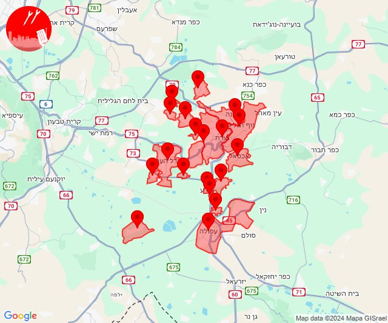

## 03:00

🔴 צבע אדום (24/09/2024):

06:00:
• קו העימות: גשר הזיו, סער, נהריה (מיידי, 15 שניות)

צופר - צבע אדום

## 03:00

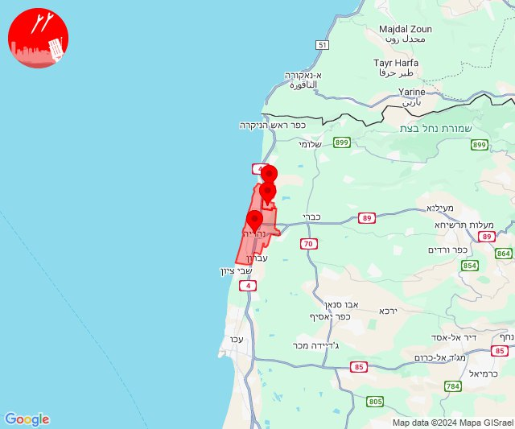

## 04:43

🔴 צבע אדום (24/09/2024):

07:42:
• גליל עליון: אפק, יסעור, ירכא, ינוח ג'ת (דקה, 30 שניות)
• המפרץ: קריית אתא, קריית ביאליק (דקה)
• מרכז הגליל: אזור תעשייה טמרה, אעבלין, טמרה, כאבול, מצפה אבי''ב, שפרעם (דקה)

07:43:
• גליל עליון: אחיהוד, אזור תעשייה בר-לב (דקה)
• מרכז הגליל: מנוף, מורשת (דקה)

צופר - צבע אדום

## 04:43

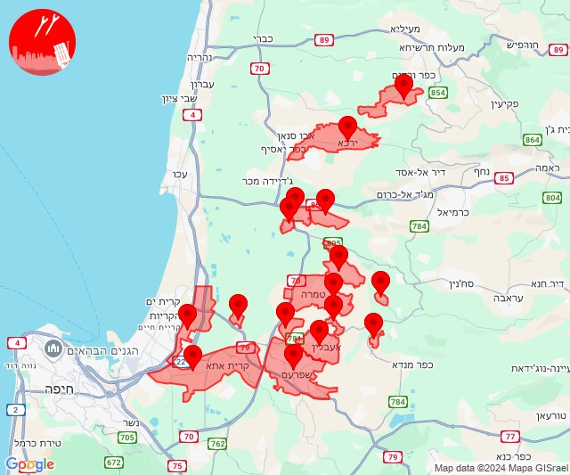

## 06:36

🔴 צבע אדום (24/09/2024):

09:36:
• העמקים: גניגר, יפיע, כפר החורש, מגדל העמק, נצרת, עילוט, עפולה, בלפוריה, גבת, יפעת, כפר גדעון, מזרע, רמת דוד, שריד, תל עדשים, היוגב, כפר ברוך, תחנת רכבת כפר ברוך, נוף הגליל, ציפורי, ריינה (דקה)

צופר - צבע אדום

## 06:36

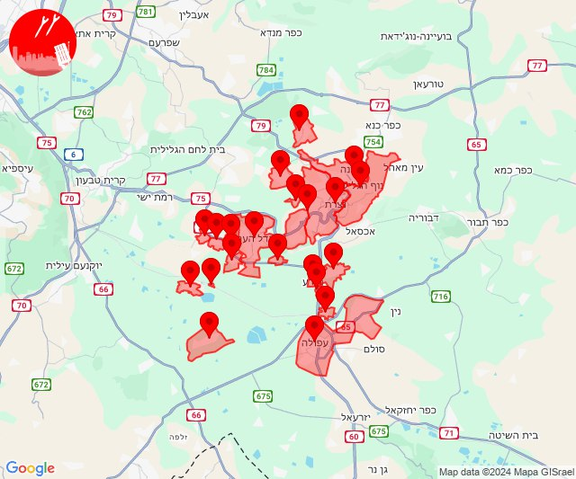

## 06:44

🔴 צבע אדום (24/09/2024):

09:42:
• קו העימות: קריית שמונה, תל חי, כפר גלעדי, מטולה, כפר יובל, קריית שמונה, תל חי, מעיין ברוך, כפר גלעדי (מיידי)

09:43:
• קו העימות: מטולה, קריית שמונה, תל חי, משגב עם, כפר גלעדי, כפר יובל, מעיין ברוך, מטולה (מיידי)

09:44:
• קו העימות: כפר גלעדי, משגב עם, תל חי (מיידי)

צופר - צבע אדום

## 06:44

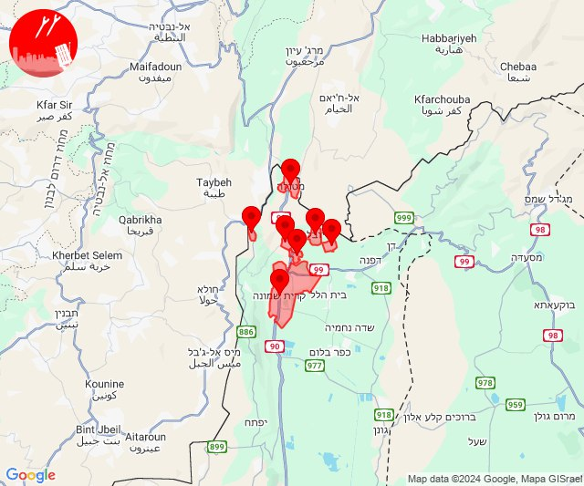

## 07:33

🔴 צבע אדום (24/09/2024):

10:32:
• גליל תחתון: כפר נהר הירדן, שדה אילן, אתר ההנצחה גולני, כפר כמא (דקה)
• העמקים: אילניה (דקה)

10:33:
• גליל תחתון: גבעת אבני, הודיות, לביא (דקה)

צופר - צבע אדום

## 07:33

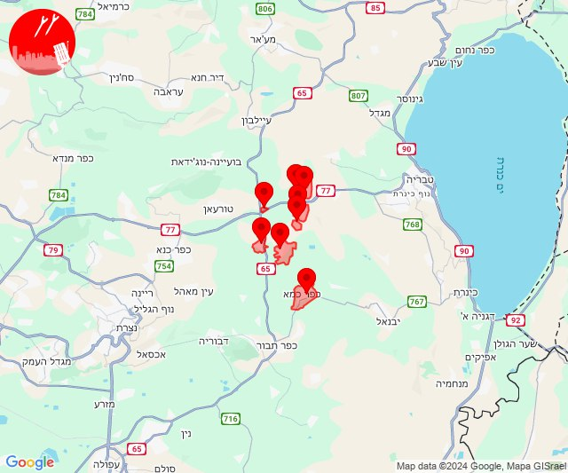

## 07:50

🔴 צבע אדום (24/09/2024):

10:50:
• קו העימות: שניר, קיבוץ דן, דפנה, שאר ישוב (מיידי)

צופר - צבע אדום

## 07:50

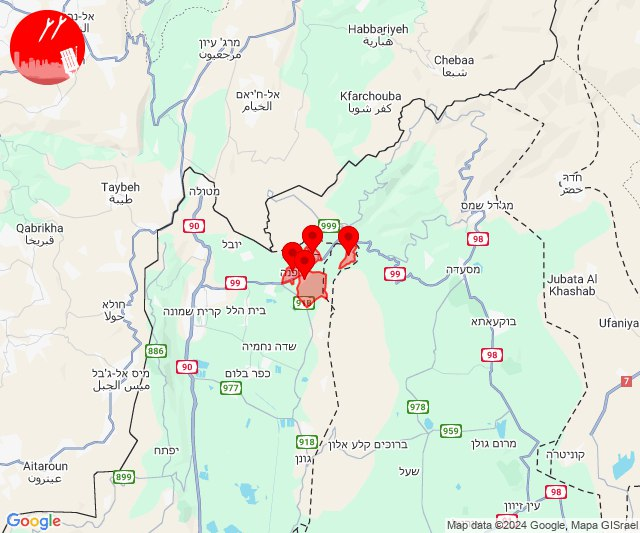

## 09:41

🔴 צבע אדום (24/09/2024):

12:41:
• קו העימות: אביבים (מיידי)

צופר - צבע אדום

## 09:41

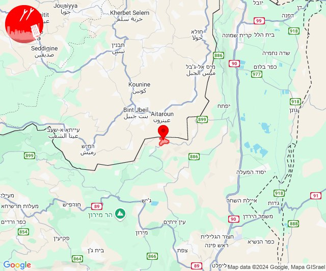

## 10:08

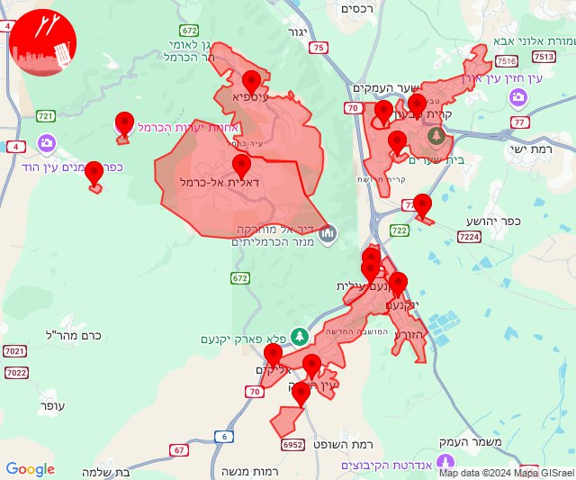

## 10:08

🔴 צבע אדום (24/09/2024):

13:07:
• ואדי ערה: אליקים, יקנעם עילית, אזור תעשייה יקנעם עילית, אזור תעשייה מבוא כרמל, יקנעם המושבה והזורע, עין העמק (דקה וחצי)
• הכרמל: דלית אל כרמל (דקה)

13:08:
• העמקים: אורנים, כפר תקווה, קריית טבעון - בית זייד, תחנת רכבת כפר יהושוע, חוואלד, שער העמקים (דקה)
• הכרמל: עספיא, עין חוד, יערות הכרמל, בית סוהר קישון (דקה)
• המפרץ: כפר המכבי, רמת יוחנן, איבטין, כפר חסידים, רכסים, בית עלמין תל רגב, יגור (דקה)

צופר - צבע אדום

## 10:08

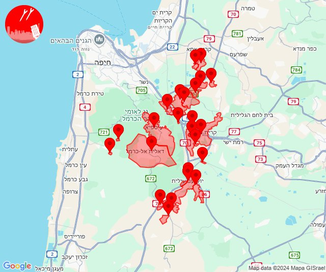

## 10:31

🔴 צבע אדום (24/09/2024):

13:31:
• קו העימות: חניתה, שלומי (מיידי)

צופר - צבע אדום

## 10:31

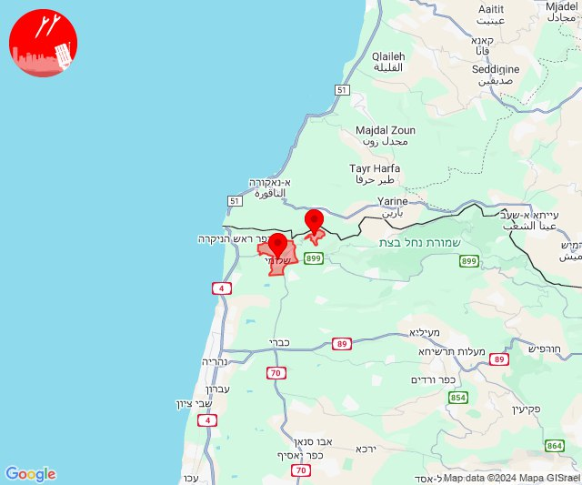

## 10:31

✈️ חדירת כלי טיס עוין (24/09/2024):

13:31:
• קו העימות: מצובה, יערה, אדמית, אילון, גורן, גורנות הגליל, חניתה, יערה, ערב אל עראמשה, עבדון 

צופר - צבע אדום

## 10:31

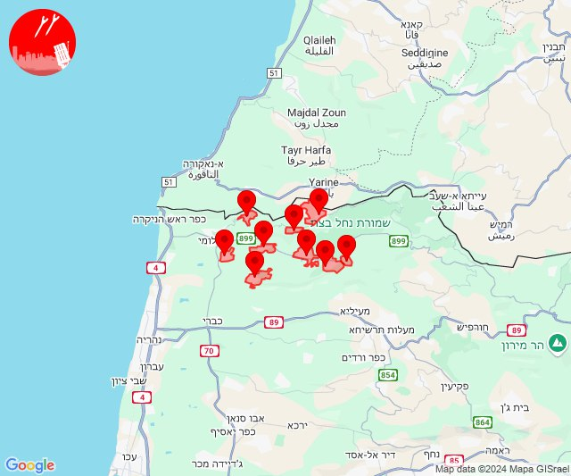

## 10:58

🔴 צבע אדום (24/09/2024):

13:57:
• גליל עליון: ג'וליס, ירכא, אזור תעשייה בר-לב, אחיהוד, ג'דידה מכר, כפר יאסיף, יסעור, כליל (30 שניות, דקה)
• קו העימות: אדמית, אילון, גורן, ערב אל עראמשה, חוות אירוח גורן, יערה, גורנות הגליל, מנות, עבדון (מיידי)

13:58:
• גליל עליון: שייח' דנון, אבו סנאן, אשרת, עמקה, טל - אל (30 שניות)

צופר - צבע אדום

## 10:58

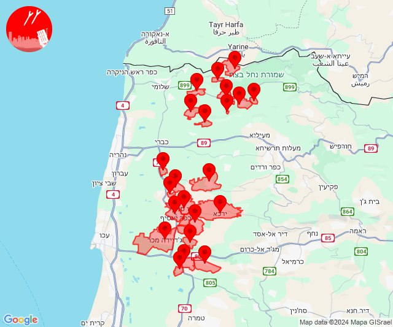

## 11:53

🔴 צבע אדום (24/09/2024):

14:51:
• גליל תחתון: הודיות, לביא, נבי שועייב, ארבל, כפר זיתים (דקה)
• מרכז הגליל: עילבון (דקה)

14:52:
• מרכז הגליל: דיר חנא, טפחות, מסד, מע'אר, בית סוהר צלמון (דקה)
• גליל תחתון: גבעת אבני (דקה)

14:53:
• מרכז הגליל: בועיינה-נוג'ידאת, מצפה נטופה (דקה)

צופר - צבע אדום

## 11:53

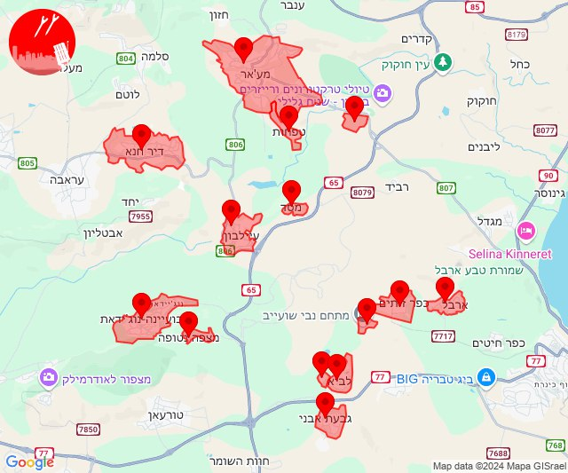

## 12:04

🔴 צבע אדום (24/09/2024):

15:03:
• גליל עליון: אזור תעשייה שער נעמן, אחיהוד, יסעור, ג'דידה מכר, בית העלמין החדש עכו, כפר מסריק, אזור תעשייה בר-לב, עין המפרץ, עכו - אזור תעשייה, בוסתן הגליל, נס עמים, עכו, שומרת, ג'וליס, טל - אל, ירכא, כפר יאסיף, לוחמי הגטאות, אפק (דקה, 30 שניות)
• המפרץ: קריית ביאליק, אזור תעשייה קריית ביאליק, קריית ים, קריית מוצקין, חיפה - קריית חיים ושמואל, כפר ביאליק (דקה)

15:04:
• גליל עליון: ג'דידה מכר, בית העלמין החדש עכו, כפר מסריק, אבו סנאן, עין המפרץ, עכו, עכו - אזור תעשייה, ג'דידה מכר, בית העלמין החדש עכו (30 שניות)

צופר - צבע אדום

## 12:04

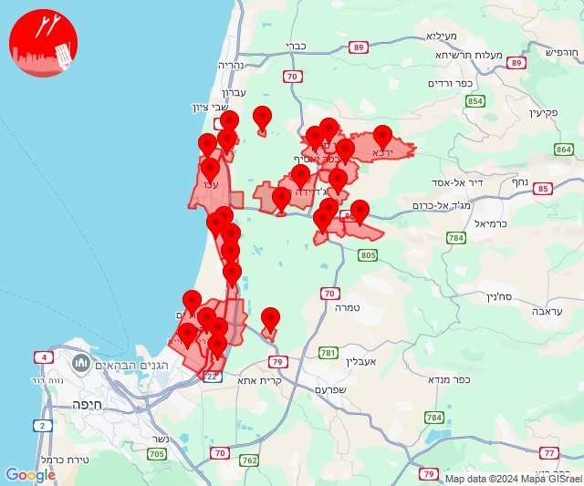

## 12:13

🔴 צבע אדום (24/09/2024):

15:12:
• מרכז הגליל: כפר מנדא, ביר אלמכסור, דמיידה, חנתון, יודפת, כאוכב אבו אלהיג'א, מורשת, מנוף, מרכז אזורי משגב, קורנית, רקפת, שכניה, אזור תעשייה תרדיון, בית רימון, סכנין, עוזייר, רומאנה, רומת אל הייב (דקה)
• העמקים: הושעיה, ציפורי (דקה)

15:13:
• העמקים: אזור תעשייה ציפורית (דקה)
• מרכז הגליל: אשבל (דקה)

צופר - צבע אדום

## 12:13

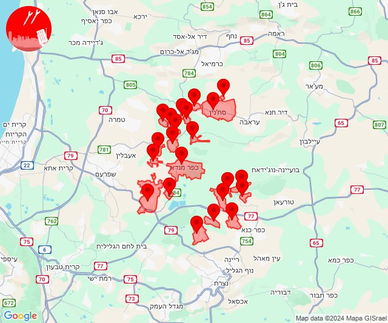

## 12:20

✈️ חדירת כלי טיס עוין (24/09/2024):

15:20:
• קו העימות: יערה 

צופר - צבע אדום

## 12:20

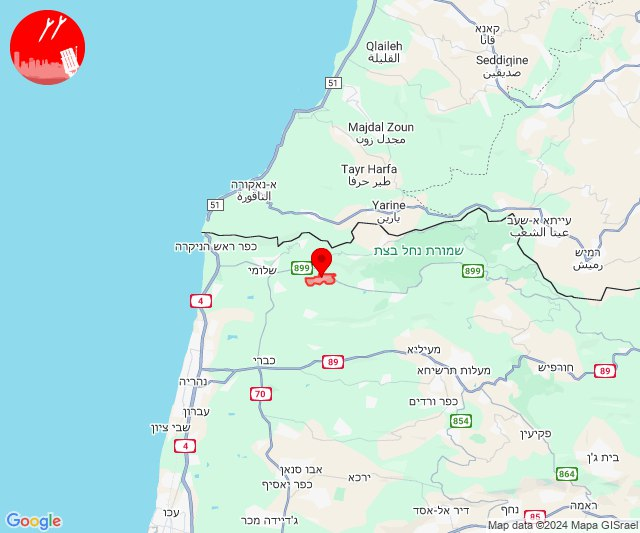

## 12:28

🔴 צבע אדום (24/09/2024):

15:28:
• דרום הגולן: קצרין - אזור תעשייה, קצרין, קדמת צבי (30 שניות, 15 שניות)
• צפון הגולן: מלון פרא (15 שניות)

צופר - צבע אדום

## 12:28

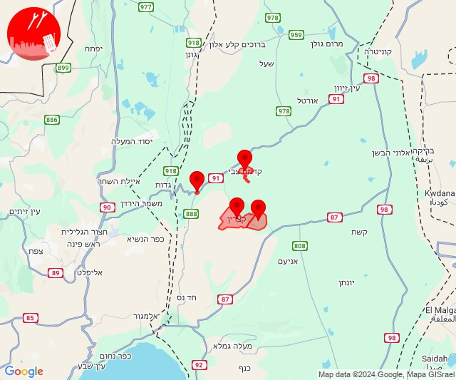

## 12:45

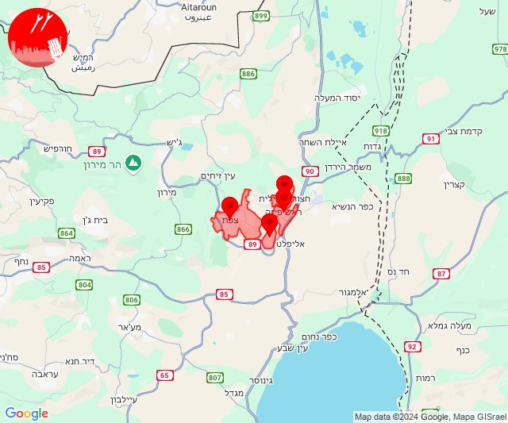

## 12:45

🔴 צבע אדום (24/09/2024):

15:45:
• גליל עליון: צפת - נוף כנרת, חצור הגלילית, צפת - עיר, ראש פינה, צפת - עיר, אליפלט, ביריה, עמוקה, צפת - עכברה, צפת - עיר, חצור הגלילית, ראש פינה, צפת - נוף כנרת, צפת - עיר (30 שניות)
• קו העימות: אזור תעשייה רמת דלתון, דלתון, עלמה, ריחאנייה, רמות נפתלי, כרם בן זמרה, אזור תעשייה רמת דלתון, דלתון (מיידי)

צופר - צבע אדום

## 12:45

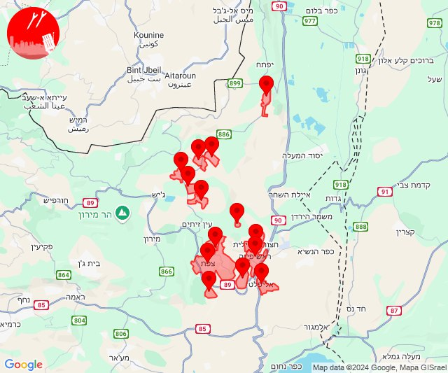

## 14:14

🔴 צבע אדום (24/09/2024):

17:14:
• קו העימות: מרגליות, קריית שמונה (מיידי)

צופר - צבע אדום

## 14:14

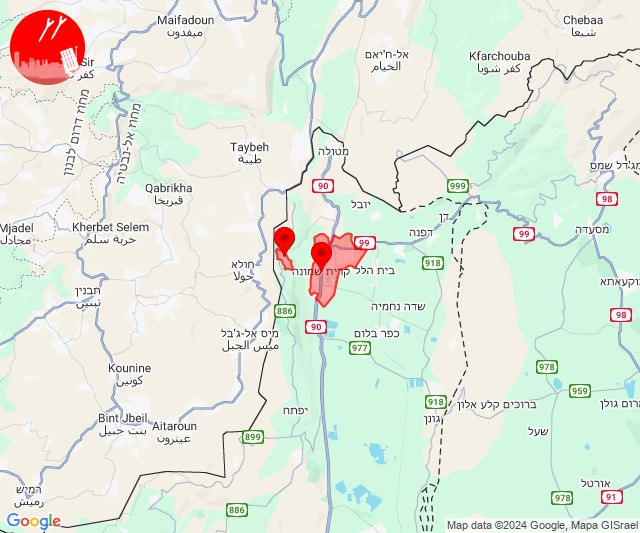

## 14:27

🔴 צבע אדום (24/09/2024):

17:26:
• קו העימות: בצת, לימן, שלומי (מיידי)

17:27:
• קו העימות: בצת, לימן, שלומי, גשר הזיו, מצובה (מיידי)

צופר - צבע אדום

## 14:27

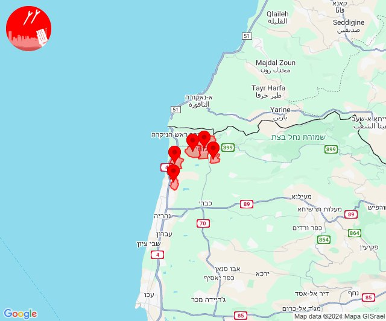

## 14:38

🔴 צבע אדום (24/09/2024):

17:36:
• גליל עליון: צפת - עיר, צפת - נוף כנרת, צפת - עכברה (30 שניות)

17:37:
• קו העימות: כרם בן זמרה, אזור תעשייה רמת דלתון, דלתון, עלמה, אביבים, ג'ש - גוש חלב (מיידי)
• גליל עליון: קדיתא, ביריה, צפת - עיר, ספסופה - כפר חושן, קדיתא (30 שניות)

17:38:
• גליל עליון: צפת - עכברה, צפת - עיר (30 שניות)

צופר - צבע אדום

## 14:38

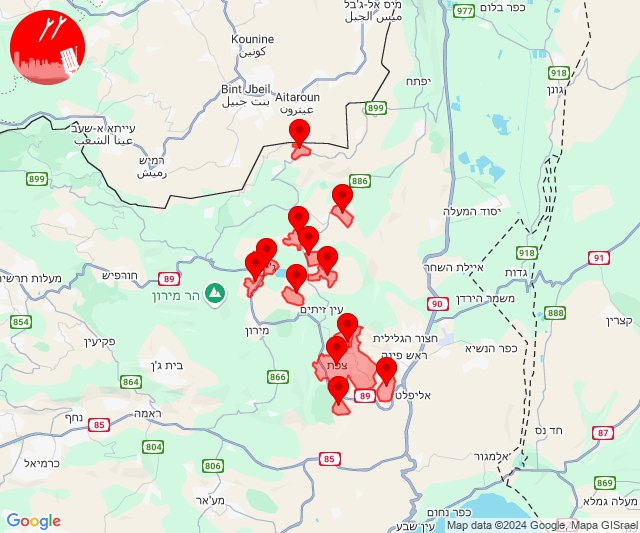

## 15:08

🔴 צבע אדום (24/09/2024):

18:07:
• דרום הגולן: קצרין, קצרין - אזור תעשייה (30 שניות)

18:08:
• צפון הגולן: מלון פרא (15 שניות)
• דרום הגולן: קדמת צבי (15 שניות)
• גליל עליון: רפטינג נהר הירדן (30 שניות)

צופר - צבע אדום

## 15:08

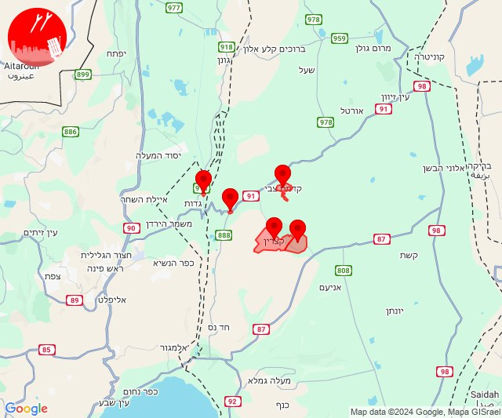

## 15:37

✈️ חדירת כלי טיס עוין (24/09/2024):

18:35:
• קו העימות: ראש הנקרה 

18:36:
• קו העימות: שלומי, ראש הנקרה, חוף בצת 

18:37:
• קו העימות: בצת, איזור תעשייה מילואות צפון, לימן 

צופר - צבע אדום

## 15:37

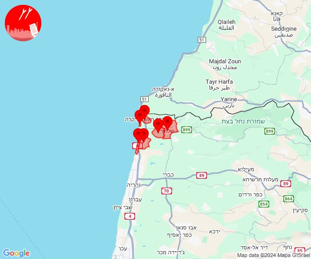

## 15:39

✈️ חדירת כלי טיס עוין (24/09/2024):

18:39:
• קו העימות: גשר הזיו, לימן 

צופר - צבע אדום

## 15:39

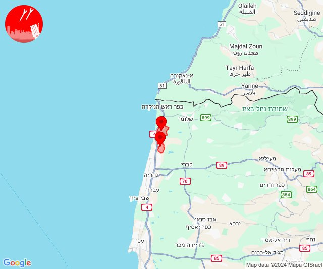

## 16:24

🔴 צבע אדום (24/09/2024):

19:22:
• גליל עליון: צפת - נוף כנרת, צפת - עכברה, צפת - עיר (30 שניות)

19:23:
• גליל עליון: חצור הגלילית, ראש פינה, אזור תעשייה חצור הגלילית, ביריה, צפת - עיר, עמוקה, צפת - נוף כנרת, אליפלט, מחניים, חצור הגלילית, ראש פינה (30 שניות)
• קו העימות: דלתון, אזור תעשייה רמת דלתון (מיידי)

19:24:
• גליל עליון: אזור תעשייה חצור הגלילית, ביריה, צפת - עיר, עמוקה, אזור תעשייה צ.ח.ר, טובא זנגריה, כפר הנשיא, מחניים, מנחת מחניים (30 שניות)
• קו העימות: דלתון (מיידי)

צופר - צבע אדום

## 16:24

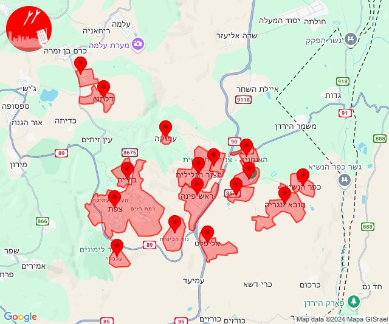

## 16:39

✈️ חדירת כלי טיס עוין (24/09/2024):

19:39:
• הכרמל: נווה ים, עתלית 

צופר - צבע אדום

## 16:39

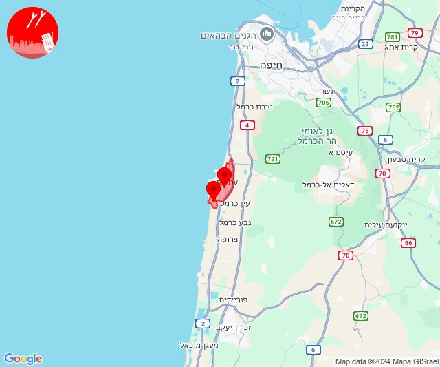

## 16:43

✈️ חדירת כלי טיס עוין (24/09/2024):

19:42:
• הכרמל: עתלית, מגדים 

19:43:
• הכרמל: נווה ים 

צופר - צבע אדום

## 16:43

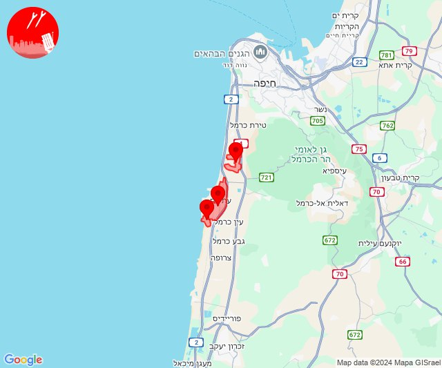

## 16:46

🔴 צבע אדום (24/09/2024):

19:46:
• גליל עליון: בית ג'אן (30 שניות)

צופר - צבע אדום

## 16:46

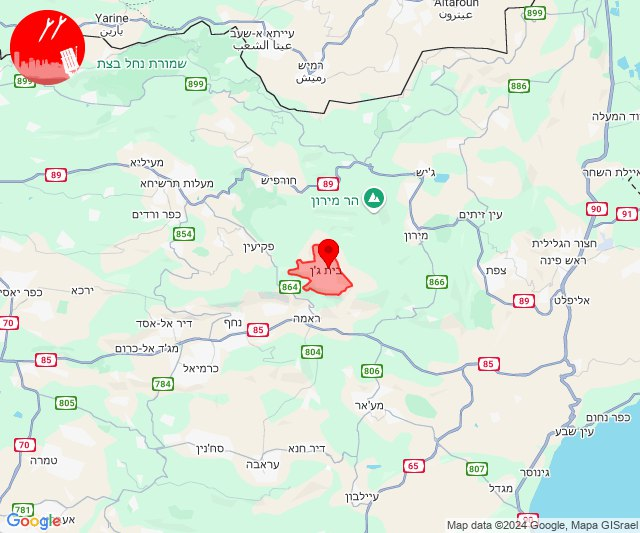

## 16:53

🔴 צבע אדום (24/09/2024):

19:52:
• גליל תחתון: כפר נהר הירדן, שדה אילן, גבעת אבני, הודיות, לביא, אתר ההנצחה גולני (דקה)
• קו העימות: עלמה (מיידי)
• העמקים: אילניה (דקה)

19:53:
• גליל תחתון: נבי שועייב, אזור תעשייה קדמת גליל (דקה)

צופר - צבע אדום

## 16:53

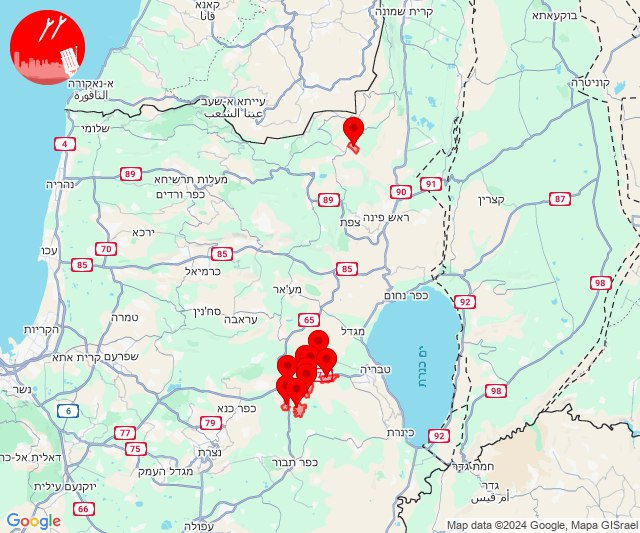

## 21:21

✈️ חדירת כלי טיס עוין (25/09/2024):

00:21:
• ערבה: ספיר 

צופר - צבע אדום

## 21:22

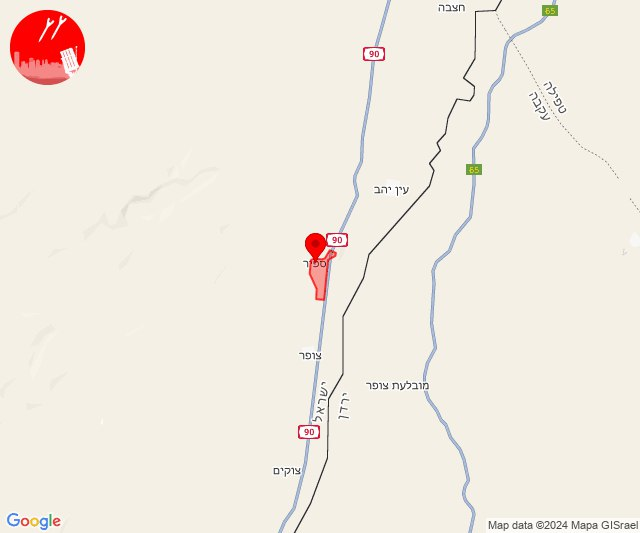

## 22:35

✈️ חדירת כלי טיס עוין (25/09/2024):

01:35:
• דרום הגולן: רמת מגשימים, חספין, נוב, אבני איתן 

צופר - צבע אדום

## 22:35

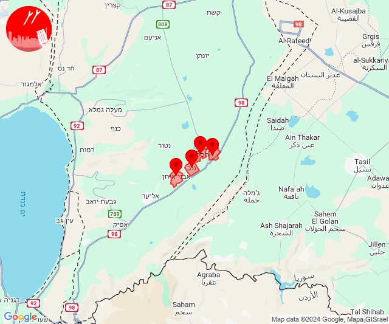

## 22:47

🔴 צבע אדום (25/09/2024):

01:47:
• קו העימות: בית הלל, כפר גלעדי, כפר יובל, מטולה, מנרה, מעיין ברוך, מרגליות, משגב עם, קריית שמונה, תל חי (מיידי)

צופר - צבע אדום

## 22:47

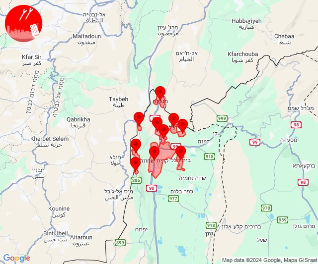

