# Alerts for 2024-09-25

## 00:01

✈️ חדירת כלי טיס עוין (25/09/2024):

03:00:
• צפון הגולן: עין זיוון, מרום גולן 

03:01:
• צפון הגולן: מרום גולן, עין זיוון 

צופר - צבע אדום

## 00:01

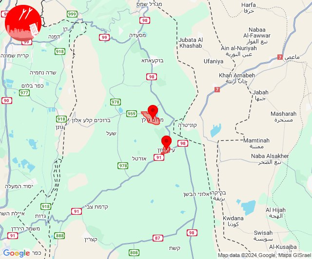

## 03:32

🔴 צבע אדום (25/09/2024):

06:30:
• דן: תל אביב - מרכז העיר, תל אביב - עבר הירקון, מתחם פי גלילות, רמת גן - מערב, סינמה סיטי גלילות (דקה וחצי)

06:31:
• מנשה: תלמי אלעזר (דקה וחצי)

06:32:
• שרון: אביחיל, נתניה - מזרח, נתניה - מערב, שושנת העמקים, בני דרור, פרדסיה, צור משה, קדימה צורן, אבן יהודה, אודים, בית יהושע, געש, יקום, כפר נטר, מכון וינגייט, תל יצחק, אזור תעשייה כפר יונה, בית חרות, בית ינאי, בית יצחק - שער חפר, ביתן אהרן, בת חן, גבעת שפירא, גנות הדר, הדר עם, המרכז האקדמי רופין, חבצלת השרון וצוקי ים, חופית, כפר ויתקין, כפר חיים, כפר ידידיה, כפר יונה, כפר מונש, מעברות, משמר השרון, נורדיה, נעורים (דקה וחצי)

צופר - צבע אדום

## 03:32

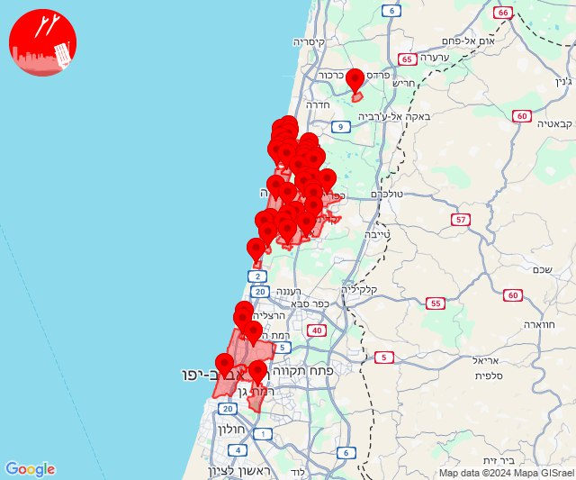

## 05:49

✈️ חדירת כלי טיס עוין (25/09/2024):

08:49:
• דרום הגולן: אלי עד 

צופר - צבע אדום

## 05:49

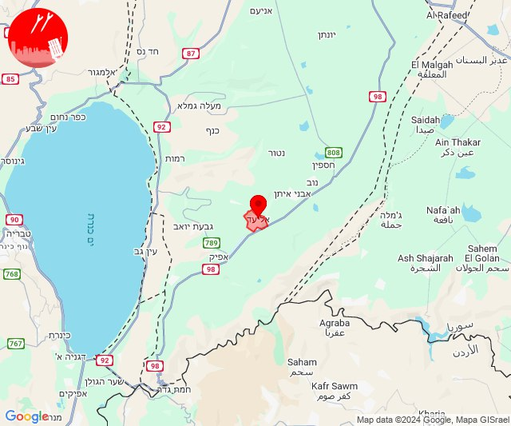

## 06:08

🔴 צבע אדום (25/09/2024):

09:07:
• מנשה: זכרון יעקב, עמיקם (דקה וחצי)
• ואדי ערה: אזור תעשייה מבוא כרמל, אליקים, גבעת ניל''י, גלעד, דליה, יקנעם עילית, עין העמק, עין השופט, רמות מנשה, רמת השופט (דקה וחצי)

09:08:
• הכרמל: בת שלמה, גבע כרמל, דור, הבונים, כרם מהר''ל, מאיר שפיה, מרכז מיר''ב, נחשולים, עופר, עין איילה, פוריידיס, צרופה, דלית אל כרמל (דקה)
• ואדי ערה: אזור תעשייה יקנעם עילית (דקה וחצי)

צופר - צבע אדום

## 06:08

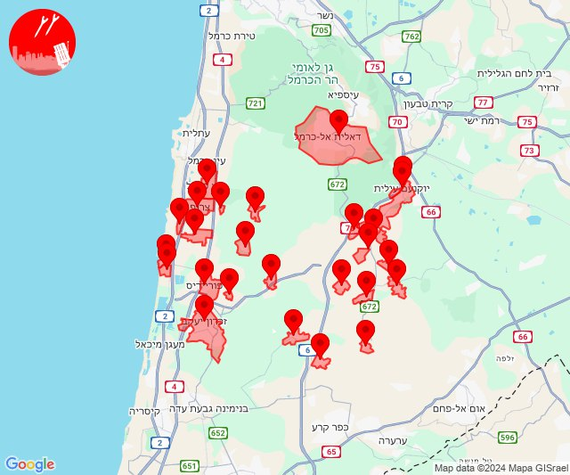

## 06:27

✈️ חדירת כלי טיס עוין (25/09/2024):

09:27:
• גליל תחתון: טבריה 

צופר - צבע אדום

## 06:27

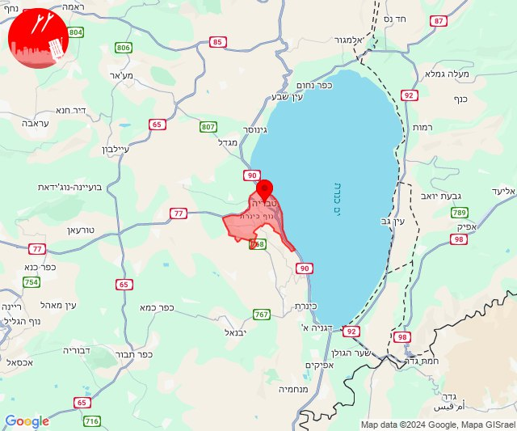

## 07:33

🔴 צבע אדום (25/09/2024):

10:33:
• קו העימות: נטועה, שתולה, בית ספר שדה מירון, מתת, סאסא (מיידי)

צופר - צבע אדום

## 07:33

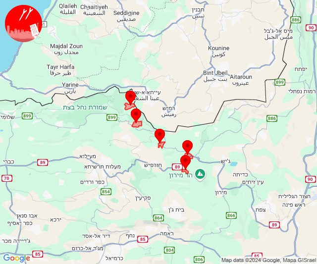

## 08:02

🔴 צבע אדום (25/09/2024):

11:00:
• גליל עליון: ביריה, צפת - עיר (30 שניות)
• קו העימות: אזור תעשייה רמת דלתון, דלתון, כרם בן זמרה, עלמה, ריחאנייה (מיידי)

11:01:
• קו העימות: אביבים, ג'ש - גוש חלב, אזור תעשייה רמת דלתון, דלתון, כרם בן זמרה, ריחאנייה (מיידי)
• גליל עליון: עמוקה, קדיתא, חצור הגלילית, כפר שמאי, ספסופה - כפר חושן, ראש פינה, צפת - עכברה, ביריה, צפת - עיר, צפת - נוף כנרת (30 שניות)

11:02:
• גליל עליון: חצור הגלילית, עמוקה, ראש פינה, אליפלט, צפת - עיר, אזור תעשייה חצור הגלילית, ביריה, מחניים, צפת - נוף כנרת, אזור תעשייה צ.ח.ר, טובא זנגריה (30 שניות)

צופר - צבע אדום

## 08:02

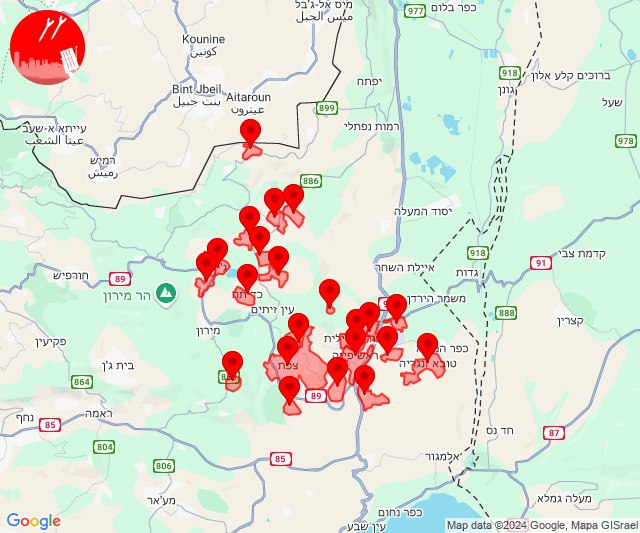

## 10:39

🔴 צבע אדום (25/09/2024):

13:35:
• קו העימות: סער, גשר הזיו, נהריה, איזור תעשייה מילואות צפון, לימן, בצת, מצובה, שלומי, ראש הנקרה (מיידי, 15 שניות)

13:36:
• מרכז הגליל: ביר אלמכסור, דמיידה, אעבלין, שפרעם (דקה)

13:37:
• מרכז הגליל: מצפה אבי''ב, טמרה, מורשת, כאוכב אבו אלהיג'א, מנוף, שכניה, חנתון (דקה)
• העמקים: אלון הגליל, חג'אג'רה, כעביה, בסמת טבעון, הרדוף, כעביה טבאש, כפר טבאש, נופית, עדי, ראס עלי, ח'וואלד, סואעד חמירה (דקה)
• גליל עליון: גיתה, ינוח ג'ת, ירכא, כישור, פלך, תובל (30 שניות)

13:38:
• מרכז הגליל: כפר מנדא, קורנית (דקה)

13:39:
• מרכז הגליל: ביר אלמכסור (דקה)

צופר - צבע אדום

## 10:39

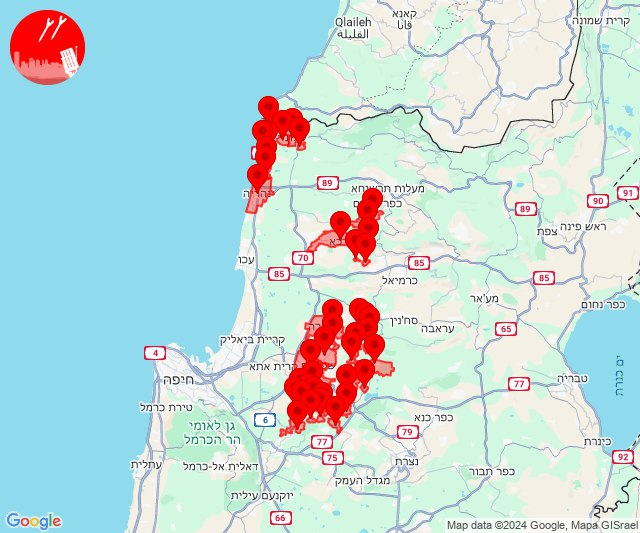

## 12:09

🔴 צבע אדום (25/09/2024):

15:09:
• קו העימות: גונן, להבות הבשן (15 שניות)

צופר - צבע אדום

## 12:09

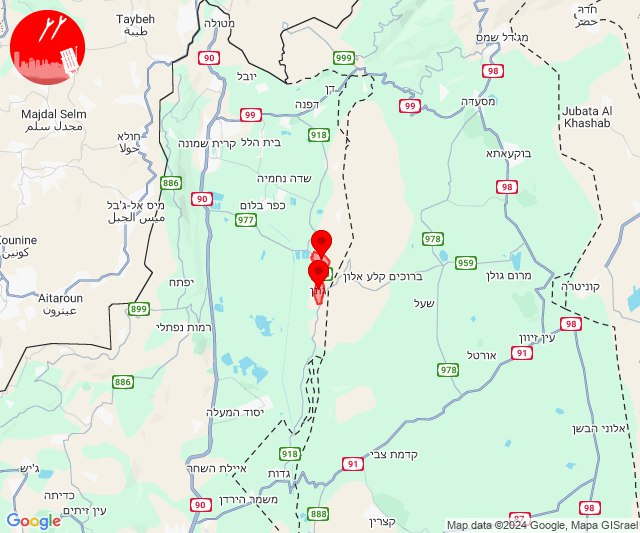

## 12:29

🔴 צבע אדום (25/09/2024):

15:28:
• קו העימות: להבות הבשן, כפר בלום, קריית שמונה (15 שניות, מיידי)

15:29:
• קו העימות: מנרה (מיידי)

צופר - צבע אדום

## 12:29

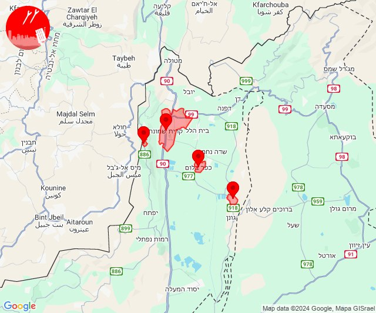

## 17:19

✈️ חדירת כלי טיס עוין (25/09/2024):

20:19:
• אילת: אילת 

צופר - צבע אדום

## 17:19

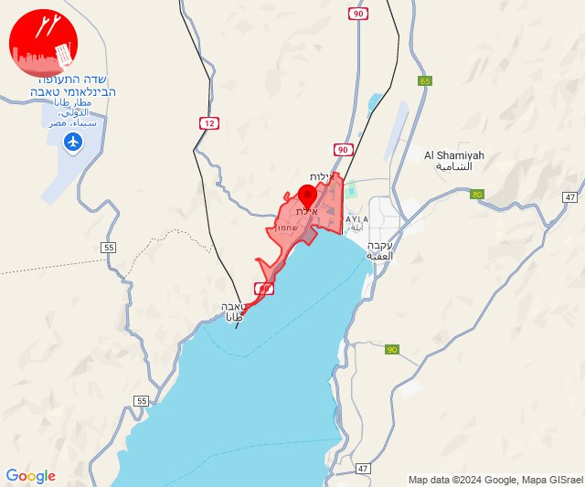

## 19:13

🔴 צבע אדום (25/09/2024):

22:13:
• עוטף עזה: נחל עוז (15 שניות)

צופר - צבע אדום

## 19:13

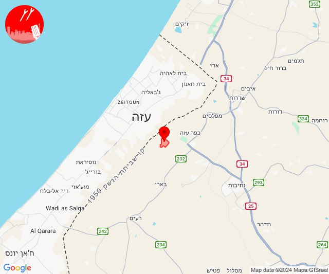

