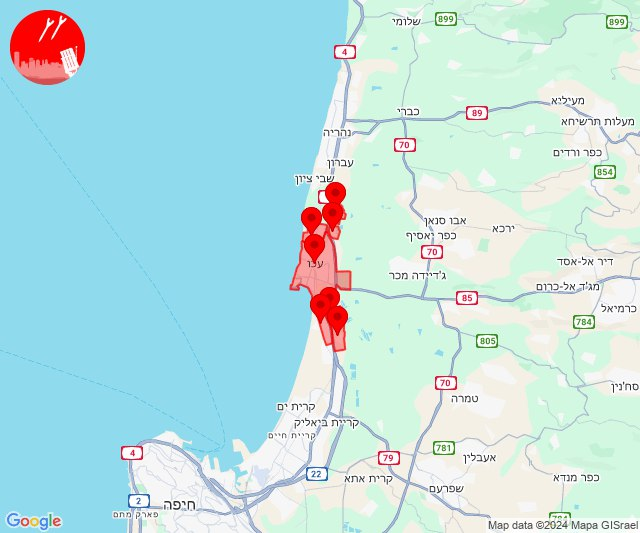
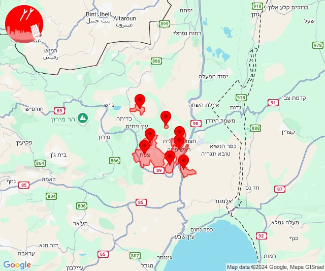
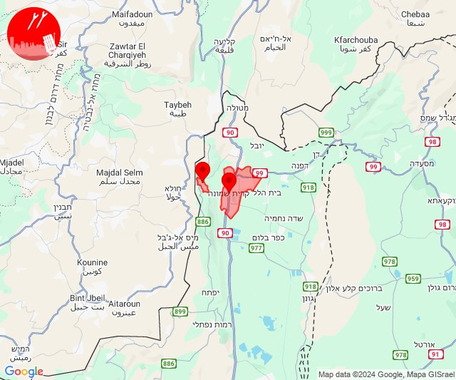
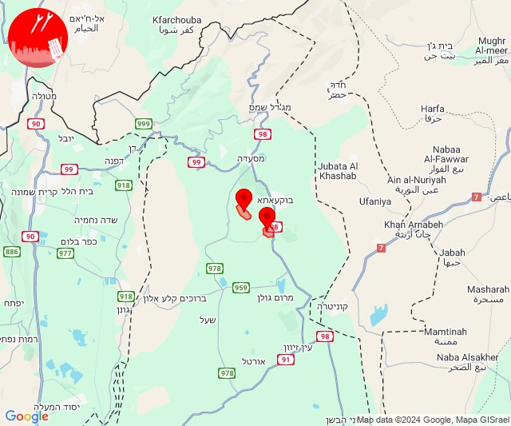
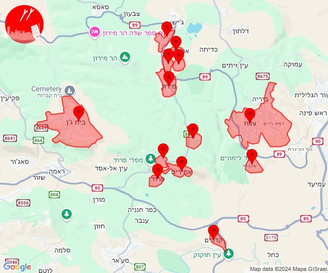
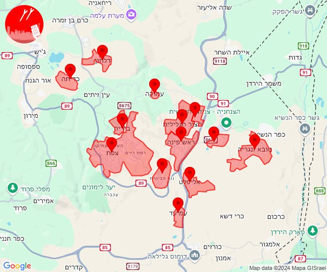
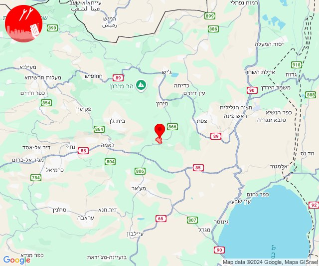
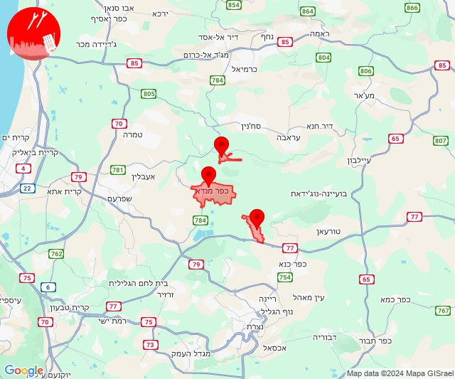
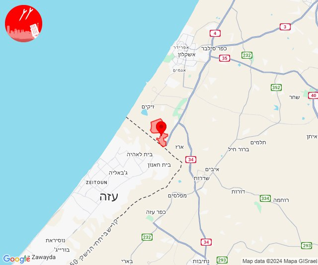
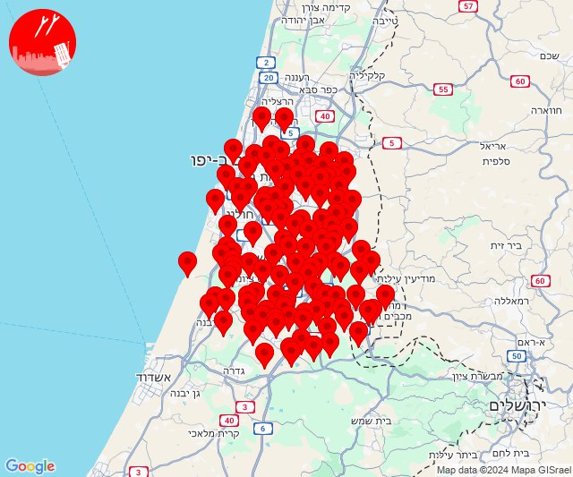

# Alerts for 2024-09-26

## 07:46

🔴 צבע אדום (26/09/2024):

10:45:
• גליל עליון: עכו (30 שניות)

10:46:
• גליל עליון: עכו - אזור תעשייה, עין המפרץ, כפר מסריק, בוסתן הגליל, שומרת, לוחמי הגטאות, עכו, עכו - אזור תעשייה (30 שניות)

צופר - צבע אדום

## 07:46

## 10:25

🔴 צבע אדום (26/09/2024):

13:25:
• גליל עליון: צפת - נוף כנרת, אליפלט, ראש פינה, ביריה, חצור הגלילית, צפת - עיר, עמוקה (30 שניות)
• קו העימות: דלתון (מיידי)

צופר - צבע אדום

## 10:25

## 10:37

🔴 צבע אדום (26/09/2024):

13:36:
• קו העימות: קריית שמונה, מרגליות (מיידי)

13:37:
• קו העימות: קריית שמונה (מיידי)

צופר - צבע אדום

## 10:37

## 12:38

🔴 צבע אדום (26/09/2024):

15:38:
• צפון הגולן: אודם, אל רום (מיידי)

צופר - צבע אדום

## 12:38

## 13:08

🔴 צבע אדום (26/09/2024):

16:06:
• גליל עליון: כפר שמאי, אמירים, שפר (30 שניות)

16:07:
• גליל עליון: מירון, אור הגנוז, בר יוחאי, מרכז אזורי מרום גליל, ספסופה - כפר חושן, פרוד, אמירים, כפר שמאי, שפר, מירון, קדרים (30 שניות, דקה)

16:08:
• גליל עליון: בית ג'אן, פרוד, צפת - עכברה, צפת - עיר, בר יוחאי, כפר שמאי, אמירים, שפר (30 שניות)

צופר - צבע אדום

## 13:08

## 15:03

🔴 צבע אדום (26/09/2024):

18:01:
• גליל עליון: חצור הגלילית, ראש פינה, צפת - נוף כנרת, צפת - עיר, עמוקה, אליפלט (30 שניות)

18:02:
• גליל עליון: ביריה, קדיתא, אזור תעשייה חצור הגלילית, אזור תעשייה צ.ח.ר, טובא זנגריה, חצור הגלילית, ראש פינה, צפת - נוף כנרת, צפת - עיר, עמוקה, אליפלט, עמיעד, ביריה, אזור תעשייה חצור הגלילית (30 שניות)
• קו העימות: דלתון, דלתון (מיידי)

18:03:
• גליל עליון: חצור הגלילית, ראש פינה, צפת - עיר, עמוקה, צפת - נוף כנרת, אליפלט (30 שניות)

צופר - צבע אדום

## 15:03

## 15:26

🔴 צבע אדום (26/09/2024):

18:26:
• גליל עליון: שפר (30 שניות)

צופר - צבע אדום

## 15:26

## 16:09

🔴 צבע אדום (26/09/2024):

19:08:
• מרכז הגליל: כפר מנדא, רומת אל הייב (דקה)

19:09:
• מרכז הגליל: יודפת (דקה)

צופר - צבע אדום

## 16:09

## 17:16

🔴 צבע אדום (26/09/2024):

20:16:
• עוטף עזה: נתיב העשרה (15 שניות)

צופר - צבע אדום

## 17:16

## 21:41

🔴 צבע אדום (27/09/2024):

00:40:
• דן: תל אביב - דרום העיר ויפו, תל אביב - מזרח, תל אביב - מרכז העיר, תל אביב - עבר הירקון, אור יהודה, אזור, בני ברק, גבעת שמואל, גבעתיים, גת רימון, חולון, יהוד מונוסון, מעש, מקווה ישראל, סביון, פתח תקווה, קריית אונו, רמת גן - מזרח, רמת גן - מערב, גני תקווה, מגשימים, בית עלמין מורשה, בת ים, כפר סירקין (דקה וחצי)
• ירקון: גמזו, כפר דניאל, בארות יצחק, בני עטרות, גבעת כ''ח, מזור, נופך, נחלים, רינתיה, בית נחמיה, בית עריף, ברקת, חדיד, טירת יהודה, כפר טרומן, שוהם, איירפורט סיטי, מבוא מודיעים, מודיעין - ליגד סנטר, אלעד, נחשונים, אזור תעשייה חבל מודיעין, נאות קדומים (דקה וחצי)
• השפלה: ראשון לציון - מזרח, אזור תעשייה נשר - רמלה, אזור תעשייה רגמ, אחיסמך, באר יעקב, בן שמן, גינתון, כפר נוער בן שמן, לוד, ניר צבי, רמלה, תעשיון צריפין, אחיעזר, בית דגן, זיתן, חמד, חניון הנתיב מהיר, יגל, כפר חב''ד, משמר השבעה, צפריה, גנות, גיבתון, גן שלמה, נצר סרני, פארק תעשיות פלמחים, ראשון לציון - מערב, רחובות, אירוס, בית חנן, בית עובד, גן שורק, ישרש, מצליח, נטעים, נס ציונה, עיינות, בית חשמונאי, בית עוזיאל, גזר, גני הדר, גני יוחנן, יד רמב''ם, יציץ, כפר ביל''ו, כפר שמואל, נען, סתריה, עזריה, פדיה, פתחיה, קריית עקרון, רמות מאיר (דקה וחצי)
• לכיש: פלמחים, גבעת ברנר (דקה וחצי)

00:41:
• ירקון: מודיעין מכבים רעות, נוף איילון, שעלבים, מודיעין - ישפרו סנטר (דקה וחצי)
• לכיש: בית אלעזרי, יבנה, כפר הנגיד, בית גמליאל, מפעל אגריגדה (דקה)
• השפלה: גאליה, חולדה, יסודות, כפר בן נון, כרמי יוסף, מזכרת בתיה, משמר איילון, משמר דוד, נצר חזני (דקה, דקה וחצי)
• שפלת יהודה: בקוע, מיני ישראל - נחשון (דקה וחצי)

צופר - צבע אדום

## 21:41

