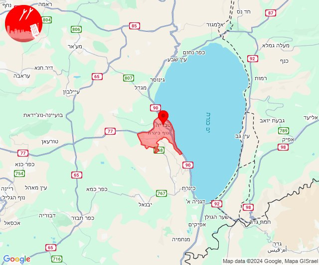
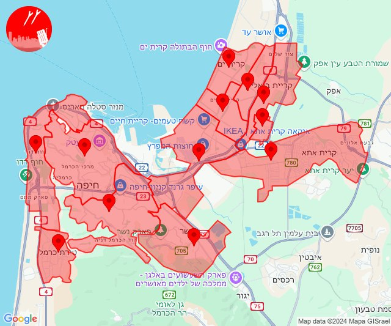
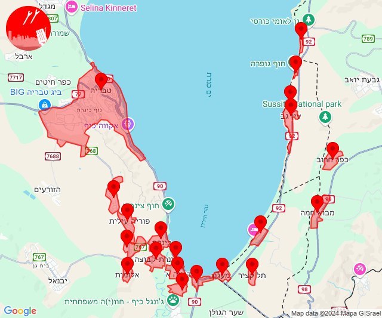
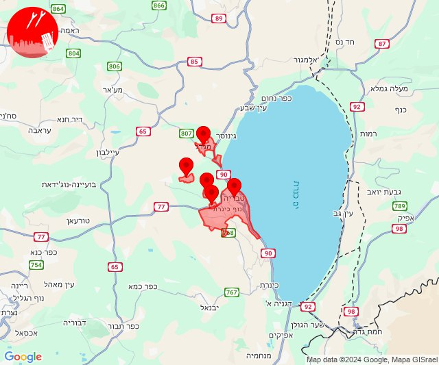
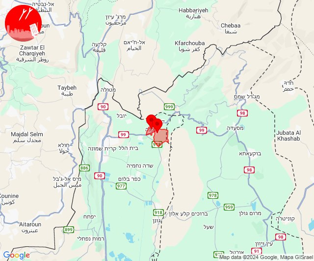
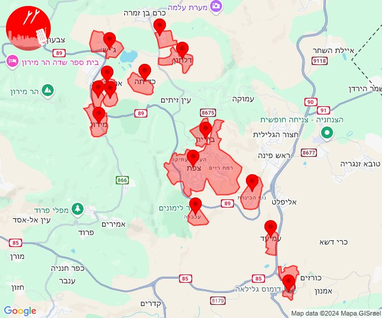
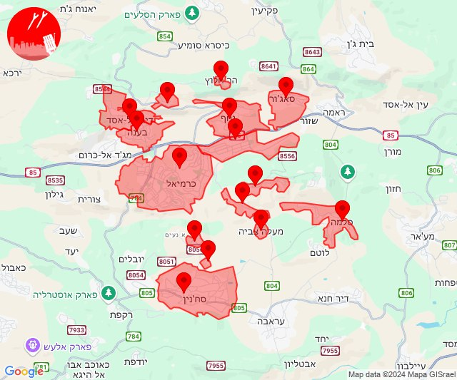
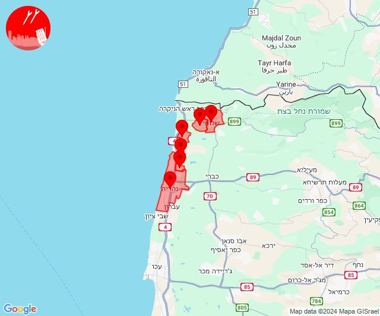
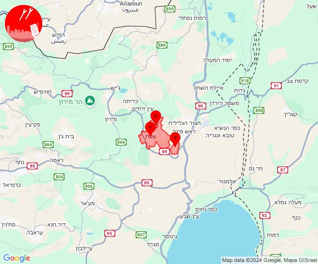
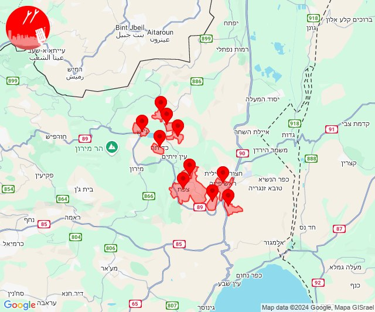

# Alerts for 2024-09-27

## 04:26

🔴 צבע אדום (27/09/2024):

07:26:
• גליל תחתון: טבריה (דקה)

צופר - צבע אדום

## 04:26

## 05:34

🔴 צבע אדום (27/09/2024):

08:33:
• המפרץ: חיפה - כרמל, הדר ועיר תחתית, חיפה - מערב, חיפה - מפרץ, חיפה - נווה שאנן ורמות כרמל, חיפה - קריית חיים ושמואל, קריית אתא, קריית ים (דקה)
• מנשה: נשר (דקה)

08:34:
• המפרץ: קריית ביאליק, קריית מוצקין, כפר ביאליק (דקה)
• מנשה: טירת כרמל (דקה)

צופר - צבע אדום

## 05:34

## 06:30

🔴 צבע אדום (27/09/2024):

09:29:
• גליל תחתון: טבריה (דקה)

09:30:
• גליל תחתון: אלומות, בית ירח, דגניה א, דגניה ב, כינרת מושבה, כינרת קבוצה, פוריה כפר עבודה, פוריה נווה עובד, פוריה עילית (דקה)
• דרום הגולן: האון, חוף גופרה, חוף סוסיתא, עין גב, חוף כורסי, לבנון, חלוקים, כפר חרוב, מבוא חמה, מעגן, צמח, תל קציר (30 שניות, 15 שניות)

צופר - צבע אדום

## 06:30

## 07:00

🔴 צבע אדום (27/09/2024):

09:59:
• גליל תחתון: טבריה, מצפה, כפר חיטים, ארבל (דקה)

10:00:
• גליל תחתון: מגדל (דקה)

צופר - צבע אדום

## 07:00

## 12:49

🔴 צבע אדום (27/09/2024):

15:49:
• קו העימות: דפנה, שאר ישוב (מיידי)

צופר - צבע אדום

## 12:49

## 19:04

🔴 צבע אדום (27/09/2024):

22:03:
• גליל עליון: צפת - עיר, צפת - עכברה, ביריה, אור הגנוז, בר יוחאי, קדיתא, מירון, מרכז אזורי מרום גליל, צפת - נוף כנרת, כורזים ורד הגליל, עמיעד, צפת - עיר (30 שניות)
• קו העימות: אזור תעשייה רמת דלתון, ג'ש - גוש חלב, דלתון (מיידי)

22:04:
• גליל עליון: צפת - עכברה, ביריה, קדיתא, צפת - נוף כנרת (30 שניות)
• קו העימות: דלתון (מיידי)

צופר - צבע אדום

## 19:04

## 19:22

🔴 צבע אדום (27/09/2024):

22:21:
• מרכז הגליל: חוסנייה, מעלה צביה, סלמה, אשחר, סכנין, אשבל (דקה)
• גליל עליון: מכמנים, כרמיאל, אזור תעשייה כרמיאל (30 שניות)

22:22:
• גליל עליון: בענה, דיר אל-אסד, לבון, נחף, סאג'ור, כרמיאל, אזור תעשייה כרמיאל, הר חלוץ (30 שניות)

צופר - צבע אדום

## 19:22

## 19:25

🔴 צבע אדום (27/09/2024):

22:24:
• קו העימות: נהריה, סער, גשר הזיו (15 שניות, מיידי)

22:25:
• קו העימות: בצת, שלומי, לימן (מיידי)

צופר - צבע אדום

## 19:25

## 22:23

🔴 צבע אדום (28/09/2024):

01:23:
• גליל עליון: צפת - נוף כנרת, צפת - עיר, ביריה (30 שניות)

צופר - צבע אדום

## 22:23

## 22:26

🔴 צבע אדום (28/09/2024):

01:26:
• גליל עליון: צפת - נוף כנרת, צפת - עיר, קדיתא, אליפלט, ביריה, ראש פינה (30 שניות)
• קו העימות: אזור תעשייה רמת דלתון, דלתון, ג'ש - גוש חלב, כרם בן זמרה (מיידי)

צופר - צבע אדום

## 22:26

