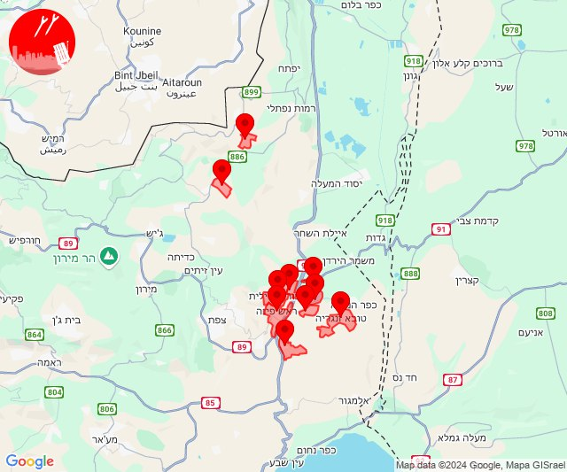

# Alerts for 2024-09-28

## 03:18

🔴 צבע אדום (28/09/2024):

06:17:
• גליל עליון: אזור תעשייה חצור הגלילית, אזור תעשייה צ.ח.ר, טובא זנגריה, ראש פינה, חצור הגלילית, מנחת מחניים (30 שניות)

06:18:
• גליל עליון: אליפלט, מחניים (30 שניות)
• קו העימות: דישון, עלמה (מיידי)

צופר - צבע אדום

## 03:18

## 04:35

🔴 צבע אדום (28/09/2024):

07:34:
• שומרון: בית אל, בית אריה, חלמיש, טלמון, נחליאל, עטרת, עפרה, פדואל, חרשה, כרם רעים, נריה, עופרים (דקה וחצי)

07:35:
• שומרון: עלי זהב (דקה וחצי)

צופר - צבע אדום

## 04:35

## 05:05

🔴 צבע אדום (28/09/2024):

07:59:
• גליל עליון: אזור תעשייה בר-לב, אחיהוד, יסעור, עכו - אזור תעשייה, אפק, ג'דידה מכר, כרמיאל, מג'דל כרום, צורית גילון, בית העלמין החדש עכו, ג'וליס, טל - אל, ירכא, פלך, תובל (דקה, 30 שניות)
• מרכז הגליל: אזור תעשייה טמרה, אעבלין, דמיידה, טמרה, יובלים, יודפת, יעד, כאבול, כאוכב אבו אלהיג'א, כפר מנדא, מורשת, מנוף, מצפה אבי''ב, מרכז אזורי משגב, עצמון - שגב, ערב אל נעים, קורנית, רקפת, שורשים, שכניה, שעב, אבטליון, אזור תעשייה תרדיון, אשבל, אשחר, בית רימון, סכנין, עוזייר, עראבה, רומאנה, רומת אל הייב, ביר אלמכסור, חנתון, שפרעם, בועיינה-נוג'ידאת, טורעאן (דקה, 30 שניות)
• העמקים: הושעיה, כפר כנא, אזור תעשייה ציפורית (דקה)

08:01:
• קו העימות: אביבים, אבירים, אבן מנחם, אדמית, אילון, אלקוש, ברעם, גורן, גורנות הגליל, דוב''ב, זרעית, חניתה, יערה, יראון, מתת, נטועה, סאסא, ערב אל עראמשה, פסוטה, שומרה, שתולה, הילה, חוות אירוח גורן, חוסן, כפר ורדים, מעונה, מעיליא, מעלות תרשיחא, אזור תעשייה רמת דלתון, בית ספר שדה מירון, ג'ש - גוש חלב, געתון, דלתון, חורפיש, יחיעם, כרם בן זמרה, מנות, נווה זיו, עבדון, עין יעקב, פקיעין החדשה, פקיעין, צבעון, צוריאל, ריחאנייה (מיידי, 15 שניות)
• גליל עליון: כמון, מכמנים, אזור תעשייה כרמיאל, בית ג'אן, בענה, דיר אל-אסד, הר חלוץ, חרשים, כרמיאל, לבון, מג'דל כרום, נחף, סאג'ור, עין אל אסד, ראמה, שזור, אור הגנוז, בר יוחאי, גיתה, ינוח ג'ת, ירכא, כישור, כליל, כסרא סמיע, כפר שמאי, לפידות, מגדל תפן, מירון, מרכז אזורי מרום גליל, ספסופה - כפר חושן, קדיתא, שפר, תובל (30 שניות)
• מרכז הגליל: מורן, ראס אל-עין (דקה)

08:02:
• ואדי ערה: אזור תעשייה מבוא כרמל, גלעד, דליה, מדרך עוז, משמר העמק, עין העמק, עין השופט, קיבוץ מגידו, רמות מנשה, רמת השופט, אום אל פחם, אל עריאן, גבעת עוז, מועאוויה, מי עמי, מעלה עירון, ערערה, בית סוהר מגידו, אליקים (דקה וחצי)
• גליל עליון: עכו - אזור תעשייה (30 שניות)
• שומרון: חיננית (דקה וחצי)
• העמקים: ישובי אומן, מרכז חבר, רם און (דקה)

08:03:
• העמקים: היוגב (דקה)

08:04:
• העמקים: אזור תעשייה אלון התבור, אחוזת ברק, דברת, דחי, מרחביה מושב, מרחביה קיבוץ, נין, סולם, עפולה, אורנים, אכסאל, אלון הגליל, אלוני אבא, אלונים, בית לחם הגלילית, בית שערים, בלפוריה, בסמת טבעון, גבעת אלה, גבת, גניגר, הושעיה, הסוללים, הרדוף, זרזיר, חג'אג'רה, יפיע, יפעת, כעביה טבאש, כעביה, כפר גדעון, כפר החורש, כפר טבאש, כפר יהושע, כפר כנא, כפר תקווה, מגדל העמק, מזרע, מנשית זבדה, משהד, נהלל, נוף הגליל, נופית, נצרת, עדי, עילוט, עין מאהל, ציפורי, קריית טבעון - בית זייד, ראס עלי, ריינה, רמת דוד, רמת ישי, שדה יעקב, שמשית, שער העמקים, שריד, תל עדשים, תמרת, יזרעאל, ישובי יעל, דבוריה, כפר ברוך, תחנת רכבת כפר ברוך, אזור תעשייה מבואות הגלבוע, אזור תעשייה ציפורית, ח'וואלד, חוואלד, סואעד חמירה, תחנת רכבת כפר יהושוע (דקה)
• המפרץ: איבטין, יגור, כפר חסידים, רכסים, בית עלמין תל רגב (דקה)
• מרכז הגליל: ביר אלמכסור, דמיידה, חנתון, כפר מנדא, שפרעם, בית רימון, עוזייר, רומאנה, רומת אל הייב (דקה)
• הכרמל: דלית אל כרמל, עספיא, בית סוהר קישון (דקה)
• ואדי ערה: אזור תעשייה יקנעם עילית, יקנעם המושבה והזורע, יקנעם עילית (דקה וחצי)

08:05:
• הכרמל: בת שלמה (דקה)
• העמקים: ישובי אומן, מוקיבלה, מרכז חבר, רם און (דקה)
• מנשה: אביאל, אלוני יצחק, גבעת עדה, כפר גליקסון, עמיקם, ברקאי, אזור תעשייה רגבים (דקה וחצי)
• ואדי ערה: אזור תעשייה מבוא כרמל, גבעת ניל''י, גלעד, דליה, מדרך עוז, משמר העמק, עין העמק, עין השופט, קיבוץ מגידו, רגבים, רמות מנשה, רמת השופט, אום אל פחם, אום אל קוטוף, אל עריאן, ברטעה, גבעת עוז, חריש, כפר קרע, מועאוויה, מי עמי, מעלה עירון, מצפה אילן, עין אל סהלה, ערערה, בית סוהר מגידו, קציר (דקה וחצי)
• שומרון: אזור תעשייה שחק, ריחן, שקד, טל מנשה (דקה וחצי)

צופר - צבע אדום

## 05:05

## 06:00

🔴 צבע אדום (28/09/2024):

09:00:
• העמקים: אלוני אבא, כעביה טבאש, כפר טבאש, בית לחם הגלילית, חג'אג'רה (דקה)

צופר - צבע אדום

## 06:01

🔴 צבע אדום (28/09/2024):

09:00:
• העמקים: אלוני אבא, כעביה טבאש, כפר טבאש, בית לחם הגלילית, חג'אג'רה, בסמת טבעון (דקה)

09:01:
• המפרץ: כפר המכבי, קריית אתא, רמת יוחנן, רכסים, איבטין, בית עלמין תל רגב (דקה)
• העמקים: אלונים, רמת ישי, אלון הגליל, הסוללים, הרדוף, זרזיר, כעביה, נופית, עדי, קריית טבעון - בית זייד, ראס עלי, ח'וואלד, חוואלד, סואעד חמירה, בית שערים, גבעת אלה, גבת, יפעת, כפר יהושע, מגדל העמק, מנשית זבדה, נהלל, עילוט, רמת דוד, שמשית, תמרת (דקה)
• מרכז הגליל: אעבלין, ביר אלמכסור, חנתון, שפרעם (דקה)

צופר - צבע אדום

## 06:01

## 06:36

🔴 צבע אדום (28/09/2024):

09:35:
• גליל עליון: עכו - אזור תעשייה, אפק (30 שניות, דקה)
• מרכז הגליל: אזור תעשייה טמרה, אעבלין, ביר אלמכסור, דמיידה, חנתון, טמרה, יודפת, יעד, כאבול, כאוכב אבו אלהיג'א, כפר מנדא, מורשת, מנוף, מצפה אבי''ב, מרכז אזורי משגב, עצמון - שגב, קורנית, רקפת, שכניה, שפרעם, אזור תעשייה תרדיון, בית רימון, טורעאן, עוזייר, רומאנה, רומת אל הייב (דקה)
• העמקים: אלון הגליל, הושעיה, הסוללים, כפר כנא, משהד, ציפורי, אזור תעשייה ציפורית, נוף הגליל (דקה)
• המפרץ: קריית אתא (דקה)

09:36:
• גליל עליון: כרמיאל, מכמנים, מג'דל כרום, צורית גילון, אזור תעשייה בר-לב, אחיהוד, יסעור, טל - אל, פלך, תובל, כמון, צפת - עכברה, אזור תעשייה כרמיאל, ביריה, בית ג'אן, בענה, דיר אל-אסד, הר חלוץ, חרשים, לבון, נחף, סאג'ור, עין אל אסד, צפת - עיר, ראמה, שזור, אור הגנוז, אמירים, בר יוחאי, גיתה, ינוח ג'ת, כישור, כסרא סמיע, כפר שמאי, לפידות, מגדל תפן, מירון, מרכז אזורי מרום גליל, ספסופה - כפר חושן, עין כמונים, עמוקה, פרוד, קדיתא, שפר (30 שניות, דקה)
• מרכז הגליל: ערב אל נעים, אשבל, אשחר, חוסנייה, מעלה צביה, סכנין, יובלים, שורשים, שעב, אבטליון, בועיינה-נוג'ידאת, דיר חנא, הררית יחד, מצפה נטופה, עראבה, חזון, כפר חנניה, מורן, סלמה, עינבר, ראס אל-עין (30 שניות, דקה)
• גליל תחתון: אתר ההנצחה גולני (דקה)
• קו העימות: אביבים, אבירים, אבן מנחם, אילון, אלקוש, ברעם, גורן, גורנות הגליל, דוב''ב, דישון, זרעית, יראון, מלכיה, מתת, נטועה, סאסא, ערב אל עראמשה, פסוטה, שומרה, שתולה, הילה, חוות אירוח גורן, חוסן, כפר ורדים, מעונה, מעיליא, מעלות תרשיחא, אזור תעשייה רמת דלתון, בית ספר שדה מירון, ג'ש - גוש חלב, געתון, דלתון, חורפיש, יחיעם, כרם בן זמרה, עין יעקב, עלמה, פקיעין החדשה, פקיעין, צבעון, צוריאל, ריחאנייה (מיידי, 15 שניות)

צופר - צבע אדום

## 06:36

## 06:50

🔴 צבע אדום (28/09/2024):

09:49:
• גליל עליון: חצור הגלילית, ראש פינה, צפת - נוף כנרת, צפת - עיר, ביריה, עמוקה (30 שניות)
• קו העימות: אזור תעשייה רמת דלתון, דלתון (מיידי)

09:50:
• גליל עליון: אזור תעשייה חצור הגלילית, מנחת מחניים, צפת - עכברה, חצור הגלילית, ראש פינה (30 שניות)
• קו העימות: כרם בן זמרה, ריחאנייה (מיידי)

צופר - צבע אדום

## 06:50

## 07:12

🔴 צבע אדום (28/09/2024):

10:12:
• קו העימות: שלומי (מיידי)

צופר - צבע אדום

## 07:12

## 07:43

🔴 צבע אדום (28/09/2024):

10:42:
• גליל עליון: עכו - אזור תעשייה, אזור תעשייה בר-לב, אחיהוד, יסעור, ג'דידה מכר, אבו סנאן, ג'וליס, ירכא, כליל, כפר יאסיף, בוסתן הגליל, בית העמק, בענה, דיר אל-אסד, כרמיאל, לבון, מג'דל כרום, נס עמים, נתיב השיירה, עכו, צורית גילון, שבי ציון, שומרת, שייח' דנון, אשרת, בית העלמין החדש עכו, גיתה, טל - אל, ינוח ג'ת, כישור, לוחמי הגטאות, לפידות, מזרעה, עמקה, פלך, רגבה, תובל, בית ג'אן, כסרא סמיע, מגדל תפן, ספסופה - כפר חושן (30 שניות, דקה)
• מרכז הגליל: יובלים, יעד, כאבול, מרכז אזורי משגב, עצמון - שגב, ערב אל נעים, שורשים, שעב, אזור תעשייה תרדיון, אשבל, אשחר (דקה, 30 שניות)
• קו העימות: בית העלמין החדש נהריה, בן עמי, נהריה, סער, עברון, כברי, יחיעם, אביבים, אבירים, אבן מנחם, אדמית, אילון, אלקוש, ברעם, גורן, גורנות הגליל, דוב''ב, זרעית, חניתה, יערה, יראון, מצובה, מתת, נטועה, סאסא, ערב אל עראמשה, פסוטה, שומרה, שלומי, שתולה, הילה, חוות אירוח גורן, חוסן, כפר ורדים, מעונה, מעיליא, מעלות תרשיחא, בית ספר שדה מירון, ג'ש - גוש חלב, געתון, חורפיש, מנות, נווה זיו, עבדון, עין יעקב, פקיעין החדשה, פקיעין, צבעון, צוריאל (30 שניות, מיידי, 15 שניות)

10:43:
• מרכז הגליל: טמרה, מנוף, רקפת, שכניה, סכנין (דקה)

צופר - צבע אדום

## 07:43

## 07:46

🔴 צבע אדום (28/09/2024):

10:45:
• קו העימות: נהריה (15 שניות)

10:46:
• קו העימות: סער, בצת, שלומי, גשר הזיו, איזור תעשייה מילואות צפון, לימן (מיידי)

צופר - צבע אדום

## 07:46

## 08:17

🔴 צבע אדום (28/09/2024):

11:16:
• שומרון: גבעת הראל וגבעת הרואה, חלמיש, כוכב השחר, מעלה לבונה, עטרת, עפרה, בית אל, גבעת אסף, דולב, טלמון, נחליאל, פסגות, רימונים, חרשה, כרם רעים, נריה (דקה וחצי)

11:17:
• שומרון: כוכב יעקב, מעלה מכמש, תל ציון, מגרון (דקה וחצי)

צופר - צבע אדום

## 08:17

## 09:11

🔴 צבע אדום (28/09/2024):

12:11:
• גליל עליון: צפת - עיר, ספסופה - כפר חושן, קדיתא, אור הגנוז (30 שניות)
• קו העימות: אזור תעשייה רמת דלתון, ג'ש - גוש חלב, דלתון, כרם בן זמרה (מיידי)

צופר - צבע אדום

## 09:11

## 10:16

🔴 צבע אדום (28/09/2024):

13:15:
• קו העימות: בית העלמין החדש נהריה, כברי, מנות, נווה זיו, עבדון, מצובה, בן עמי, ערב אל עראמשה (30 שניות, מיידי)
• גליל עליון: נתיב השיירה, שייח' דנון (30 שניות)

13:16:
• קו העימות: אילון, גורן, כברי, מנות, נווה זיו, עבדון, מצובה (מיידי)

צופר - צבע אדום

## 10:16

## 10:21

🔴 צבע אדום (28/09/2024):

13:21:
• קו העימות: מצובה, שלומי, חניתה (מיידי)

צופר - צבע אדום

## 10:21

## 10:43

🔴 צבע אדום (28/09/2024):

13:40:
• דרום הגולן: קצרין - אזור תעשייה (30 שניות)

13:42:
• קו העימות: מעונה, מעיליא, מעלות תרשיחא, כפר ורדים, אבירים, פסוטה, אבן מנחם, זרעית, נטועה, שומרה, שתולה, חוסן, מעונה, מעיליא, מעלות תרשיחא, עין יעקב (מיידי, 15 שניות)
• גליל עליון: ינוח ג'ת, מגדל תפן (30 שניות)

13:43:
• קו העימות: הילה, אבירים, פסוטה, כפר ורדים, חורפיש, צוריאל (מיידי, 15 שניות)
• גליל עליון: כסרא סמיע (30 שניות)

צופר - צבע אדום

## 10:43

## 11:02

🔴 צבע אדום (28/09/2024):

14:01:
• גליל עליון: ביריה, צפת - עיר, קדיתא, צפת - נוף כנרת, כורזים ורד הגליל, עמיעד, אליפלט (30 שניות)
• קו העימות: אזור תעשייה רמת דלתון, ג'ש - גוש חלב, דלתון, כרם בן זמרה (מיידי)

14:02:
• גליל עליון: ביריה, צפת - עיר, קדיתא (30 שניות)
• קו העימות: דלתון, אזור תעשייה רמת דלתון, ג'ש - גוש חלב, כרם בן זמרה, ברעם, דוב''ב, צבעון (מיידי)

צופר - צבע אדום

## 11:02

## 14:21

🔴 צבע אדום (28/09/2024):

17:21:
• קו העימות: ראש הנקרה, שלומי (מיידי)

צופר - צבע אדום

## 14:21

## 14:42

🔴 צבע אדום (28/09/2024):

17:41:
• ירקון: גמזו, כפר דניאל, מודיעין - ליגד סנטר, מודיעין מכבים רעות, נוף איילון, שעלבים, בית נחמיה, בית עריף, חדיד, כפר טרומן, נאות קדומים, שוהם, איירפורט סיטי, מודיעין - ישפרו סנטר, חשמונאים, מבוא מודיעים, אלעד, בארות יצחק, בני עטרות, גבעת כ''ח, מזור, נופך, נחלים, נחשונים, רינתיה, תעשיון חצב, אזור תעשייה חבל מודיעין, ברקת, טירת יהודה, כפר רות, לפיד, מבוא חורון, מודיעין עילית, מתתיהו, שילת, כפר האורנים (דקה וחצי)
• השפלה: אזור תעשייה נשר - רמלה, אזור תעשייה רגמ, אחיסמך, באר יעקב, בן שמן, גינתון, כפר נוער בן שמן, לוד, מצליח, ניר צבי, רמלה, תעשיון צריפין, אחיעזר, בית חשמונאי, גזר, זיתן, חניון הנתיב מהיר, יגל, יד רמב''ם, כפר בן נון, כפר חב''ד, כפר שמואל, משמר איילון, עזריה, צפריה, גיבתון, גן שלמה, נצר סרני, פארק תעשיות פלמחים, ראשון לציון - מזרח, ראשון לציון - מערב, רחובות, אירוס, בית חנן, בית עובד, גן שורק, ישרש, נטעים, נס ציונה, עיינות, בית דגן, בית עוזיאל, גני הדר, גני יוחנן, חמד, יציץ, כפר ביל''ו, כרמי יוסף, מזכרת בתיה, משמר השבעה, נען, סתריה, פדיה, פתחיה, קריית עקרון, רמות מאיר, גנות, חולדה, יסודות, משמר דוד, נצר חזני (דקה וחצי)
• דן: תל אביב - דרום העיר ויפו, תל אביב - מזרח, אור יהודה, אזור, בני ברק, בת ים, גבעת שמואל, גבעתיים, גת רימון, חולון, יהוד מונוסון, כפר סירקין, מעש, מקווה ישראל, סביון, פתח תקווה, קריית אונו, רמת גן - מזרח, רמת גן - מערב, גני תקווה, מגשימים (דקה וחצי)
• לכיש: גבעת ברנר, בית אלעזרי, מפעל אגריגדה (דקה וחצי, דקה)
• שפלת יהודה: אשתאול, בקוע, גיזו, הראל, טל שחר, כפר אוריה, לטרון, מיני ישראל - נחשון, מסילת ציון, נווה שלום, נחשון, צלפון, רטורנו - גבעת שמש, שער הגיא, תעוז, תרום (דקה וחצי)
• שומרון: נילי (דקה וחצי)

17:42:
• דן: גבעת השלושה (דקה וחצי)
• ירקון: עינת (דקה וחצי)

צופר - צבע אדום

## 14:42

## 19:05

🔴 צבע אדום (28/09/2024):

22:05:
• יהודה: אזור תעשייה מישור אדומים, אלון, כפר אדומים, עלמון, נופי פרת, מעלה אדומים, מצפה יריחו (דקה וחצי)
• שומרון: גבע בנימין, מעלה מכמש, אזור תעשייה שער בנימין (דקה וחצי)

צופר - צבע אדום

## 19:05

## 20:03

✈️ חדירת כלי טיס עוין (28/09/2024):

23:03:
• קו העימות: בן עמי, גשר הזיו, נהריה, סער, עברון, איזור תעשייה מילואות צפון, בצת, חוף בצת, לימן, מצובה, ראש הנקרה, שלומי 
• גליל עליון: שבי ציון 

צופר - צבע אדום

## 20:03

## 20:12

✈️ חדירת כלי טיס עוין (28/09/2024):

23:12:
• קו העימות: איזור תעשייה מילואות צפון, בצת, חוף בצת, לימן, מצובה, ראש הנקרה, שלומי 

צופר - צבע אדום

## 20:12

