# Alerts for 2024-09-29

## 00:22

🔴 צבע אדום (29/09/2024):

03:22:
• קו העימות: קריית שמונה (מיידי)

צופר - צבע אדום

## 00:22

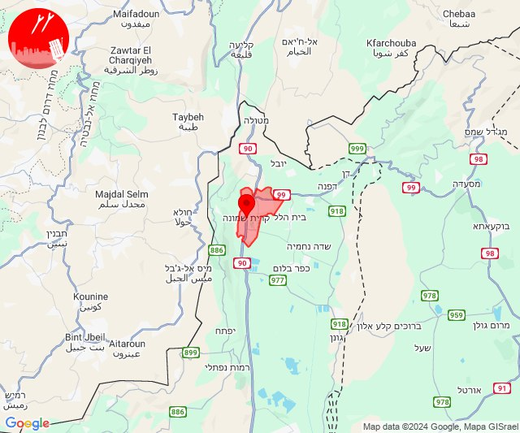

## 02:30

✈️ חדירת כלי טיס עוין (29/09/2024):

05:30:
• אילת: אילות, אילת, אזור תעשייה שחורת 

צופר - צבע אדום

## 02:30

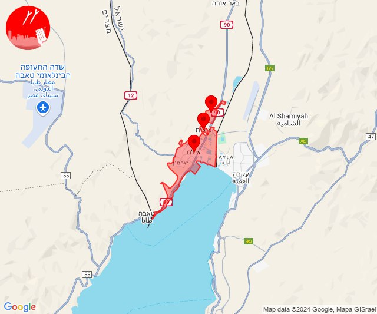

## 05:39

🔴 צבע אדום (29/09/2024):

08:38:
• גליל תחתון: טבריה (דקה)

08:39:
• גליל תחתון: מצפה, הזורעים, כינרת מושבה, כינרת קבוצה, כפר חיטים, פוריה כפר עבודה, פוריה נווה עובד, פוריה עילית (דקה)
• דרום הגולן: האון, חוף גופרה, חוף סוסיתא, עין גב, כפר חרוב (30 שניות, 15 שניות)

צופר - צבע אדום

## 05:39

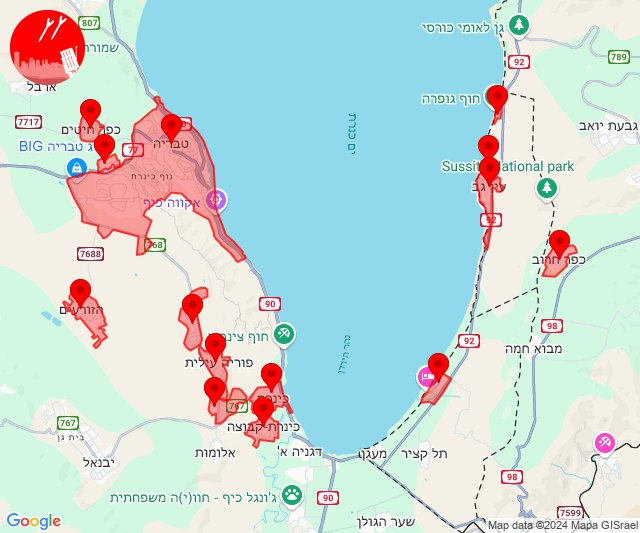

## 09:56

🔴 צבע אדום (29/09/2024):

12:56:
• גליל עליון: שדה אליעזר, יסוד המעלה (30 שניות)

צופר - צבע אדום

## 09:56

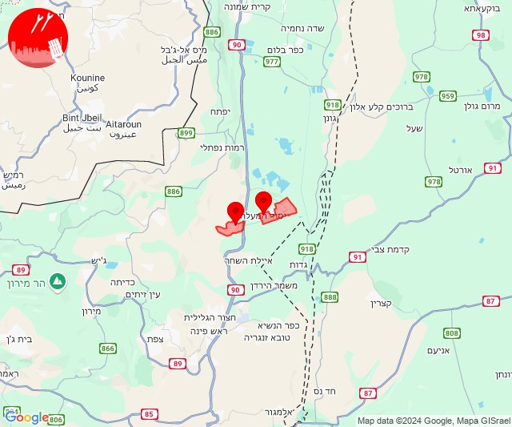

## 10:34

✈️ חדירת כלי טיס עוין (29/09/2024):

13:34:
• קו העימות: אביבים 

צופר - צבע אדום

## 10:34

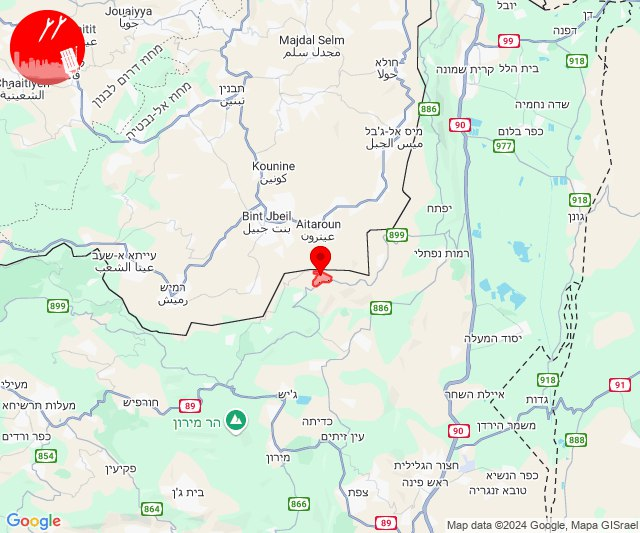

## 11:27

🔴 צבע אדום (29/09/2024):

14:24:
• קו העימות: בן עמי, נהריה, נווה זיו, כברי, מצובה, עבדון, יערה, מנות, שלומי, גשר הזיו, איזור תעשייה מילואות צפון (מיידי, 15 שניות)

14:26:
• העמקים: אזור תעשייה אלון התבור, אחוזת ברק, אכסאל, דברת, דחי, טמרה בגלבוע, נוף הגליל, נין, עין מאהל, עפולה, בית קשת, דבוריה, כדורי, כפר מצר, כפר תבור, עין דור, שבלי, שדמות דבורה, אום אלג'נם, בלפוריה, גניגר, יפיע, כפר גדעון, כפר החורש, מגדל העמק, מזרע, נצרת, ריינה, תל עדשים, נאעורה, רמת צבי, אילניה, גזית, כפר קיש, עין חרוד, קבוצת גבע, תל יוסף, בית סוהר שיטה וגלבוע, משהד, גבעת אלה, גבת, זרזיר, יפעת, נהלל, עילוט, רמת דוד, שמשית, שריד, תמרת, תחנת רכבת כפר ברוך, כפר כנא (דקה)
• בקעת בית שאן: בית השיטה, טייבה בגלבוע, מולדת (דקה)
• גליל תחתון: כפר נהר הירדן, כפר כמא, שדה אילן, שרונה (דקה)

14:27:
• העמקים: אזור תעשייה ציפורית, מרחביה מושב, סולם (דקה)

צופר - צבע אדום

## 11:27

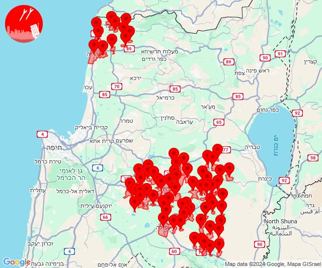

## 13:18

🔴 צבע אדום (29/09/2024):

16:17:
• גליל עליון: ביריה, צפת - עיר, קדיתא (30 שניות)
• קו העימות: אזור תעשייה רמת דלתון, דלתון, כרם בן זמרה (מיידי)

16:18:
• קו העימות: ג'ש - גוש חלב (מיידי)
• גליל עליון: עמוקה (30 שניות)

צופר - צבע אדום

## 13:18

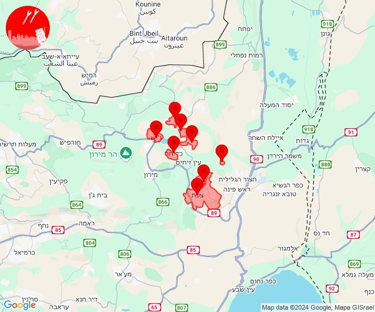

## 13:37

🔴 צבע אדום (29/09/2024):

16:37:
• גליל עליון: ראש פינה, אליפלט, חצור הגלילית, צפת - נוף כנרת, עמוקה (30 שניות)
• קו העימות: דלתון, אזור תעשייה רמת דלתון, עלמה, ריחאנייה (מיידי)

צופר - צבע אדום

## 13:37

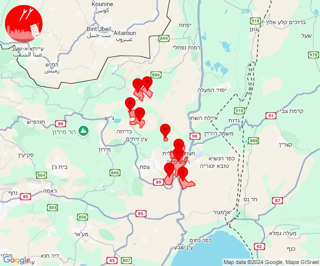

## 13:50

🔴 צבע אדום (29/09/2024):

16:50:
• קו העימות: זרעית, שומרה, שתולה (מיידי)

צופר - צבע אדום

## 13:50

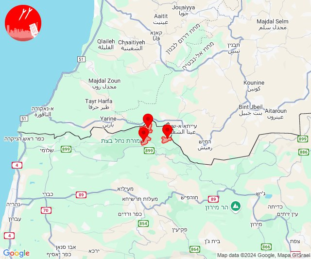

## 14:56

🔴 צבע אדום (29/09/2024):

17:56:
• קו העימות: שתולה, שומרה (מיידי)

צופר - צבע אדום

## 14:56

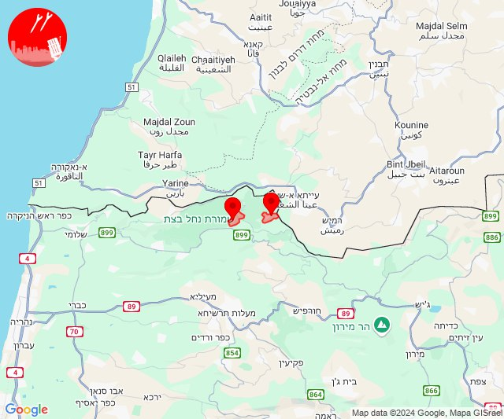

## 15:34

🔴 צבע אדום (29/09/2024):

18:34:
• קו העימות: שתולה, נטועה, שתולה (מיידי)

צופר - צבע אדום

## 15:34

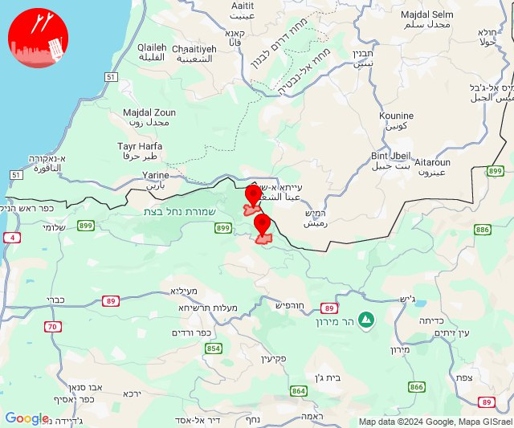

## 15:38

🔴 צבע אדום (29/09/2024):

18:37:
• קו העימות: נווה זיו, מנות (מיידי)

18:38:
• גליל עליון: אזור תעשייה שער נעמן, כפר מסריק, עין המפרץ, עכו - אזור תעשייה, עכו, כליל, ג'דידה מכר, בית העלמין החדש עכו, כפר מסריק, עין המפרץ (דקה, 30 שניות)
• קו העימות: געתון (15 שניות)

צופר - צבע אדום

## 15:38

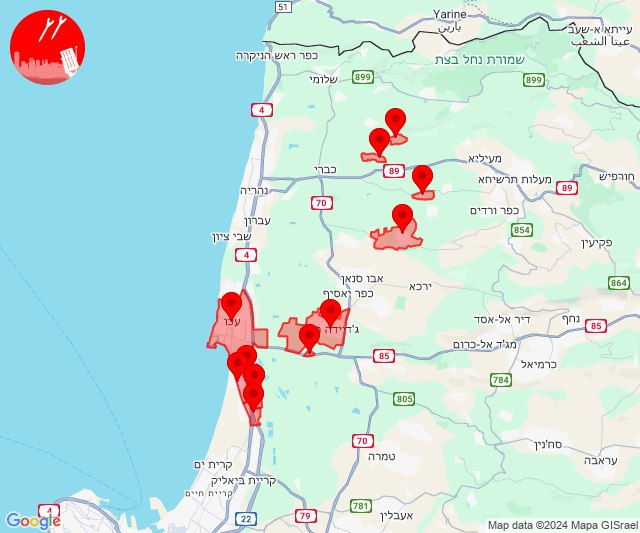

## 17:02

ערב טוב לכולם.

בשעות אלו מפתחי צופר עובדים ומתחזקים את המערכות השונות מסביב לשעון, כאשר מולנו מטרה אחת ויחידה - לספק שירות התרעות אמין, מיידי ומציל חיים.

עקב ריבוי המשתמשים בימים האחרונים נשמח לעזרתכם

מליוני אזרחים נעזרים ומקבלים התרעות מצופר, ועקב ריבוי המשתמשים הגדול אנו נדרשים להרחיב ולשדרג את השרתים, לבצע תחזוקות שוטפות ולשפר מנגנוני אבטחת מידע למניעת התקפות סייבר.

התרומות שלכם יאפשרו לנו להמשיך ולספק לכם שירות התרעות חיוני ומציל חיים.

לתרומה באמצעות פייפאל:
https://paypal.me/tzevaadom

לתרומה באמצעות פייבוקס:
https://payboxapp.page.link/D61pA1neQXyGhBui7

אנו רוצים להודות מכאן, לכל האנשים הטובים והיקרים שתרמו ותורמים מכספם עבור המערכת!

שימו לב 
בשבוע האחרון שיפרנו את זמני ההתרעה בצופר באופן משמעותי, וממליצים לשדרג לגרסה האחרונה בחנות למי שטרם עשה זאת.

משתמשי אנדרואיד - מזכירים לאפשר ריצה ברקע לאפליקצית צופר (ולבטל אופטימיזציה של סוללה) כדי להבטיח קבלת התרעות בצורה מיטבית וללא עיכובים. 

צופר מחזקת את אזרחי ישראל וחיילי צה״ל 🇮🇱

איתכם בכל זמן,
צוות צופר

## 18:15

🔴 צבע אדום (29/09/2024):

21:14:
• המפרץ: חיפה - מערב, חיפה - נווה שאנן ורמות כרמל (דקה)
• הכרמל: בית אורן, גבעת וולפסון, אזור תעשייה ניר עציון, בית צבי, כפר הנוער ימין אורד, מגדים, נווה ים, ניר עציון, עין הוד, עין חוד, עין כרמל, עתלית, יערות הכרמל, כלא דמון (דקה)
• מנשה: החותרים, טירת כרמל, כפר גלים (דקה)

21:15:
• קו העימות: איזור תעשייה מילואות צפון, לימן, בית העלמין החדש נהריה, בן עמי, גשר הזיו, נהריה, סער, עברון, געתון, יחיעם, כברי, נווה זיו (מיידי, 30 שניות, 15 שניות)
• גליל עליון: בוסתן הגליל, בית העמק, ג'דידה מכר, כפר מסריק, מג'דל כרום, נס עמים, נתיב השיירה, עין המפרץ, עכו - אזור תעשייה, עכו, צורית גילון, שבי ציון, שומרת, שייח' דנון, אבו סנאן, אשרת, בית העלמין החדש עכו, ג'וליס, טל - אל, ירכא, כליל, כפר יאסיף, לוחמי הגטאות, מזרעה, עמקה, פלך, רגבה, תובל, אזור תעשייה שער נעמן, אפק, אזור תעשייה בר-לב, אחיהוד, יסעור (30 שניות, דקה)
• המפרץ: אושה, חיפה - כרמל, הדר ועיר תחתית, חיפה - מפרץ, חיפה - קריית חיים ושמואל, כפר ביאליק, קריית אתא, קריית ביאליק, קריית ים, קריית מוצקין, רמת יוחנן, אזור תעשייה קריית ביאליק (דקה)
• מרכז הגליל: אזור תעשייה טמרה, אעבלין, טמרה, כאבול, מצפה אבי''ב, שעב, שפרעם (דקה)

צופר - צבע אדום

## 18:15

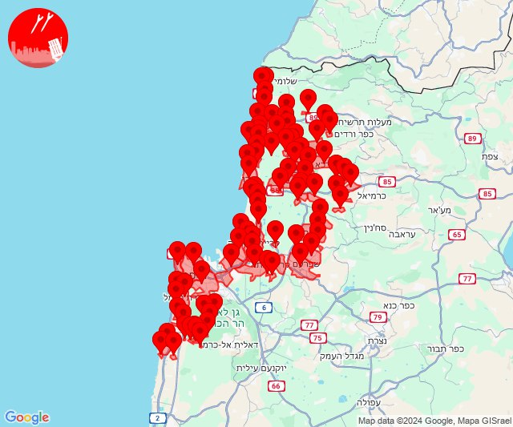

## 23:00

🔴 צבע אדום (30/09/2024):

02:00:
• קו העימות: רמות נפתלי (מיידי)

צופר - צבע אדום

## 23:00

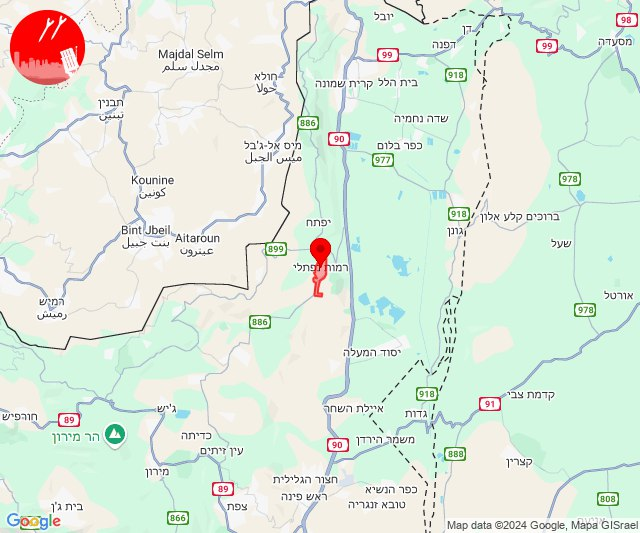

