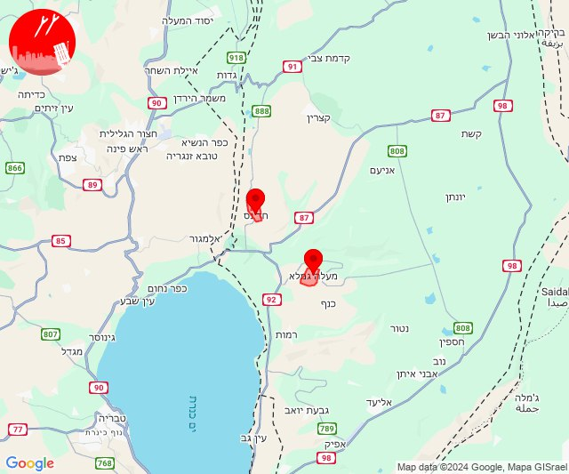

# Alerts for 2024-09-30

## 06:42

🔴 צבע אדום (30/09/2024):

09:42:
• גליל עליון: צפת - עכברה, צפת - עיר, צפת - נוף כנרת (30 שניות)

צופר - צבע אדום

## 06:42

## 07:04

🔴 צבע אדום (30/09/2024):

10:04:
• קו העימות: יראון (מיידי)

צופר - צבע אדום

## 07:04

## 08:09

🔴 צבע אדום (30/09/2024):

11:08:
• צפון הגולן: שעל, רמת טראמפ, מצוק עורבים (15 שניות)
• קו העימות: שניר (מיידי)

11:09:
• צפון הגולן: שעל (15 שניות)

צופר - צבע אדום

## 08:09

## 08:13

🔴 צבע אדום (30/09/2024):

11:12:
• קו העימות: קיבוץ דן, שאר ישוב (מיידי)

11:13:
• דרום הגולן: קצרין (30 שניות)
• צפון הגולן: מלון פרא (15 שניות)

צופר - צבע אדום

## 08:13

## 08:33

🔴 צבע אדום (30/09/2024):

11:33:
• קו העימות: נווה זיו, מנות (מיידי)

צופר - צבע אדום

## 08:33

## 08:53

🔴 צבע אדום (30/09/2024):

11:53:
• קו העימות: ראש הנקרה, שלומי (מיידי)

צופר - צבע אדום

## 08:53

## 09:19

🔴 צבע אדום (30/09/2024):

12:19:
• קו העימות: שלומי (מיידי)

צופר - צבע אדום

## 09:19

## 12:09

🔴 צבע אדום (30/09/2024):

15:09:
• דרום הגולן: חוף כינר, דוגה, דוגית (15 שניות)

צופר - צבע אדום

## 12:09

## 12:32

🔴 צבע אדום (30/09/2024):

15:32:
• דרום הגולן: חד נס, מעלה גמלא (15 שניות)

צופר - צבע אדום

## 12:32

## 12:42

🔴 צבע אדום (30/09/2024):

15:39:
• קו העימות: נהריה, גשר הזיו, סער, איזור תעשייה מילואות צפון, בצת, לימן, שלומי, ראש הנקרה, חוף בצת (15 שניות, מיידי)

15:40:
• קו העימות: איזור תעשייה מילואות צפון, נהריה, סער, בצת, לימן, שלומי, גשר הזיו, ראש הנקרה, בן עמי, עברון, חוף בצת (מיידי, 15 שניות)

15:41:
• קו העימות: איזור תעשייה מילואות צפון, בצת, לימן, שלומי, ראש הנקרה (מיידי)

15:42:
• קו העימות: נהריה, גשר הזיו, סער, איזור תעשייה מילואות צפון (15 שניות, מיידי)

צופר - צבע אדום

## 12:42

## 13:22

🔴 צבע אדום (30/09/2024):

16:22:
• קו העימות: כברי, בן עמי, עבדון, גשר הזיו, נהריה, סער (מיידי, 15 שניות)

צופר - צבע אדום

## 13:22

## 14:37

🔴 צבע אדום (30/09/2024):

17:36:
• קו העימות: כפר גלעדי (מיידי)

17:37:
• קו העימות: תל חי (מיידי)

צופר - צבע אדום

## 14:37

## 16:55

🔴 צבע אדום (30/09/2024):

19:53:
• המפרץ: קריית אתא (דקה)
• מרכז הגליל: אזור תעשייה טמרה, שפרעם (דקה)
• גליל עליון: אפק (דקה)

19:54:
• המפרץ: רמת יוחנן (דקה)
• מרכז הגליל: טמרה (דקה)

19:55:
• מרכז הגליל: אעבלין (דקה)

צופר - צבע אדום

## 16:55

## 20:45

🔴 צבע אדום (30/09/2024):

23:45:
• קו העימות: שתולה (מיידי)

צופר - צבע אדום

## 20:45

## 21:43

🔴 צבע אדום (01/10/2024):

00:43:
• קו העימות: משגב עם, משגב עם (מיידי)

צופר - צבע אדום

## 21:43

## 22:24

🔴 צבע אדום (01/10/2024):

01:24:
• קו העימות: זרעית (מיידי)

צופר - צבע אדום

## 22:24

## 22:37

🔴 צבע אדום (01/10/2024):

01:37:
• קו העימות: נטועה, שתולה (מיידי)

צופר - צבע אדום

## 22:37

## 22:48

🔴 צבע אדום (01/10/2024):

01:47:
• קו העימות: צבעון (מיידי)
• גליל עליון: מירון (30 שניות)

01:48:
• קו העימות: סאסא, בית ספר שדה מירון, צבעון (מיידי)
• גליל עליון: מרכז אזורי מרום גליל (30 שניות)

צופר - צבע אדום

## 22:48

