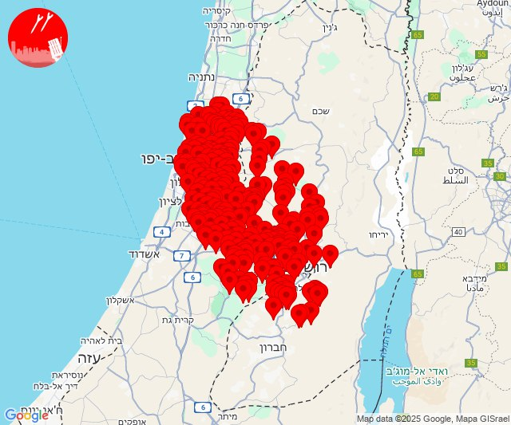
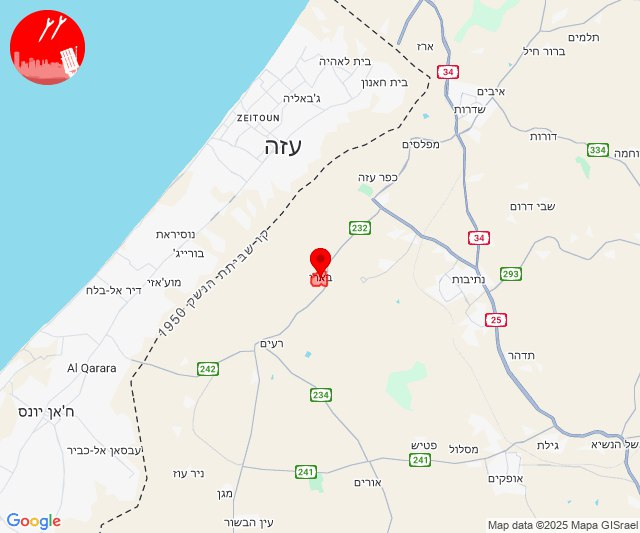
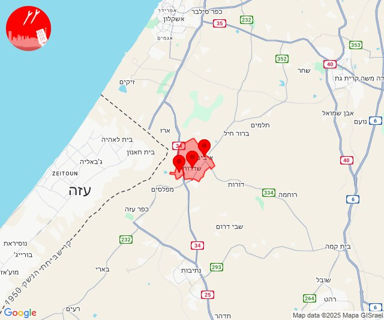
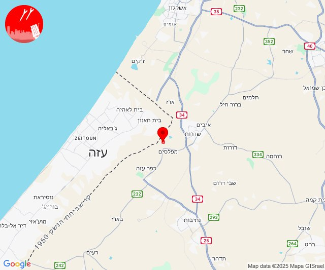
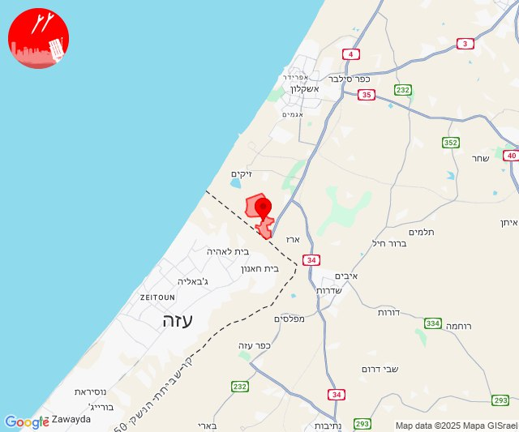
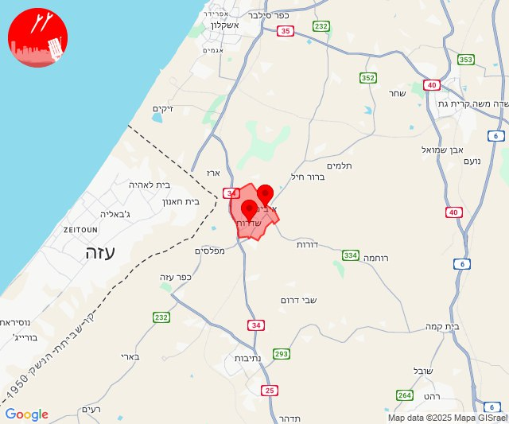

# Alerts for 2025-01-03

## 00:54

🔴 צבע אדום (03/01/2025):

02:54:
• עוטף עזה: ניר עם, שדרות, איבים (15 שניות)

צופר - צבע אדום

## 00:54

## 02:35

🔴 צבע אדום (03/01/2025):

04:34:
• ירושלים: ירושלים - אזור תעשייה עטרות, ירושלים - דרום, ירושלים - כפר עקב, ירושלים - מזרח, ירושלים - מערב, ירושלים - מרכז, ירושלים - צפון, בית זית, מבשרת ציון, מוצא עילית, פנימיית עין כרם, גבעון החדשה, גבעת זאב, נבי סמואל, אבן ספיר, אורה, עמינדב (דקה וחצי)
• דן: תל אביב - מזרח, תל אביב - עבר הירקון, אור יהודה, אזור, בני ברק, גבעת השלושה, גבעת שמואל, גבעתיים, גת רימון, הרצליה - מרכז וגליל ים, חולון, יהוד מונוסון, כפר סירקין, מעש, מקווה ישראל, סביון, פתח תקווה, קריית אונו, רמת גן - מזרח, רמת גן - מערב, רמת השרון, גני תקווה, מגשימים, בית עלמין מורשה, סינמה סיטי גלילות, מתחם פי גלילות (דקה וחצי)
• שרון: גבעת חן, אורנית, אלישמע, ג'לג'וליה, גן חיים, גני עם, הוד השרון, חגור, חורשים, ירחיב, ירקונה, כפר ברא, כפר מל''ל, כפר סבא, כפר קאסם, מתן, נווה ימין, נווה ירק, נירית, עדנים, צופית, רמות השבים, שדי חמד, תחנת רכבת ראש העין, אלקנה, עץ אפרים, שערי תקווה, מרכז אזורי דרום השרון (דקה וחצי)
• ירקון: גמזו, חשמונאים, כפר דניאל, כפר רות, לפיד, מבוא חורון, מבוא מודיעים, מודיעין - ליגד סנטר, מודיעין מכבים רעות, מודיעין עילית, מתתיהו, נוף איילון, שילת, שעלבים, אלעד, בארות יצחק, בני עטרות, גבעת כ''ח, מזור, נופך, נחלים, נחשונים, עינת, ראש העין, רינתיה, תעשיון חצב, אזור תעשייה חבל מודיעין, בית נחמיה, בית עריף, ברקת, חדיד, טירת יהודה, כפר טרומן, נאות קדומים, שוהם, אזור תעשייה אפק ולב הארץ, איירפורט סיטי, כפר האורנים, מודיעין - ישפרו סנטר (דקה וחצי)
• השפלה: נצר סרני, ראשון לציון - מזרח, אזור תעשייה נשר - רמלה, אזור תעשייה רגמ, אחיסמך, באר יעקב, בן שמן, גינתון, ישרש, כפר נוער בן שמן, לוד, מצליח, ניר צבי, רמלה, תעשיון צריפין, אחיעזר, בית דגן, בית חשמונאי, בית עוזיאל, גזר, גני הדר, גני יוחנן, זיתן, חולדה, חמד, חניון הנתיב מהיר, יגל, יד רמב''ם, יסודות, יציץ, כפר ביל''ו, כפר בן נון, כפר חב''ד, כפר שמואל, כרמי יוסף, מזכרת בתיה, משמר איילון, משמר דוד, משמר השבעה, נען, נצר חזני, סתריה, עזריה, פדיה, פתחיה, צפריה, רמות מאיר, גנות (דקה וחצי)
• שפלת יהודה: בית נקופה, הר אדר, מעלה החמישה, צובה, קריית ענבים, אביעזר, אדרת, אזור תעשייה הר טוב - צרעה, אשתאול, בית שמש, בקוע, גבעות עדן, גיזו, הראל, זנוח, טל שחר, ישעי, כפר אוריה, לטרון, מחסיה, מיני ישראל - נחשון, מסילת ציון, נווה מיכאל - רוגלית, נווה שלום, נחם, נחשון, נתיב הל''ה, צלפון, צרעה, רטורנו - גבעת שמש, שער הגיא, תעוז, תרום, אבו גוש, בית מאיר, בר גיורא, גבעת יערים, יד השמונה, כסלון, כפר הנוער קריית יערים, מבוא ביתר, מטע, נווה אילן, נטף, נס הרים, עין נקובא, עין ראפה, צור הדסה, קריית יערים, רמת רזיאל, שואבה, שורש, אזור תעשייה ברוש, זכריה, שדות מיכה, צומת האלה (דקה וחצי, דקה)
• יהודה: אבו נוור, אלון שבות, אלעזר, אפרת, ביתר עילית, בת עין, הר גילה, כפר אלדד, כפר עציון, כרמי צור, מגדל עוז, מיצד, מעלה עמוס, מעלה רחבעם, נווה דניאל, נוקדים, פארק תעשיות מגדל עוז, פני קדם, ראש צורים, שדה בר, תקוע, צומת הגוש, גבעות (דקה וחצי)
• שומרון: אזור תעשייה שער בנימין, בית אל, בית אריה, בית חורון, ברוכין, גבעת אסף, דולב, חלמיש, טלמון, כוכב יעקב, נחליאל, נילי, נעלה, עטרת, עלי זהב, פדואל, פסגות, תל ציון, חרשה, כרם רעים, מגרון, נריה, עופרים (דקה וחצי)

04:35:
• השפלה: רחובות (דקה וחצי)

צופר - צבע אדום

## 02:35

## 10:08

🔴 צבע אדום (03/01/2025):

12:08:
• עוטף עזה: בארי (15 שניות)

צופר - צבע אדום

## 10:08

## 11:29

🔴 צבע אדום (03/01/2025):

13:29:
• עוטף עזה: שדרות, איבים, ניר עם (15 שניות)

צופר - צבע אדום

## 11:29

## 14:19

🔴 צבע אדום (03/01/2025):

16:19:
• עוטף עזה: מטווח ניר עם (15 שניות)

צופר - צבע אדום

## 14:19

## 20:11

🔴 צבע אדום (03/01/2025):

22:11:
• עוטף עזה: נתיב העשרה (15 שניות)

צופר - צבע אדום

## 20:11

## 21:16

🔴 צבע אדום (03/01/2025):

23:16:
• עוטף עזה: שדרות, איבים (15 שניות)

צופר - צבע אדום

## 21:16

