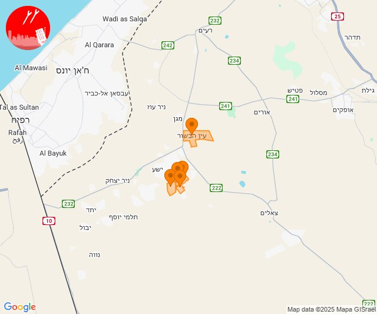
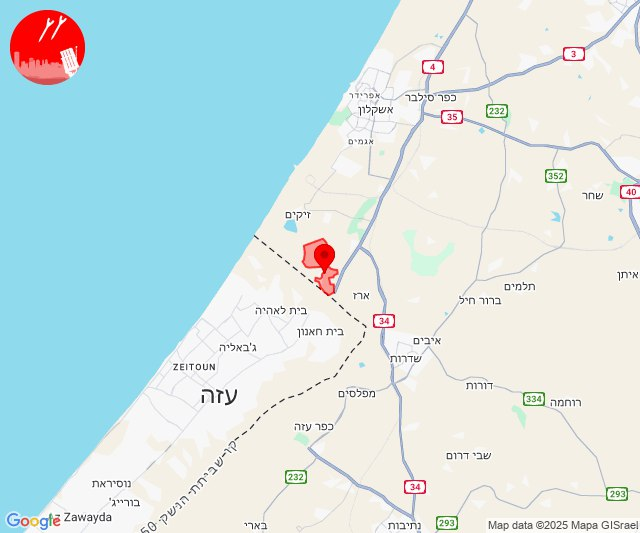

# Alerts for 2025-01-12

## 06:48

✈️ חדירת כלי טיס עוין (12/01/2025):

08:46:
• עוטף עזה: צוחר, אוהד, שדה ניצן, תלמי אליהו 

08:48:
• עוטף עזה: עין הבשור 

צופר - צבע אדום

## 06:48

## 09:45

🔴 צבע אדום (12/01/2025):

11:45:
• קו העימות: יראון (מיידי)

צופר - צבע אדום

## 09:45

## 14:19

🔴 צבע אדום (12/01/2025):

16:19:
• עוטף עזה: נתיב העשרה (15 שניות)

צופר - צבע אדום

## 14:19

