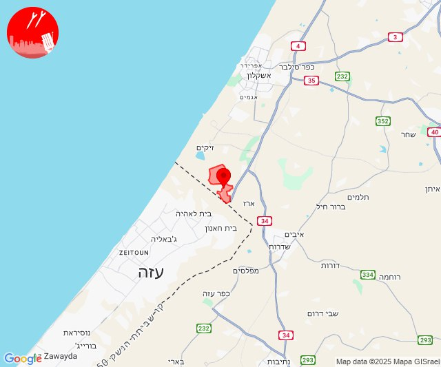
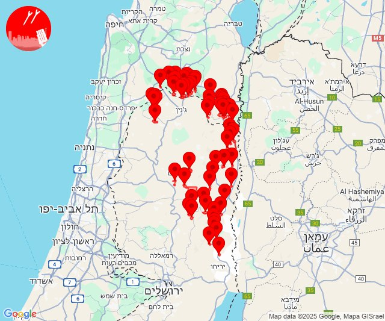

# Alerts for 2025-01-13

## 05:44

🔴 צבע אדום (13/01/2025):

07:44:
• עוטף עזה: נתיב העשרה (15 שניות)

צופר - צבע אדום

## 05:44

## 16:38

🔴 צבע אדום (13/01/2025):

18:38:
• שומרון: איתמר, אלון מורה, מגדלים, קידה, אחיה, אזור תעשייה שחק, הר ברכה, חיננית, מבוא דותן, שקד, טל מנשה (דקה וחצי)
• בקעה: ארגמן, בקעות, גיתית, גלגל, חמרה, ייט''ב, יפית, מכורה, מעלה אפרים, משואה, נעמה, נערן, נתיב הגדוד, פצאל, רועי, תומר, חמדת, מחולה, משכיות, רותם, שדמות מחולה (דקה וחצי)
• ואדי ערה: גבעת עוז (דקה וחצי)
• בקעת בית שאן: בית אלפא וחפציבה, חוות עדן, טירת צבי, כפר גמילה מלכישוע, מירב, מעלה גלבוע, רחוב, רשפים, שדה אליהו, שדי תרומות, שלוחות, תל תאומים, שלפים, רוויה (דקה)
• העמקים: גדעונה, גן נר, יזרעאל, ישובי אומן, ישובי יעל, מגן שאול, מוקיבלה, מרכז חבר, מתחם סקי גלבוע, נורית, סנדלה, רם און, אזור תעשייה מבואות הגלבוע (דקה)

צופר - צבע אדום

## 16:38

